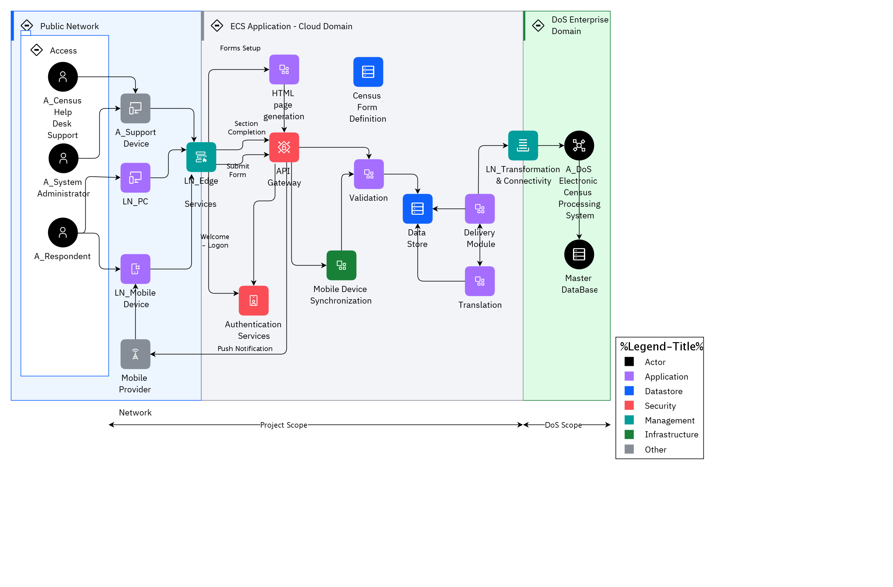

## Diagram

### Name

ECS Base

### Description

## Element

[Expand all](#){ .md-button .diff-line }

### Actor

    

A_Census Help Desk Support

<table>
    <caption></caption>
    <thead>
        <tr>
            <th></th>
            <th></th>
        </tr>
    </thead>
    <tr>
        <td> <strong>Name</strong> </td>
        <td>A_Census Help Desk Support</td>
    </tr>
    <tr>
        <td> <strong>Description</strong> </td>
        <td>Help desk provides visibility to end-user issues.</td>
    </tr>
    <tr>
        <td> <strong>Type</strong> </td>
        <td>Human</td>
    </tr>
    <tr>
        <td> <strong>Generic Group</strong> </td>
<td>
        
</td>
    </tr>
</table>

    

A_DoS Electronic Census Processing System

<table>
    <caption></caption>
    <thead>
        <tr>
            <th></th>
            <th></th>
        </tr>
    </thead>
    <tr>
        <td> <strong>Name</strong> </td>
        <td>A_DoS Electronic Census Processing System</td>
    </tr>
    <tr>
        <td> <strong>Description</strong> </td>
        <td>DoS Census Processing  system – this component receives data files, separates out the different data types (collector notifications, technical help requests, respondent data and feedback) processing each as appropriate, and generates acknowledgement and resend request files if required.</td>
    </tr>
    <tr>
        <td> <strong>Type</strong> </td>
        <td>IT System</td>
    </tr>
    <tr>
        <td> <strong>Generic Group</strong> </td>
<td>
        
</td>
    </tr>
</table>

    

A_Respondent

<table>
    <caption></caption>
    <thead>
        <tr>
            <th></th>
            <th></th>
        </tr>
    </thead>
    <tr>
        <td> <strong>Name</strong> </td>
        <td>A_Respondent</td>
    </tr>
    <tr>
        <td> <strong>Description</strong> </td>
        <td>Census form respondent, might be using a PC, or a mobile device.</td>
    </tr>
    <tr>
        <td> <strong>Type</strong> </td>
        <td>Human</td>
    </tr>
    <tr>
        <td> <strong>Generic Group</strong> </td>
<td>
        
                
                
<strong>SubSystem,Access</strong>[Auto-Generated]

                
This group is derived from SubSystem named Access.

                
                
</td>
    </tr>
</table>

    

A_Support Device

<table>
    <caption></caption>
    <thead>
        <tr>
            <th></th>
            <th></th>
        </tr>
    </thead>
    <tr>
        <td> <strong>Name</strong> </td>
        <td>A_Support Device</td>
    </tr>
    <tr>
        <td> <strong>Description</strong> </td>
        <td>PC or mobile device used by help desk support person.  They are using the system via a browser, so no software to be deployed.

The browser accessed user interface - must meet the accessibility requirements including operation with JavaScript disabled and support for screen readers. ECS application running on the server generates all HTML pages displayed to the respondent and performs all field validation, business rule and mandatory question checks, and subsequent processing. The browser performs the pure presentation layer function, and thus every individual page transition requires interaction with the server.</td>
    </tr>
    <tr>
        <td> <strong>Type</strong> </td>
        <td>IT System</td>
    </tr>
    <tr>
        <td> <strong>Generic Group</strong> </td>
<td>
        
</td>
    </tr>
</table>

    

A_System Administrator

<table>
    <caption></caption>
    <thead>
        <tr>
            <th></th>
            <th></th>
        </tr>
    </thead>
    <tr>
        <td> <strong>Name</strong> </td>
        <td>A_System Administrator</td>
    </tr>
    <tr>
        <td> <strong>Description</strong> </td>
        <td>The System Administrator is responsible for support of the ECS system itself.  The System Administrator deploys new versions of the ECS system and may be involved in problem troubleshooting on request from the Census Help Desk.</td>
    </tr>
    <tr>
        <td> <strong>Type</strong> </td>
        <td>Human</td>
    </tr>
    <tr>
        <td> <strong>Generic Group</strong> </td>
<td>
        
                
                
<strong>SubSystem,Access</strong>[Auto-Generated]

                
This group is derived from SubSystem named Access.

                
                
</td>
    </tr>
</table>

    

### Subsystem

    

Access

<table>
    <caption></caption>
    <thead>
        <tr>
            <th></th>
            <th></th>
        </tr>
    </thead>
    <tr>
        <td> <strong>Name</strong> </td>
        <td>Access</td>
    </tr>
    <tr>
        <td> <strong>Description</strong> </td>
        <td></td>
    </tr>
</table>

    

### Location

    

DoS Enterprise Domain

<table>
    <caption></caption>
    <thead>
        <tr>
            <th></th>
            <th></th>
        </tr>
    </thead>
    <tr>
        <td> <strong>Name</strong> </td>
        <td>DoS Enterprise Domain</td>
    </tr>
    <tr>
        <td> <strong>Description</strong> </td>
        <td></td>
    </tr>
</table>

    

ECS Application - Cloud Domain

<table>
    <caption></caption>
    <thead>
        <tr>
            <th></th>
            <th></th>
        </tr>
    </thead>
    <tr>
        <td> <strong>Name</strong> </td>
        <td>ECS Application - Cloud Domain</td>
    </tr>
    <tr>
        <td> <strong>Description</strong> </td>
        <td></td>
    </tr>
</table>

    

Public Network

<table>
    <caption></caption>
    <thead>
        <tr>
            <th></th>
            <th></th>
        </tr>
    </thead>
    <tr>
        <td> <strong>Name</strong> </td>
        <td>Public Network</td>
    </tr>
    <tr>
        <td> <strong>Description</strong> </td>
        <td></td>
    </tr>
</table>

    

### Logical Connection

    

<table>
    <caption></caption>
    <thead>
        <tr>
            <th></th>
            <th></th>
        </tr>
    </thead>
    <tr>
        <td> <strong>Name</strong> </td>
        <td></td>
    </tr>
    <tr>
        <td> <strong>Description</strong> </td>
        <td></td>
    </tr>
</table>

    

<table>
    <caption></caption>
    <thead>
        <tr>
            <th></th>
            <th></th>
        </tr>
    </thead>
    <tr>
        <td> <strong>Name</strong> </td>
        <td></td>
    </tr>
    <tr>
        <td> <strong>Description</strong> </td>
        <td></td>
    </tr>
</table>

    

<table>
    <caption></caption>
    <thead>
        <tr>
            <th></th>
            <th></th>
        </tr>
    </thead>
    <tr>
        <td> <strong>Name</strong> </td>
        <td></td>
    </tr>
    <tr>
        <td> <strong>Description</strong> </td>
        <td></td>
    </tr>
</table>

    

<table>
    <caption></caption>
    <thead>
        <tr>
            <th></th>
            <th></th>
        </tr>
    </thead>
    <tr>
        <td> <strong>Name</strong> </td>
        <td></td>
    </tr>
    <tr>
        <td> <strong>Description</strong> </td>
        <td></td>
    </tr>
</table>

    

<table>
    <caption></caption>
    <thead>
        <tr>
            <th></th>
            <th></th>
        </tr>
    </thead>
    <tr>
        <td> <strong>Name</strong> </td>
        <td></td>
    </tr>
    <tr>
        <td> <strong>Description</strong> </td>
        <td></td>
    </tr>
</table>

    

<table>
    <caption></caption>
    <thead>
        <tr>
            <th></th>
            <th></th>
        </tr>
    </thead>
    <tr>
        <td> <strong>Name</strong> </td>
        <td></td>
    </tr>
    <tr>
        <td> <strong>Description</strong> </td>
        <td></td>
    </tr>
</table>

    

<table>
    <caption></caption>
    <thead>
        <tr>
            <th></th>
            <th></th>
        </tr>
    </thead>
    <tr>
        <td> <strong>Name</strong> </td>
        <td></td>
    </tr>
    <tr>
        <td> <strong>Description</strong> </td>
        <td></td>
    </tr>
</table>

    

<table>
    <caption></caption>
    <thead>
        <tr>
            <th></th>
            <th></th>
        </tr>
    </thead>
    <tr>
        <td> <strong>Name</strong> </td>
        <td></td>
    </tr>
    <tr>
        <td> <strong>Description</strong> </td>
        <td></td>
    </tr>
</table>

    

<table>
    <caption></caption>
    <thead>
        <tr>
            <th></th>
            <th></th>
        </tr>
    </thead>
    <tr>
        <td> <strong>Name</strong> </td>
        <td></td>
    </tr>
    <tr>
        <td> <strong>Description</strong> </td>
        <td></td>
    </tr>
</table>

    

<table>
    <caption></caption>
    <thead>
        <tr>
            <th></th>
            <th></th>
        </tr>
    </thead>
    <tr>
        <td> <strong>Name</strong> </td>
        <td></td>
    </tr>
    <tr>
        <td> <strong>Description</strong> </td>
        <td></td>
    </tr>
</table>

    

<table>
    <caption></caption>
    <thead>
        <tr>
            <th></th>
            <th></th>
        </tr>
    </thead>
    <tr>
        <td> <strong>Name</strong> </td>
        <td></td>
    </tr>
    <tr>
        <td> <strong>Description</strong> </td>
        <td></td>
    </tr>
</table>

    

<table>
    <caption></caption>
    <thead>
        <tr>
            <th></th>
            <th></th>
        </tr>
    </thead>
    <tr>
        <td> <strong>Name</strong> </td>
        <td></td>
    </tr>
    <tr>
        <td> <strong>Description</strong> </td>
        <td></td>
    </tr>
</table>

    

<table>
    <caption></caption>
    <thead>
        <tr>
            <th></th>
            <th></th>
        </tr>
    </thead>
    <tr>
        <td> <strong>Name</strong> </td>
        <td></td>
    </tr>
    <tr>
        <td> <strong>Description</strong> </td>
        <td></td>
    </tr>
</table>

    

<table>
    <caption></caption>
    <thead>
        <tr>
            <th></th>
            <th></th>
        </tr>
    </thead>
    <tr>
        <td> <strong>Name</strong> </td>
        <td></td>
    </tr>
    <tr>
        <td> <strong>Description</strong> </td>
        <td></td>
    </tr>
</table>

    

<table>
    <caption></caption>
    <thead>
        <tr>
            <th></th>
            <th></th>
        </tr>
    </thead>
    <tr>
        <td> <strong>Name</strong> </td>
        <td></td>
    </tr>
    <tr>
        <td> <strong>Description</strong> </td>
        <td></td>
    </tr>
</table>

    

<table>
    <caption></caption>
    <thead>
        <tr>
            <th></th>
            <th></th>
        </tr>
    </thead>
    <tr>
        <td> <strong>Name</strong> </td>
        <td></td>
    </tr>
    <tr>
        <td> <strong>Description</strong> </td>
        <td></td>
    </tr>
</table>

    

<table>
    <caption></caption>
    <thead>
        <tr>
            <th></th>
            <th></th>
        </tr>
    </thead>
    <tr>
        <td> <strong>Name</strong> </td>
        <td></td>
    </tr>
    <tr>
        <td> <strong>Description</strong> </td>
        <td></td>
    </tr>
</table>

    

<table>
    <caption></caption>
    <thead>
        <tr>
            <th></th>
            <th></th>
        </tr>
    </thead>
    <tr>
        <td> <strong>Name</strong> </td>
        <td></td>
    </tr>
    <tr>
        <td> <strong>Description</strong> </td>
        <td></td>
    </tr>
</table>

    

<table>
    <caption></caption>
    <thead>
        <tr>
            <th></th>
            <th></th>
        </tr>
    </thead>
    <tr>
        <td> <strong>Name</strong> </td>
        <td></td>
    </tr>
    <tr>
        <td> <strong>Description</strong> </td>
        <td></td>
    </tr>
</table>

    

<table>
    <caption></caption>
    <thead>
        <tr>
            <th></th>
            <th></th>
        </tr>
    </thead>
    <tr>
        <td> <strong>Name</strong> </td>
        <td></td>
    </tr>
    <tr>
        <td> <strong>Description</strong> </td>
        <td></td>
    </tr>
</table>

    

Forms Setup

<table>
    <caption></caption>
    <thead>
        <tr>
            <th></th>
            <th></th>
        </tr>
    </thead>
    <tr>
        <td> <strong>Name</strong> </td>
        <td>Forms Setup</td>
    </tr>
    <tr>
        <td> <strong>Description</strong> </td>
        <td></td>
    </tr>
</table>

    

Push Notification

<table>
    <caption></caption>
    <thead>
        <tr>
            <th></th>
            <th></th>
        </tr>
    </thead>
    <tr>
        <td> <strong>Name</strong> </td>
        <td>Push Notification</td>
    </tr>
    <tr>
        <td> <strong>Description</strong> </td>
        <td></td>
    </tr>
</table>

    

Section 
Completion

<table>
    <caption></caption>
    <thead>
        <tr>
            <th></th>
            <th></th>
        </tr>
    </thead>
    <tr>
        <td> <strong>Name</strong> </td>
        <td>Section 
Completion</td>
    </tr>
    <tr>
        <td> <strong>Description</strong> </td>
        <td></td>
    </tr>
</table>

    

Submit 
Form

<table>
    <caption></caption>
    <thead>
        <tr>
            <th></th>
            <th></th>
        </tr>
    </thead>
    <tr>
        <td> <strong>Name</strong> </td>
        <td>Submit 
Form</td>
    </tr>
    <tr>
        <td> <strong>Description</strong> </td>
        <td></td>
    </tr>
</table>

    

Welcome 
- Logon

<table>
    <caption></caption>
    <thead>
        <tr>
            <th></th>
            <th></th>
        </tr>
    </thead>
    <tr>
        <td> <strong>Name</strong> </td>
        <td>Welcome 
- Logon</td>
    </tr>
    <tr>
        <td> <strong>Description</strong> </td>
        <td></td>
    </tr>
</table>

    

### Logical Node

    

API Gateway

<table>
    <caption></caption>
    <thead>
        <tr>
            <th></th>
            <th></th>
        </tr>
    </thead>
    <tr>
        <td> <strong>Name</strong> </td>
        <td>API Gateway</td>
    </tr>
    <tr>
        <td> <strong>Description</strong> </td>
        <td>API Gateway – Invokes APIs (exposed by Microservices), routes and connects requests from the front-end applications.</td>
    </tr>
    <tr>
        <td> <strong>Type</strong> </td>
        <td></td>
    </tr>
    <tr>
        <td> <strong>Primary Capability</strong> </td>
        <td>
            
                
api gateway

            
        </td>
    </tr>
    <tr>
        <td> <strong>Implementation</strong> </td>
        <td>
            
        </td>
    </tr>
    <tr>
        <td> <strong>Architectural Decision</strong> </td>
        <td>
            
        </td>
    </tr>
    <tr>
        <td> <strong>Non Functional Requirement</strong> </td>
        <td>
            
        </td>
    </tr>
    <tr>
        <td> <strong>Generic Group</strong> </td>
        <td></td>
    </tr>
    <tr>
        <td> <strong>Sub-level Diagram</strong> </td>
        <td></td>
    </tr>
    <tr>
        <td> <strong>Related Diagrams</strong> </td>
        <td>
            
                
<a href="../../IT System View/aoditsystem_SJ5yHK9eF_r13-bc9lY_BJK24keC9">ECS Base</a>

            
        </td>
    </tr>
    <tr>
        <td> <strong>Related Elements</strong> </td>
        <td>
            
            
        </td>
    </tr>
</table>

    

Authentication Services

<table>
    <caption></caption>
    <thead>
        <tr>
            <th></th>
            <th></th>
        </tr>
    </thead>
    <tr>
        <td> <strong>Name</strong> </td>
        <td>Authentication Services</td>
    </tr>
    <tr>
        <td> <strong>Description</strong> </td>
        <td>Authentication – ECS is secured using a combination of Census Form Number (CFN), and ECS Number (ECN). The Authentication module implements the required ECN authentication algorithms and security rules related to number of logins per ECN, IP Lockout and other security features. Validation and authentication of the user-provided CFN and ECN is performed with algorithms provided by the DoS but implemented as part of the ESC.</td>
    </tr>
    <tr>
        <td> <strong>Type</strong> </td>
        <td></td>
    </tr>
    <tr>
        <td> <strong>Primary Capability</strong> </td>
        <td>
            
                
IAM

            
        </td>
    </tr>
    <tr>
        <td> <strong>Implementation</strong> </td>
        <td>
            
        </td>
    </tr>
    <tr>
        <td> <strong>Architectural Decision</strong> </td>
        <td>
            
        </td>
    </tr>
    <tr>
        <td> <strong>Non Functional Requirement</strong> </td>
        <td>
            
        </td>
    </tr>
    <tr>
        <td> <strong>Generic Group</strong> </td>
        <td></td>
    </tr>
    <tr>
        <td> <strong>Sub-level Diagram</strong> </td>
        <td></td>
    </tr>
    <tr>
        <td> <strong>Related Diagrams</strong> </td>
        <td>
            
                
<a href="../../IT System View/aoditsystem_SJ5yHK9eF_r13-bc9lY_BJK24keC9">ECS Base</a>

            
        </td>
    </tr>
    <tr>
        <td> <strong>Related Elements</strong> </td>
        <td>
            
            
                
IAM

                
            
        </td>
    </tr>
</table>

    

Census Form Definition

<table>
    <caption></caption>
    <thead>
        <tr>
            <th></th>
            <th></th>
        </tr>
    </thead>
    <tr>
        <td> <strong>Name</strong> </td>
        <td>Census Form Definition</td>
    </tr>
    <tr>
        <td> <strong>Description</strong> </td>
        <td>Census Form Definition – all question information (question type, question text, help text, message content), in fact all text information displayed within the census form is defined within XML definition file(s). Thus the ECS application is a relatively generic mass scale internet based questionnaire solution that is configured to fulfil the specific DoS requirements. 

The configuration data has the following elements:
• Census Page Definition – is an XML file that specifies the overall information for the Navigation panel, and the set of pages that make up the census, and various overall parameters such as the core application button labels (Next, Previous etc.). The census form is composed of multiple sections with questions; each section requires one or more pages to respond to the questions.
• Census Form Definition – is an XML file that specifies each of the questions belonging to a section. This includes the question response type (Text, Date, Address and Selection), the question text, alternate question text, help text, labels, field sizes, field validation rules, question dependency rules, business rules, and all other presentation and functional aspects of each question on the form.</td>
    </tr>
    <tr>
        <td> <strong>Type</strong> </td>
        <td></td>
    </tr>
    <tr>
        <td> <strong>Primary Capability</strong> </td>
        <td>
            
        </td>
    </tr>
    <tr>
        <td> <strong>Implementation</strong> </td>
        <td>
            
        </td>
    </tr>
    <tr>
        <td> <strong>Architectural Decision</strong> </td>
        <td>
            
        </td>
    </tr>
    <tr>
        <td> <strong>Non Functional Requirement</strong> </td>
        <td>
            
        </td>
    </tr>
    <tr>
        <td> <strong>Generic Group</strong> </td>
        <td></td>
    </tr>
    <tr>
        <td> <strong>Sub-level Diagram</strong> </td>
        <td></td>
    </tr>
    <tr>
        <td> <strong>Related Diagrams</strong> </td>
        <td>
            
                
<a href="../../IT System View/aoditsystem_SJ5yHK9eF_r13-bc9lY_BJK24keC9">ECS Base</a>

            
        </td>
    </tr>
    <tr>
        <td> <strong>Related Elements</strong> </td>
        <td>
            
            
        </td>
    </tr>
</table>

    

Data Store

<table>
    <caption></caption>
    <thead>
        <tr>
            <th></th>
            <th></th>
        </tr>
    </thead>
    <tr>
        <td> <strong>Name</strong> </td>
        <td>Data Store</td>
    </tr>
    <tr>
        <td> <strong>Description</strong> </td>
        <td>
Data Store – the temporary (store and forward) data store contains the respondent's data which is subsequently sent to the DoS' Electronic Census Processing system using asynchronous ‘store &amp; forward’ pattern.

 

The stored information includes both census data (from respondents) as well as management information, generated by the ECS solution itself. 
</td>
    </tr>
    <tr>
        <td> <strong>Type</strong> </td>
        <td></td>
    </tr>
    <tr>
        <td> <strong>Primary Capability</strong> </td>
        <td>
            
                
repository

            
        </td>
    </tr>
    <tr>
        <td> <strong>Implementation</strong> </td>
        <td>
            
                
<a href="">MongoDB</a>

            
        </td>
    </tr>
    <tr>
        <td> <strong>Architectural Decision</strong> </td>
        <td>
            
        </td>
    </tr>
    <tr>
        <td> <strong>Non Functional Requirement</strong> </td>
        <td>
            
        </td>
    </tr>
    <tr>
        <td> <strong>Generic Group</strong> </td>
        <td></td>
    </tr>
    <tr>
        <td> <strong>Sub-level Diagram</strong> </td>
        <td></td>
    </tr>
    <tr>
        <td> <strong>Related Diagrams</strong> </td>
        <td>
            
                
<a href="../../IT System View/aoditsystem_SJ5yHK9eF_r13-bc9lY_BJK24keC9">ECS Base</a>

            
        </td>
    </tr>
    <tr>
        <td> <strong>Related Elements</strong> </td>
        <td>
            
            
                
repository

                
            
                
SYS_DU_2L2t0lXSkzf

                
            
        </td>
    </tr>
</table>

    

Delivery Module

<table>
    <caption></caption>
    <thead>
        <tr>
            <th></th>
            <th></th>
        </tr>
    </thead>
    <tr>
        <td> <strong>Name</strong> </td>
        <td>Delivery Module</td>
    </tr>
    <tr>
        <td> <strong>Description</strong> </td>
        <td>Delivery module – this module runs periodically and performs three distinct flows:
• Extracts the respondents’ data from the database and transfers it to DoS.
• Retrieves acknowledgment files from DoS and deletes census records that are positively acknowledged by DoS. 
• Retrieves re-submission requests from DoS where respondent’s data has not been successfully processed by DoS. These respondent records will be included in the first sub-sequent extraction and delivery to DoS.</td>
    </tr>
    <tr>
        <td> <strong>Type</strong> </td>
        <td></td>
    </tr>
    <tr>
        <td> <strong>Primary Capability</strong> </td>
        <td>
            
        </td>
    </tr>
    <tr>
        <td> <strong>Implementation</strong> </td>
        <td>
            
        </td>
    </tr>
    <tr>
        <td> <strong>Architectural Decision</strong> </td>
        <td>
            
        </td>
    </tr>
    <tr>
        <td> <strong>Non Functional Requirement</strong> </td>
        <td>
            
        </td>
    </tr>
    <tr>
        <td> <strong>Generic Group</strong> </td>
        <td></td>
    </tr>
    <tr>
        <td> <strong>Sub-level Diagram</strong> </td>
        <td></td>
    </tr>
    <tr>
        <td> <strong>Related Diagrams</strong> </td>
        <td>
            
                
<a href="../../IT System View/aoditsystem_SJ5yHK9eF_r13-bc9lY_BJK24keC9">ECS Base</a>

            
        </td>
    </tr>
    <tr>
        <td> <strong>Related Elements</strong> </td>
        <td>
            
            
        </td>
    </tr>
</table>

    

HTML page generation

<table>
    <caption></caption>
    <thead>
        <tr>
            <th></th>
            <th></th>
        </tr>
    </thead>
    <tr>
        <td> <strong>Name</strong> </td>
        <td>HTML page generation</td>
    </tr>
    <tr>
        <td> <strong>Description</strong> </td>
        <td>HTML page generation – page generation after the Welcome and Login page is performed on the server and rendered on the client side.</td>
    </tr>
    <tr>
        <td> <strong>Type</strong> </td>
        <td></td>
    </tr>
    <tr>
        <td> <strong>Primary Capability</strong> </td>
        <td>
            
        </td>
    </tr>
    <tr>
        <td> <strong>Implementation</strong> </td>
        <td>
            
        </td>
    </tr>
    <tr>
        <td> <strong>Architectural Decision</strong> </td>
        <td>
            
        </td>
    </tr>
    <tr>
        <td> <strong>Non Functional Requirement</strong> </td>
        <td>
            
                
<a href="../../Non Functional Requirements/nfr_BJAcxrWqK5YO_r13-bc9lY_BJK24keC9">Overall response time</a>

            
        </td>
    </tr>
    <tr>
        <td> <strong>Generic Group</strong> </td>
        <td></td>
    </tr>
    <tr>
        <td> <strong>Sub-level Diagram</strong> </td>
        <td></td>
    </tr>
    <tr>
        <td> <strong>Related Diagrams</strong> </td>
        <td>
            
                
<a href="../../IT System View/aoditsystem_SJ5yHK9eF_r13-bc9lY_BJK24keC9">ECS Base</a>

            
        </td>
    </tr>
    <tr>
        <td> <strong>Related Elements</strong> </td>
        <td>
            
                
Overall response time

                
                    
                    <li><a href="../../Prescribed Operational Model/pomview_ryoKWHbcF9Yd_r13-bc9lY_BJK24keC9">POM - Base</a></li>
                    
                    <li><a href="../../Logical Operational View/lomview_S18vZHZqK9FO_r13-bc9lY_BJK24keC9">LOM - Base</a></li>
                    
                    <li><a href="../../Logical Operational View/lomview_SJ4GogkCd_r13-bc9lY_BJK24keC9">LOM Base - new</a></li>
                    
                    <li><a href="../../IT System View/aoditsystem_SJ5yHK9eF_r13-bc9lY_BJK24keC9">ECS Base</a></li>
                    
                
            
            
        </td>
    </tr>
</table>

    

LN_Edge Services

<table>
    <caption></caption>
    <thead>
        <tr>
            <th></th>
            <th></th>
        </tr>
    </thead>
    <tr>
        <td> <strong>Name</strong> </td>
        <td>LN_Edge Services</td>
    </tr>
    <tr>
        <td> <strong>Description</strong> </td>
        <td>Provide network capability to deliver content through the Internet (DNS, CDN, firewall, load balancer).</td>
    </tr>
    <tr>
        <td> <strong>Type</strong> </td>
        <td></td>
    </tr>
    <tr>
        <td> <strong>Primary Capability</strong> </td>
        <td>
            
                
edge services

            
        </td>
    </tr>
    <tr>
        <td> <strong>Implementation</strong> </td>
        <td>
            
                
<a href="https://www.ibm.com/cloud/cloud-internet-services">IBM Cloud Internet Services</a>

            
        </td>
    </tr>
    <tr>
        <td> <strong>Architectural Decision</strong> </td>
        <td>
            
        </td>
    </tr>
    <tr>
        <td> <strong>Non Functional Requirement</strong> </td>
        <td>
            
                
<a href="../../Non Functional Requirements/nfr_BJAcxrWqK5YO_r13-bc9lY_BJK24keC9">Overall response time</a>

            
                
<a href="../../Non Functional Requirements/nfr_HJ55lSW9t9YO_r13-bc9lY_BJK24keC9">Capacity during census enumeration period.</a>

            
                
<a href="../../Non Functional Requirements/nfr_Hkv5lBZ9tqtd_r13-bc9lY_BJK24keC9">Transaction Processing Time</a>

            
                
<a href="../../Non Functional Requirements/nfr_Hy89lHbcY5tO_r13-bc9lY_BJK24keC9">Device Support</a>

            
                
<a href="../../Non Functional Requirements/nfr_r1_qgSZct9Fd_r13-bc9lY_BJK24keC9">Availability</a>

            
        </td>
    </tr>
    <tr>
        <td> <strong>Generic Group</strong> </td>
        <td></td>
    </tr>
    <tr>
        <td> <strong>Sub-level Diagram</strong> </td>
        <td></td>
    </tr>
    <tr>
        <td> <strong>Related Diagrams</strong> </td>
        <td>
            
                
<a href="../../Logical Operational View/lomview_S18vZHZqK9FO_r13-bc9lY_BJK24keC9">LOM - Base</a>

            
                
<a href="../../Logical Operational View/lomview_SJ4GogkCd_r13-bc9lY_BJK24keC9">LOM Base - new</a>

            
                
<a href="../../IT System View/aoditsystem_SJ5yHK9eF_r13-bc9lY_BJK24keC9">ECS Base</a>

            
                
<a href="../../Prescribed Operational Model/pomview_ryoKWHbcF9Yd_r13-bc9lY_BJK24keC9">POM - Base</a>

            
        </td>
    </tr>
    <tr>
        <td> <strong>Related Elements</strong> </td>
        <td>
            
                
PN_Edge Services

                
                    
                    <li><a href="../../Prescribed Operational Model/pomview_ryoKWHbcF9Yd_r13-bc9lY_BJK24keC9">POM - Base</a></li>
                    
                
            
                
L_04 Cloud Secure (DMZ)

                
                    
                    <li><a href="../../Logical Operational View/lomview_S18vZHZqK9FO_r13-bc9lY_BJK24keC9">LOM - Base</a></li>
                    
                    <li><a href="../../Logical Operational View/lomview_SJ4GogkCd_r13-bc9lY_BJK24keC9">LOM Base - new</a></li>
                    
                
            
                
Overall response time

                
                    
                    <li><a href="../../Prescribed Operational Model/pomview_ryoKWHbcF9Yd_r13-bc9lY_BJK24keC9">POM - Base</a></li>
                    
                    <li><a href="../../Logical Operational View/lomview_S18vZHZqK9FO_r13-bc9lY_BJK24keC9">LOM - Base</a></li>
                    
                    <li><a href="../../Logical Operational View/lomview_SJ4GogkCd_r13-bc9lY_BJK24keC9">LOM Base - new</a></li>
                    
                    <li><a href="../../IT System View/aoditsystem_SJ5yHK9eF_r13-bc9lY_BJK24keC9">ECS Base</a></li>
                    
                
            
                
Capacity during census enumeration period.

                
                    
                    <li><a href="../../Prescribed Operational Model/pomview_ryoKWHbcF9Yd_r13-bc9lY_BJK24keC9">POM - Base</a></li>
                    
                    <li><a href="../../Logical Operational View/lomview_S18vZHZqK9FO_r13-bc9lY_BJK24keC9">LOM - Base</a></li>
                    
                    <li><a href="../../Logical Operational View/lomview_SJ4GogkCd_r13-bc9lY_BJK24keC9">LOM Base - new</a></li>
                    
                    <li><a href="../../IT System View/aoditsystem_SJ5yHK9eF_r13-bc9lY_BJK24keC9">ECS Base</a></li>
                    
                
            
                
Transaction Processing Time

                
                    
                    <li><a href="../../Prescribed Operational Model/pomview_ryoKWHbcF9Yd_r13-bc9lY_BJK24keC9">POM - Base</a></li>
                    
                    <li><a href="../../Logical Operational View/lomview_S18vZHZqK9FO_r13-bc9lY_BJK24keC9">LOM - Base</a></li>
                    
                    <li><a href="../../Logical Operational View/lomview_SJ4GogkCd_r13-bc9lY_BJK24keC9">LOM Base - new</a></li>
                    
                    <li><a href="../../IT System View/aoditsystem_SJ5yHK9eF_r13-bc9lY_BJK24keC9">ECS Base</a></li>
                    
                
            
                
Device Support

                
                    
                    <li><a href="../../Prescribed Operational Model/pomview_ryoKWHbcF9Yd_r13-bc9lY_BJK24keC9">POM - Base</a></li>
                    
                    <li><a href="../../Logical Operational View/lomview_S18vZHZqK9FO_r13-bc9lY_BJK24keC9">LOM - Base</a></li>
                    
                    <li><a href="../../Logical Operational View/lomview_SJ4GogkCd_r13-bc9lY_BJK24keC9">LOM Base - new</a></li>
                    
                    <li><a href="../../IT System View/aoditsystem_SJ5yHK9eF_r13-bc9lY_BJK24keC9">ECS Base</a></li>
                    
                
            
                
Availability

                
                    
                    <li><a href="../../Prescribed Operational Model/pomview_ryoKWHbcF9Yd_r13-bc9lY_BJK24keC9">POM - Base</a></li>
                    
                    <li><a href="../../Logical Operational View/lomview_S18vZHZqK9FO_r13-bc9lY_BJK24keC9">LOM - Base</a></li>
                    
                    <li><a href="../../Logical Operational View/lomview_SJ4GogkCd_r13-bc9lY_BJK24keC9">LOM Base - new</a></li>
                    
                    <li><a href="../../IT System View/aoditsystem_SJ5yHK9eF_r13-bc9lY_BJK24keC9">ECS Base</a></li>
                    
                
            
            
                
TE_Load Balancer

                
            
                
TE_Secure Gateway

                
            
                
TE_CDN

                
            
                
TE_DNS

                
            
                
TE_Firewall

                
            
        </td>
    </tr>
</table>

    

LN_Mobile Device

<table>
    <caption></caption>
    <thead>
        <tr>
            <th></th>
            <th></th>
        </tr>
    </thead>
    <tr>
        <td> <strong>Name</strong> </td>
        <td>LN_Mobile Device</td>
    </tr>
    <tr>
        <td> <strong>Description</strong> </td>
        <td>Mobile device, running an application that must be available for Android, iOS and Windows devices. The functionality of the mobile device application will be like that offered by the Rich client browser application. Additionally, the solution will support “offline” mode of operation whereby census can be filled in by the mobile device user while the device is not connected to any network. The data is temporarily stored on the device and replicated back to the servers as soon as connection to a network is established. The data is removed from the mobile device once it is replicated to the server.</td>
    </tr>
    <tr>
        <td> <strong>Type</strong> </td>
        <td></td>
    </tr>
    <tr>
        <td> <strong>Primary Capability</strong> </td>
        <td>
            
        </td>
    </tr>
    <tr>
        <td> <strong>Implementation</strong> </td>
        <td>
            
                
<a href="">ECS Solution</a>

            
                
<a href="https://www.sqlite.org/index.html">SQLite</a>

            
                
<a href="">Android</a>

            
                
<a href="">IOS</a>

            
                
<a href="">Windows</a>

            
                
<a href="https://developers.google.com/maps/documentation/geolocation/overview">Google Maps API</a>

            
        </td>
    </tr>
    <tr>
        <td> <strong>Architectural Decision</strong> </td>
        <td>
            
        </td>
    </tr>
    <tr>
        <td> <strong>Non Functional Requirement</strong> </td>
        <td>
            
        </td>
    </tr>
    <tr>
        <td> <strong>Generic Group</strong> </td>
        <td></td>
    </tr>
    <tr>
        <td> <strong>Sub-level Diagram</strong> </td>
        <td></td>
    </tr>
    <tr>
        <td> <strong>Related Diagrams</strong> </td>
        <td>
            
                
<a href="../../Logical Operational View/lomview_S18vZHZqK9FO_r13-bc9lY_BJK24keC9">LOM - Base</a>

            
                
<a href="../../Logical Operational View/lomview_SJ4GogkCd_r13-bc9lY_BJK24keC9">LOM Base - new</a>

            
                
<a href="../../IT System View/aoditsystem_SJ5yHK9eF_r13-bc9lY_BJK24keC9">ECS Base</a>

            
        </td>
    </tr>
    <tr>
        <td> <strong>Related Elements</strong> </td>
        <td>
            
                
L_01 External Respondent

                
                    
                    <li><a href="../../Logical Operational View/lomview_S18vZHZqK9FO_r13-bc9lY_BJK24keC9">LOM - Base</a></li>
                    
                    <li><a href="../../Logical Operational View/lomview_SJ4GogkCd_r13-bc9lY_BJK24keC9">LOM Base - new</a></li>
                    
                
            
            
                
d_02 FormData

                
                    
                    <li>
<a href="../../Logical Operational View/lomview_S18vZHZqK9FO_r13-bc9lY_BJK24keC9">LOM - Base</a>
</li>
                    
                    <li>
<a href="../../Logical Operational View/lomview_SJ4GogkCd_r13-bc9lY_BJK24keC9">LOM Base - new</a>
</li>
                    
                    <li>
<a href="../../Static View/cmstaticview_2VSZD2lD7RK_r13-bc9lY_BJK24keC9">ECS Static View</a>
</li>
                    
                
            
                
d_01 RespondentData

                
                    
                    <li>
<a href="../../Logical Operational View/lomview_S18vZHZqK9FO_r13-bc9lY_BJK24keC9">LOM - Base</a>
</li>
                    
                    <li>
<a href="../../Logical Operational View/lomview_SJ4GogkCd_r13-bc9lY_BJK24keC9">LOM Base - new</a>
</li>
                    
                    <li>
<a href="../../Static View/cmstaticview_2VSZD2lD7RK_r13-bc9lY_BJK24keC9">ECS Static View</a>
</li>
                    
                
            
                
E_01a Mobile App (Android)

                
                    
                    <li>
<a href="../../Logical Operational View/lomview_S18vZHZqK9FO_r13-bc9lY_BJK24keC9">LOM - Base</a>
</li>
                    
                    <li>
<a href="../../Logical Operational View/lomview_SJ4GogkCd_r13-bc9lY_BJK24keC9">LOM Base - new</a>
</li>
                    
                    <li>
<a href="../../Sequence View/cmdynamicview_rknuMrZcFqKO_r13-bc9lY_BJK24keC9">SD - UC_01 Logon</a>
</li>
                    
                    <li>
<a href="../../Static View/cmstaticview_2VSZD2lD7RK_r13-bc9lY_BJK24keC9">ECS Static View</a>
</li>
                    
                
            
                
U_02c PhoneUI (Windows)

                
            
                
E_02a DeviceLocalDB (Android)

                
                    
                    <li>
<a href="../../Logical Operational View/lomview_S18vZHZqK9FO_r13-bc9lY_BJK24keC9">LOM - Base</a>
</li>
                    
                    <li>
<a href="../../Logical Operational View/lomview_SJ4GogkCd_r13-bc9lY_BJK24keC9">LOM Base - new</a>
</li>
                    
                    <li>
<a href="../../Static View/cmstaticview_2VSZD2lD7RK_r13-bc9lY_BJK24keC9">ECS Static View</a>
</li>
                    
                
            
                
E_02b DeviceLocalDB (IOS)

                
                    
                    <li>
<a href="../../Logical Operational View/lomview_S18vZHZqK9FO_r13-bc9lY_BJK24keC9">LOM - Base</a>
</li>
                    
                    <li>
<a href="../../Logical Operational View/lomview_SJ4GogkCd_r13-bc9lY_BJK24keC9">LOM Base - new</a>
</li>
                    
                    <li>
<a href="../../Static View/cmstaticview_2VSZD2lD7RK_r13-bc9lY_BJK24keC9">ECS Static View</a>
</li>
                    
                
            
                
E_01b MobileApp (IOS)

                
                    
                    <li>
<a href="../../Logical Operational View/lomview_S18vZHZqK9FO_r13-bc9lY_BJK24keC9">LOM - Base</a>
</li>
                    
                    <li>
<a href="../../Logical Operational View/lomview_SJ4GogkCd_r13-bc9lY_BJK24keC9">LOM Base - new</a>
</li>
                    
                    <li>
<a href="../../Sequence View/cmdynamicview_rknuMrZcFqKO_r13-bc9lY_BJK24keC9">SD - UC_01 Logon</a>
</li>
                    
                    <li>
<a href="../../Static View/cmstaticview_2VSZD2lD7RK_r13-bc9lY_BJK24keC9">ECS Static View</a>
</li>
                    
                
            
                
U_02a PhoneUI (Android)

                
            
                
U_01c MobileUI (Windows)

                
                    
                    <li>
<a href="../../Logical Operational View/lomview_S18vZHZqK9FO_r13-bc9lY_BJK24keC9">LOM - Base</a>
</li>
                    
                    <li>
<a href="../../Logical Operational View/lomview_SJ4GogkCd_r13-bc9lY_BJK24keC9">LOM Base - new</a>
</li>
                    
                    <li>
<a href="../../Static View/cmstaticview_2VSZD2lD7RK_r13-bc9lY_BJK24keC9">ECS Static View</a>
</li>
                    
                
            
                
U_01a MobileUI (Android)

                
                    
                    <li>
<a href="../../Logical Operational View/lomview_S18vZHZqK9FO_r13-bc9lY_BJK24keC9">LOM - Base</a>
</li>
                    
                    <li>
<a href="../../Logical Operational View/lomview_SJ4GogkCd_r13-bc9lY_BJK24keC9">LOM Base - new</a>
</li>
                    
                    <li>
<a href="../../Static View/cmstaticview_2VSZD2lD7RK_r13-bc9lY_BJK24keC9">ECS Static View</a>
</li>
                    
                
            
                
U_01b MobileUI (IOS)

                
                    
                    <li>
<a href="../../Logical Operational View/lomview_S18vZHZqK9FO_r13-bc9lY_BJK24keC9">LOM - Base</a>
</li>
                    
                    <li>
<a href="../../Logical Operational View/lomview_SJ4GogkCd_r13-bc9lY_BJK24keC9">LOM Base - new</a>
</li>
                    
                    <li>
<a href="../../Static View/cmstaticview_2VSZD2lD7RK_r13-bc9lY_BJK24keC9">ECS Static View</a>
</li>
                    
                
            
                
U_02b PhoneUI (IOS)

                
            
                
E_01c MobileApp (WIndows)

                
                    
                    <li>
<a href="../../Logical Operational View/lomview_S18vZHZqK9FO_r13-bc9lY_BJK24keC9">LOM - Base</a>
</li>
                    
                    <li>
<a href="../../Logical Operational View/lomview_SJ4GogkCd_r13-bc9lY_BJK24keC9">LOM Base - new</a>
</li>
                    
                    <li>
<a href="../../Sequence View/cmdynamicview_rknuMrZcFqKO_r13-bc9lY_BJK24keC9">SD - UC_01 Logon</a>
</li>
                    
                    <li>
<a href="../../Static View/cmstaticview_2VSZD2lD7RK_r13-bc9lY_BJK24keC9">ECS Static View</a>
</li>
                    
                
            
                
E_02c DeviceLocalDB (Windows)

                
                    
                    <li>
<a href="../../Logical Operational View/lomview_S18vZHZqK9FO_r13-bc9lY_BJK24keC9">LOM - Base</a>
</li>
                    
                    <li>
<a href="../../Logical Operational View/lomview_SJ4GogkCd_r13-bc9lY_BJK24keC9">LOM Base - new</a>
</li>
                    
                    <li>
<a href="../../Static View/cmstaticview_2VSZD2lD7RK_r13-bc9lY_BJK24keC9">ECS Static View</a>
</li>
                    
                
            
        </td>
    </tr>
</table>

    

LN_PC

<table>
    <caption></caption>
    <thead>
        <tr>
            <th></th>
            <th></th>
        </tr>
    </thead>
    <tr>
        <td> <strong>Name</strong> </td>
        <td>LN_PC</td>
    </tr>
    <tr>
        <td> <strong>Description</strong> </td>
        <td>PC running an application to provide a riich client user interface – given expected high load during peak hours usage (the first day of census period after business hours), thin client user interface is likely to generate substantial performance load on the server. A more efficient approach is to develop a rich ECS client separate from the thin ECS client. The rich AJAX client application runs within the browser and generates all of the HTML pages displayed to the respondent based on definition data, locally.  The respondent interacts with the displayed pages and the client performs all field and business rule validations, collecting the respondent and management information within the browser memory.  The client application posts the collected respondent and management information to the server at each form completion point and when the respondent submits their data, or creates feedback or a technical help request.</td>
    </tr>
    <tr>
        <td> <strong>Type</strong> </td>
        <td></td>
    </tr>
    <tr>
        <td> <strong>Primary Capability</strong> </td>
        <td>
            
        </td>
    </tr>
    <tr>
        <td> <strong>Implementation</strong> </td>
        <td>
            
        </td>
    </tr>
    <tr>
        <td> <strong>Architectural Decision</strong> </td>
        <td>
            
        </td>
    </tr>
    <tr>
        <td> <strong>Non Functional Requirement</strong> </td>
        <td>
            
        </td>
    </tr>
    <tr>
        <td> <strong>Generic Group</strong> </td>
        <td></td>
    </tr>
    <tr>
        <td> <strong>Sub-level Diagram</strong> </td>
        <td></td>
    </tr>
    <tr>
        <td> <strong>Related Diagrams</strong> </td>
        <td>
            
                
<a href="../../IT System View/aoditsystem_SJ5yHK9eF_r13-bc9lY_BJK24keC9">ECS Base</a>

            
        </td>
    </tr>
    <tr>
        <td> <strong>Related Elements</strong> </td>
        <td>
            
            
        </td>
    </tr>
</table>

    

LN_Transformation & Connectivity

<table>
    <caption></caption>
    <thead>
        <tr>
            <th></th>
            <th></th>
        </tr>
    </thead>
    <tr>
        <td> <strong>Name</strong> </td>
        <td>LN_Transformation & Connectivity</td>
    </tr>
    <tr>
        <td> <strong>Description</strong> </td>
        <td>Transformation and Connectivity - enables and connects securely between modules running in the cloud and applications running in the DoS enterprise data centre.</td>
    </tr>
    <tr>
        <td> <strong>Type</strong> </td>
        <td></td>
    </tr>
    <tr>
        <td> <strong>Primary Capability</strong> </td>
        <td>
            
                
messaging

            
        </td>
    </tr>
    <tr>
        <td> <strong>Implementation</strong> </td>
        <td>
            
                
<a href="https://camel.apache.org/">Apache Camel</a>

            
                
<a href="https://www.ibm.com/support/knowledgecenter/en/SSTTDS_11.0.0/com.ibm.ace.home.doc/help_home.htm">IBM App Connect Enterprise</a>

            
        </td>
    </tr>
    <tr>
        <td> <strong>Architectural Decision</strong> </td>
        <td>
            
        </td>
    </tr>
    <tr>
        <td> <strong>Non Functional Requirement</strong> </td>
        <td>
            
        </td>
    </tr>
    <tr>
        <td> <strong>Generic Group</strong> </td>
        <td></td>
    </tr>
    <tr>
        <td> <strong>Sub-level Diagram</strong> </td>
        <td></td>
    </tr>
    <tr>
        <td> <strong>Related Diagrams</strong> </td>
        <td>
            
                
<a href="../../Logical Operational View/lomview_SJ4GogkCd_r13-bc9lY_BJK24keC9">LOM Base - new</a>

            
                
<a href="../../IT System View/aoditsystem_SJ5yHK9eF_r13-bc9lY_BJK24keC9">ECS Base</a>

            
                
<a href="../../Prescribed Operational Model/pomview_ryoKWHbcF9Yd_r13-bc9lY_BJK24keC9">POM - Base</a>

            
        </td>
    </tr>
    <tr>
        <td> <strong>Related Elements</strong> </td>
        <td>
            
                
PN_Edge Services

                
                    
                    <li><a href="../../Prescribed Operational Model/pomview_ryoKWHbcF9Yd_r13-bc9lY_BJK24keC9">POM - Base</a></li>
                    
                
            
                
L_05 Cloud Data Centre Enterprise

                
                    
                    <li><a href="../../Logical Operational View/lomview_S18vZHZqK9FO_r13-bc9lY_BJK24keC9">LOM - Base</a></li>
                    
                    <li><a href="../../Logical Operational View/lomview_SJ4GogkCd_r13-bc9lY_BJK24keC9">LOM Base - new</a></li>
                    
                
            
            
                
E_16 Middleware

                
                    
                    <li>
<a href="../../Prescribed Operational Model/pomview_ryoKWHbcF9Yd_r13-bc9lY_BJK24keC9">POM - Base</a>
</li>
                    
                    <li>
<a href="../../Logical Operational View/lomview_SJ4GogkCd_r13-bc9lY_BJK24keC9">LOM Base - new</a>
</li>
                    
                    <li>
<a href="../../Static View/cmstaticview_2VSZD2lD7RK_r13-bc9lY_BJK24keC9">ECS Static View</a>
</li>
                    
                
            
        </td>
    </tr>
</table>

    

Master DataBase

<table>
    <caption></caption>
    <thead>
        <tr>
            <th></th>
            <th></th>
        </tr>
    </thead>
    <tr>
        <td> <strong>Name</strong> </td>
        <td>Master DataBase</td>
    </tr>
    <tr>
        <td> <strong>Description</strong> </td>
        <td></td>
    </tr>
    <tr>
        <td> <strong>Type</strong> </td>
        <td></td>
    </tr>
    <tr>
        <td> <strong>Primary Capability</strong> </td>
        <td>
            
        </td>
    </tr>
    <tr>
        <td> <strong>Implementation</strong> </td>
        <td>
            
        </td>
    </tr>
    <tr>
        <td> <strong>Architectural Decision</strong> </td>
        <td>
            
        </td>
    </tr>
    <tr>
        <td> <strong>Non Functional Requirement</strong> </td>
        <td>
            
        </td>
    </tr>
    <tr>
        <td> <strong>Generic Group</strong> </td>
        <td></td>
    </tr>
    <tr>
        <td> <strong>Sub-level Diagram</strong> </td>
        <td></td>
    </tr>
    <tr>
        <td> <strong>Related Diagrams</strong> </td>
        <td>
            
                
<a href="../../IT System View/aoditsystem_SJ5yHK9eF_r13-bc9lY_BJK24keC9">ECS Base</a>

            
        </td>
    </tr>
    <tr>
        <td> <strong>Related Elements</strong> </td>
        <td>
            
            
        </td>
    </tr>
</table>

    

Mobile Device Synchronization

<table>
    <caption></caption>
    <thead>
        <tr>
            <th></th>
            <th></th>
        </tr>
    </thead>
    <tr>
        <td> <strong>Name</strong> </td>
        <td>Mobile Device Synchronization</td>
    </tr>
    <tr>
        <td> <strong>Description</strong> </td>
        <td></td>
    </tr>
    <tr>
        <td> <strong>Type</strong> </td>
        <td></td>
    </tr>
    <tr>
        <td> <strong>Primary Capability</strong> </td>
        <td>
            
        </td>
    </tr>
    <tr>
        <td> <strong>Implementation</strong> </td>
        <td>
            
        </td>
    </tr>
    <tr>
        <td> <strong>Architectural Decision</strong> </td>
        <td>
            
        </td>
    </tr>
    <tr>
        <td> <strong>Non Functional Requirement</strong> </td>
        <td>
            
        </td>
    </tr>
    <tr>
        <td> <strong>Generic Group</strong> </td>
        <td></td>
    </tr>
    <tr>
        <td> <strong>Sub-level Diagram</strong> </td>
        <td></td>
    </tr>
    <tr>
        <td> <strong>Related Diagrams</strong> </td>
        <td>
            
                
<a href="../../IT System View/aoditsystem_SJ5yHK9eF_r13-bc9lY_BJK24keC9">ECS Base</a>

            
        </td>
    </tr>
    <tr>
        <td> <strong>Related Elements</strong> </td>
        <td>
            
            
        </td>
    </tr>
</table>

    

Mobile Provider Network

<table>
    <caption></caption>
    <thead>
        <tr>
            <th></th>
            <th></th>
        </tr>
    </thead>
    <tr>
        <td> <strong>Name</strong> </td>
        <td>Mobile Provider Network</td>
    </tr>
    <tr>
        <td> <strong>Description</strong> </td>
        <td></td>
    </tr>
    <tr>
        <td> <strong>Type</strong> </td>
        <td></td>
    </tr>
    <tr>
        <td> <strong>Primary Capability</strong> </td>
        <td>
            
        </td>
    </tr>
    <tr>
        <td> <strong>Implementation</strong> </td>
        <td>
            
        </td>
    </tr>
    <tr>
        <td> <strong>Architectural Decision</strong> </td>
        <td>
            
        </td>
    </tr>
    <tr>
        <td> <strong>Non Functional Requirement</strong> </td>
        <td>
            
        </td>
    </tr>
    <tr>
        <td> <strong>Generic Group</strong> </td>
        <td></td>
    </tr>
    <tr>
        <td> <strong>Sub-level Diagram</strong> </td>
        <td></td>
    </tr>
    <tr>
        <td> <strong>Related Diagrams</strong> </td>
        <td>
            
                
<a href="../../IT System View/aoditsystem_SJ5yHK9eF_r13-bc9lY_BJK24keC9">ECS Base</a>

            
        </td>
    </tr>
    <tr>
        <td> <strong>Related Elements</strong> </td>
        <td>
            
            
        </td>
    </tr>
</table>

    

Translation

<table>
    <caption></caption>
    <thead>
        <tr>
            <th></th>
            <th></th>
        </tr>
    </thead>
    <tr>
        <td> <strong>Name</strong> </td>
        <td>Translation</td>
    </tr>
    <tr>
        <td> <strong>Description</strong> </td>
        <td>Translation – this component translates the respondent data from the input format to the IFP format required for delivery to DoS. The IFP labels required for the answer data are specified in the Form Data definitions. Translation occurs after validation and prior to the data being stored to the database. Translation from IFP back to the client format is required when a respondent has saved their data on exit and subsequently logs back onto the system.</td>
    </tr>
    <tr>
        <td> <strong>Type</strong> </td>
        <td></td>
    </tr>
    <tr>
        <td> <strong>Primary Capability</strong> </td>
        <td>
            
        </td>
    </tr>
    <tr>
        <td> <strong>Implementation</strong> </td>
        <td>
            
        </td>
    </tr>
    <tr>
        <td> <strong>Architectural Decision</strong> </td>
        <td>
            
        </td>
    </tr>
    <tr>
        <td> <strong>Non Functional Requirement</strong> </td>
        <td>
            
        </td>
    </tr>
    <tr>
        <td> <strong>Generic Group</strong> </td>
        <td></td>
    </tr>
    <tr>
        <td> <strong>Sub-level Diagram</strong> </td>
        <td></td>
    </tr>
    <tr>
        <td> <strong>Related Diagrams</strong> </td>
        <td>
            
                
<a href="../../IT System View/aoditsystem_SJ5yHK9eF_r13-bc9lY_BJK24keC9">ECS Base</a>

            
        </td>
    </tr>
    <tr>
        <td> <strong>Related Elements</strong> </td>
        <td>
            
            
        </td>
    </tr>
</table>

    

Validation

<table>
    <caption></caption>
    <thead>
        <tr>
            <th></th>
            <th></th>
        </tr>
    </thead>
    <tr>
        <td> <strong>Name</strong> </td>
        <td>Validation</td>
    </tr>
    <tr>
        <td> <strong>Description</strong> </td>
        <td>Validation – this component performs all field (data type/length) validation, mandatory question checking, and business rule error and warning checks. Server side validation is performed on all incoming data submitted by every HTML interface page. The server side validation component is also used to validate all completed form data received from the client at the time of submission. Field and page level validation is performed upon each page submission (from the thin client), while the section and form level validation (cross-page validation) is performed at the time of form submission (from any client).</td>
    </tr>
    <tr>
        <td> <strong>Type</strong> </td>
        <td></td>
    </tr>
    <tr>
        <td> <strong>Primary Capability</strong> </td>
        <td>
            
        </td>
    </tr>
    <tr>
        <td> <strong>Implementation</strong> </td>
        <td>
            
        </td>
    </tr>
    <tr>
        <td> <strong>Architectural Decision</strong> </td>
        <td>
            
        </td>
    </tr>
    <tr>
        <td> <strong>Non Functional Requirement</strong> </td>
        <td>
            
        </td>
    </tr>
    <tr>
        <td> <strong>Generic Group</strong> </td>
        <td></td>
    </tr>
    <tr>
        <td> <strong>Sub-level Diagram</strong> </td>
        <td></td>
    </tr>
    <tr>
        <td> <strong>Related Diagrams</strong> </td>
        <td>
            
                
<a href="../../IT System View/aoditsystem_SJ5yHK9eF_r13-bc9lY_BJK24keC9">ECS Base</a>

            
        </td>
    </tr>
    <tr>
        <td> <strong>Related Elements</strong> </td>
        <td>
            
            
        </td>
    </tr>
</table>

    

