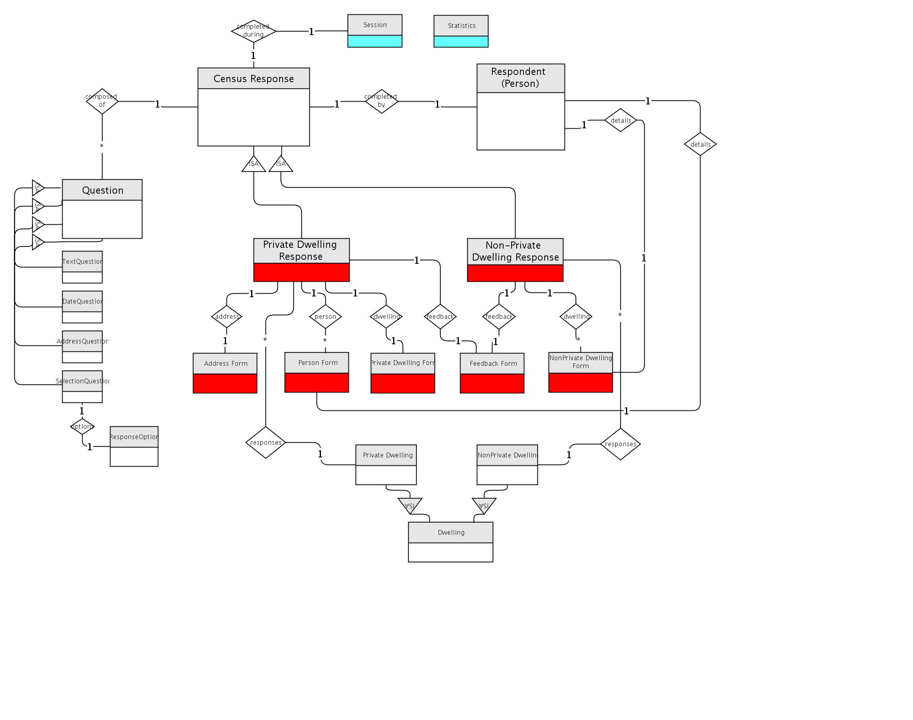

## Diagram

### Name

High Level ECS Data Model

### Description

## Element

[Expand all](#){ .md-button .diff-line }

### Entities

    

Address Form

<table>
    <caption></caption>
    <thead>
        <tr>
            <th></th>
            <th></th>
        </tr>
    </thead>
    <tr>
        <td> <strong>Name</strong> </td>
        <td>Address Form</td>
    </tr>
    <tr>
        <td> <strong>Description</strong> </td>
        <td></td>
    </tr>
    <tr>
        <td> <strong>Attributes</strong> </td>
        
        <td>
                
                
<strong>Form State,</strong>[JSON]

                

                
            </td>
        
    </tr>
</table>

    

AddressQuestion

<table>
    <caption></caption>
    <thead>
        <tr>
            <th></th>
            <th></th>
        </tr>
    </thead>
    <tr>
        <td> <strong>Name</strong> </td>
        <td>AddressQuestion</td>
    </tr>
    <tr>
        <td> <strong>Description</strong> </td>
        <td></td>
    </tr>
    <tr>
        <td> <strong>Attributes</strong> </td>
        
        <td>
                
            </td>
        
    </tr>
</table>

    

Census Response

<table>
    <caption></caption>
    <thead>
        <tr>
            <th></th>
            <th></th>
        </tr>
    </thead>
    <tr>
        <td> <strong>Name</strong> </td>
        <td>Census Response</td>
    </tr>
    <tr>
        <td> <strong>Description</strong> </td>
        <td></td>
    </tr>
    <tr>
        <td> <strong>Attributes</strong> </td>
        
        <td>
                
                
<strong>Census Form Number (CFN),</strong>[Integer]

                
Part of authentication credential

                
                
<strong>Electronic Census Number (eCN),</strong>[Integer]

                

                
                
<strong>Response State,</strong>[JSON]

                

                
            </td>
        
    </tr>
</table>

    

DateQuestion

<table>
    <caption></caption>
    <thead>
        <tr>
            <th></th>
            <th></th>
        </tr>
    </thead>
    <tr>
        <td> <strong>Name</strong> </td>
        <td>DateQuestion</td>
    </tr>
    <tr>
        <td> <strong>Description</strong> </td>
        <td></td>
    </tr>
    <tr>
        <td> <strong>Attributes</strong> </td>
        
        <td>
                
            </td>
        
    </tr>
</table>

    

Dwelling

<table>
    <caption></caption>
    <thead>
        <tr>
            <th></th>
            <th></th>
        </tr>
    </thead>
    <tr>
        <td> <strong>Name</strong> </td>
        <td>Dwelling</td>
    </tr>
    <tr>
        <td> <strong>Description</strong> </td>
        <td></td>
    </tr>
    <tr>
        <td> <strong>Attributes</strong> </td>
        
        <td>
                
                
<strong>Census Form Number (CFN),</strong>[Integer]

                

                
            </td>
        
    </tr>
</table>

    

Feedback Form

<table>
    <caption></caption>
    <thead>
        <tr>
            <th></th>
            <th></th>
        </tr>
    </thead>
    <tr>
        <td> <strong>Name</strong> </td>
        <td>Feedback Form</td>
    </tr>
    <tr>
        <td> <strong>Description</strong> </td>
        <td></td>
    </tr>
    <tr>
        <td> <strong>Attributes</strong> </td>
        
        <td>
                
                
<strong>feedback,</strong>[JSON]

                

                
            </td>
        
    </tr>
</table>

    

Non-Private Dwelling Response

<table>
    <caption></caption>
    <thead>
        <tr>
            <th></th>
            <th></th>
        </tr>
    </thead>
    <tr>
        <td> <strong>Name</strong> </td>
        <td>Non-Private Dwelling Response</td>
    </tr>
    <tr>
        <td> <strong>Description</strong> </td>
        <td></td>
    </tr>
    <tr>
        <td> <strong>Attributes</strong> </td>
        
        <td>
                
            </td>
        
    </tr>
</table>

    

NonPrivate Dwelling

<table>
    <caption></caption>
    <thead>
        <tr>
            <th></th>
            <th></th>
        </tr>
    </thead>
    <tr>
        <td> <strong>Name</strong> </td>
        <td>NonPrivate Dwelling</td>
    </tr>
    <tr>
        <td> <strong>Description</strong> </td>
        <td></td>
    </tr>
    <tr>
        <td> <strong>Attributes</strong> </td>
        
        <td>
                
            </td>
        
    </tr>
</table>

    

NonPrivate Dwelling Form

<table>
    <caption></caption>
    <thead>
        <tr>
            <th></th>
            <th></th>
        </tr>
    </thead>
    <tr>
        <td> <strong>Name</strong> </td>
        <td>NonPrivate Dwelling Form</td>
    </tr>
    <tr>
        <td> <strong>Description</strong> </td>
        <td></td>
    </tr>
    <tr>
        <td> <strong>Attributes</strong> </td>
        
        <td>
                
                
<strong>Form State,</strong>[JSON]

                

                
            </td>
        
    </tr>
</table>

    

Person Form

<table>
    <caption></caption>
    <thead>
        <tr>
            <th></th>
            <th></th>
        </tr>
    </thead>
    <tr>
        <td> <strong>Name</strong> </td>
        <td>Person Form</td>
    </tr>
    <tr>
        <td> <strong>Description</strong> </td>
        <td></td>
    </tr>
    <tr>
        <td> <strong>Attributes</strong> </td>
        
        <td>
                
                
<strong>Form State,</strong>[JSON]

                

                
            </td>
        
    </tr>
</table>

    

Private Dwelling

<table>
    <caption></caption>
    <thead>
        <tr>
            <th></th>
            <th></th>
        </tr>
    </thead>
    <tr>
        <td> <strong>Name</strong> </td>
        <td>Private Dwelling</td>
    </tr>
    <tr>
        <td> <strong>Description</strong> </td>
        <td></td>
    </tr>
    <tr>
        <td> <strong>Attributes</strong> </td>
        
        <td>
                
            </td>
        
    </tr>
</table>

    

Private Dwelling Form

<table>
    <caption></caption>
    <thead>
        <tr>
            <th></th>
            <th></th>
        </tr>
    </thead>
    <tr>
        <td> <strong>Name</strong> </td>
        <td>Private Dwelling Form</td>
    </tr>
    <tr>
        <td> <strong>Description</strong> </td>
        <td></td>
    </tr>
    <tr>
        <td> <strong>Attributes</strong> </td>
        
        <td>
                
                
<strong>Form State,</strong>[JSON]

                

                
            </td>
        
    </tr>
</table>

    

Private Dwelling Response

<table>
    <caption></caption>
    <thead>
        <tr>
            <th></th>
            <th></th>
        </tr>
    </thead>
    <tr>
        <td> <strong>Name</strong> </td>
        <td>Private Dwelling Response</td>
    </tr>
    <tr>
        <td> <strong>Description</strong> </td>
        <td></td>
    </tr>
    <tr>
        <td> <strong>Attributes</strong> </td>
        
        <td>
                
            </td>
        
    </tr>
</table>

    

Question

<table>
    <caption></caption>
    <thead>
        <tr>
            <th></th>
            <th></th>
        </tr>
    </thead>
    <tr>
        <td> <strong>Name</strong> </td>
        <td>Question</td>
    </tr>
    <tr>
        <td> <strong>Description</strong> </td>
        <td></td>
    </tr>
    <tr>
        <td> <strong>Attributes</strong> </td>
        
        <td>
                
                
<strong>Help Text,</strong>[String]

                

                
                
<strong>Question Text,</strong>[String]

                

                
            </td>
        
    </tr>
</table>

    

Respondent (Person)

<table>
    <caption></caption>
    <thead>
        <tr>
            <th></th>
            <th></th>
        </tr>
    </thead>
    <tr>
        <td> <strong>Name</strong> </td>
        <td>Respondent (Person)</td>
    </tr>
    <tr>
        <td> <strong>Description</strong> </td>
        <td></td>
    </tr>
    <tr>
        <td> <strong>Attributes</strong> </td>
        
        <td>
                
                
<strong>Age (years),</strong>[Integer]

                

                
                
<strong>Gender,</strong>[String]

                

                
                
<strong>Name,</strong>[String]

                

                
            </td>
        
    </tr>
</table>

    

ResponseOption

<table>
    <caption></caption>
    <thead>
        <tr>
            <th></th>
            <th></th>
        </tr>
    </thead>
    <tr>
        <td> <strong>Name</strong> </td>
        <td>ResponseOption</td>
    </tr>
    <tr>
        <td> <strong>Description</strong> </td>
        <td></td>
    </tr>
    <tr>
        <td> <strong>Attributes</strong> </td>
        
        <td>
                
                
<strong>OptionValue,</strong>[]

                

                
            </td>
        
    </tr>
</table>

    

SelectionQuestion

<table>
    <caption></caption>
    <thead>
        <tr>
            <th></th>
            <th></th>
        </tr>
    </thead>
    <tr>
        <td> <strong>Name</strong> </td>
        <td>SelectionQuestion</td>
    </tr>
    <tr>
        <td> <strong>Description</strong> </td>
        <td></td>
    </tr>
    <tr>
        <td> <strong>Attributes</strong> </td>
        
        <td>
                
            </td>
        
    </tr>
</table>

    

Session

<table>
    <caption></caption>
    <thead>
        <tr>
            <th></th>
            <th></th>
        </tr>
    </thead>
    <tr>
        <td> <strong>Name</strong> </td>
        <td>Session</td>
    </tr>
    <tr>
        <td> <strong>Description</strong> </td>
        <td></td>
    </tr>
    <tr>
        <td> <strong>Attributes</strong> </td>
        
        <td>
                
            </td>
        
    </tr>
</table>

    

Statistics

<table>
    <caption></caption>
    <thead>
        <tr>
            <th></th>
            <th></th>
        </tr>
    </thead>
    <tr>
        <td> <strong>Name</strong> </td>
        <td>Statistics</td>
    </tr>
    <tr>
        <td> <strong>Description</strong> </td>
        <td></td>
    </tr>
    <tr>
        <td> <strong>Attributes</strong> </td>
        
        <td>
                
            </td>
        
    </tr>
</table>

    

TextQuestion

<table>
    <caption></caption>
    <thead>
        <tr>
            <th></th>
            <th></th>
        </tr>
    </thead>
    <tr>
        <td> <strong>Name</strong> </td>
        <td>TextQuestion</td>
    </tr>
    <tr>
        <td> <strong>Description</strong> </td>
        <td></td>
    </tr>
    <tr>
        <td> <strong>Attributes</strong> </td>
        
        <td>
                
            </td>
        
    </tr>
</table>

    

### Relationships

    

address

<table>
    <caption></caption>
    <thead>
        <tr>
            <th></th>
            <th></th>
        </tr>
    </thead>
    <tr>
        <td> <strong>Name</strong> </td>
        <td>address</td>
    </tr>
    <tr>
        <td> <strong>Description</strong> </td>
        <td></td>
    </tr>
    <tr>
        <td> <strong>Attributes</strong> </td>
        
        <td>
                
            </td>
        
    </tr>
    <tr>
        <td> <strong>Relationship Connections</strong> </td>
        
        <td>
                
                
<strong>1,</strong>[1]

                
Address Form

                
                
<strong>1,</strong>[1]

                
Private Dwelling Response

                
            </td>
        
    </tr>
</table>

    

completed by

<table>
    <caption></caption>
    <thead>
        <tr>
            <th></th>
            <th></th>
        </tr>
    </thead>
    <tr>
        <td> <strong>Name</strong> </td>
        <td>completed by</td>
    </tr>
    <tr>
        <td> <strong>Description</strong> </td>
        <td></td>
    </tr>
    <tr>
        <td> <strong>Attributes</strong> </td>
        
        <td>
                
            </td>
        
    </tr>
    <tr>
        <td> <strong>Relationship Connections</strong> </td>
        
        <td>
                
                
<strong>1,</strong>[1]

                
Respondent (Person)

                
                
<strong>1,</strong>[1]

                
Census Response

                
            </td>
        
    </tr>
</table>

    

completed during

<table>
    <caption></caption>
    <thead>
        <tr>
            <th></th>
            <th></th>
        </tr>
    </thead>
    <tr>
        <td> <strong>Name</strong> </td>
        <td>completed during</td>
    </tr>
    <tr>
        <td> <strong>Description</strong> </td>
        <td></td>
    </tr>
    <tr>
        <td> <strong>Attributes</strong> </td>
        
        <td>
                
            </td>
        
    </tr>
    <tr>
        <td> <strong>Relationship Connections</strong> </td>
        
        <td>
                
                
<strong>1,</strong>[1]

                
Census Response

                
                
<strong>1,</strong>[1]

                
Session

                
            </td>
        
    </tr>
</table>

    

composed of

<table>
    <caption></caption>
    <thead>
        <tr>
            <th></th>
            <th></th>
        </tr>
    </thead>
    <tr>
        <td> <strong>Name</strong> </td>
        <td>composed of</td>
    </tr>
    <tr>
        <td> <strong>Description</strong> </td>
        <td></td>
    </tr>
    <tr>
        <td> <strong>Attributes</strong> </td>
        
        <td>
                
            </td>
        
    </tr>
    <tr>
        <td> <strong>Relationship Connections</strong> </td>
        
        <td>
                
                
<strong>*,</strong>[*]

                
Question

                
                
<strong>1,</strong>[1]

                
Census Response

                
            </td>
        
    </tr>
</table>

    

details

<table>
    <caption></caption>
    <thead>
        <tr>
            <th></th>
            <th></th>
        </tr>
    </thead>
    <tr>
        <td> <strong>Name</strong> </td>
        <td>details</td>
    </tr>
    <tr>
        <td> <strong>Description</strong> </td>
        <td></td>
    </tr>
    <tr>
        <td> <strong>Attributes</strong> </td>
        
        <td>
                
            </td>
        
    </tr>
    <tr>
        <td> <strong>Relationship Connections</strong> </td>
        
        <td>
                
                
<strong>1,</strong>[1]

                
Respondent (Person)

                
                
<strong>1,</strong>[1]

                
NonPrivate Dwelling Form

                
            </td>
        
    </tr>
</table>

    

details

<table>
    <caption></caption>
    <thead>
        <tr>
            <th></th>
            <th></th>
        </tr>
    </thead>
    <tr>
        <td> <strong>Name</strong> </td>
        <td>details</td>
    </tr>
    <tr>
        <td> <strong>Description</strong> </td>
        <td></td>
    </tr>
    <tr>
        <td> <strong>Attributes</strong> </td>
        
        <td>
                
            </td>
        
    </tr>
    <tr>
        <td> <strong>Relationship Connections</strong> </td>
        
        <td>
                
                
<strong>1,</strong>[1]

                
Respondent (Person)

                
                
<strong>1,</strong>[1]

                
Person Form

                
            </td>
        
    </tr>
</table>

    

dwelling

<table>
    <caption></caption>
    <thead>
        <tr>
            <th></th>
            <th></th>
        </tr>
    </thead>
    <tr>
        <td> <strong>Name</strong> </td>
        <td>dwelling</td>
    </tr>
    <tr>
        <td> <strong>Description</strong> </td>
        <td></td>
    </tr>
    <tr>
        <td> <strong>Attributes</strong> </td>
        
        <td>
                
            </td>
        
    </tr>
    <tr>
        <td> <strong>Relationship Connections</strong> </td>
        
        <td>
                
                
<strong>1,</strong>[1]

                
Private Dwelling Response

                
                
<strong>1,</strong>[1]

                
Private Dwelling Form

                
            </td>
        
    </tr>
</table>

    

dwelling

<table>
    <caption></caption>
    <thead>
        <tr>
            <th></th>
            <th></th>
        </tr>
    </thead>
    <tr>
        <td> <strong>Name</strong> </td>
        <td>dwelling</td>
    </tr>
    <tr>
        <td> <strong>Description</strong> </td>
        <td></td>
    </tr>
    <tr>
        <td> <strong>Attributes</strong> </td>
        
        <td>
                
            </td>
        
    </tr>
    <tr>
        <td> <strong>Relationship Connections</strong> </td>
        
        <td>
                
                
<strong>1,</strong>[1]

                
Non-Private Dwelling Response

                
                
<strong>*,</strong>[*]

                
NonPrivate Dwelling Form

                
            </td>
        
    </tr>
</table>

    

feedback

<table>
    <caption></caption>
    <thead>
        <tr>
            <th></th>
            <th></th>
        </tr>
    </thead>
    <tr>
        <td> <strong>Name</strong> </td>
        <td>feedback</td>
    </tr>
    <tr>
        <td> <strong>Description</strong> </td>
        <td></td>
    </tr>
    <tr>
        <td> <strong>Attributes</strong> </td>
        
        <td>
                
            </td>
        
    </tr>
    <tr>
        <td> <strong>Relationship Connections</strong> </td>
        
        <td>
                
                
<strong>1,</strong>[1]

                
Feedback Form

                
                
<strong>1,</strong>[1]

                
Private Dwelling Response

                
            </td>
        
    </tr>
</table>

    

feedback

<table>
    <caption></caption>
    <thead>
        <tr>
            <th></th>
            <th></th>
        </tr>
    </thead>
    <tr>
        <td> <strong>Name</strong> </td>
        <td>feedback</td>
    </tr>
    <tr>
        <td> <strong>Description</strong> </td>
        <td></td>
    </tr>
    <tr>
        <td> <strong>Attributes</strong> </td>
        
        <td>
                
            </td>
        
    </tr>
    <tr>
        <td> <strong>Relationship Connections</strong> </td>
        
        <td>
                
                
<strong>1,</strong>[1]

                
Non-Private Dwelling Response

                
                
<strong>1,</strong>[1]

                
Feedback Form

                
            </td>
        
    </tr>
</table>

    

options

<table>
    <caption></caption>
    <thead>
        <tr>
            <th></th>
            <th></th>
        </tr>
    </thead>
    <tr>
        <td> <strong>Name</strong> </td>
        <td>options</td>
    </tr>
    <tr>
        <td> <strong>Description</strong> </td>
        <td></td>
    </tr>
    <tr>
        <td> <strong>Attributes</strong> </td>
        
        <td>
                
            </td>
        
    </tr>
    <tr>
        <td> <strong>Relationship Connections</strong> </td>
        
        <td>
                
                
<strong>1,</strong>[1]

                
SelectionQuestion

                
                
<strong>1,</strong>[1]

                
ResponseOption

                
            </td>
        
    </tr>
</table>

    

person

<table>
    <caption></caption>
    <thead>
        <tr>
            <th></th>
            <th></th>
        </tr>
    </thead>
    <tr>
        <td> <strong>Name</strong> </td>
        <td>person</td>
    </tr>
    <tr>
        <td> <strong>Description</strong> </td>
        <td>1..10
</td>
    </tr>
    <tr>
        <td> <strong>Attributes</strong> </td>
        
        <td>
                
            </td>
        
    </tr>
    <tr>
        <td> <strong>Relationship Connections</strong> </td>
        
        <td>
                
                
<strong>*,</strong>[*]

                
Person Form

                
                
<strong>1,</strong>[1]

                
Private Dwelling Response

                
            </td>
        
    </tr>
</table>

    

responses

<table>
    <caption></caption>
    <thead>
        <tr>
            <th></th>
            <th></th>
        </tr>
    </thead>
    <tr>
        <td> <strong>Name</strong> </td>
        <td>responses</td>
    </tr>
    <tr>
        <td> <strong>Description</strong> </td>
        <td></td>
    </tr>
    <tr>
        <td> <strong>Attributes</strong> </td>
        
        <td>
                
            </td>
        
    </tr>
    <tr>
        <td> <strong>Relationship Connections</strong> </td>
        
        <td>
                
                
<strong>1,</strong>[1]

                
Private Dwelling

                
                
<strong>*,</strong>[*]

                
Private Dwelling Response

                
            </td>
        
    </tr>
</table>

    

responses

<table>
    <caption></caption>
    <thead>
        <tr>
            <th></th>
            <th></th>
        </tr>
    </thead>
    <tr>
        <td> <strong>Name</strong> </td>
        <td>responses</td>
    </tr>
    <tr>
        <td> <strong>Description</strong> </td>
        <td></td>
    </tr>
    <tr>
        <td> <strong>Attributes</strong> </td>
        
        <td>
                
            </td>
        
    </tr>
    <tr>
        <td> <strong>Relationship Connections</strong> </td>
        
        <td>
                
                
<strong>1,</strong>[1]

                
NonPrivate Dwelling

                
                
<strong>*,</strong>[*]

                
Non-Private Dwelling Response

                
            </td>
        
    </tr>
</table>

    

