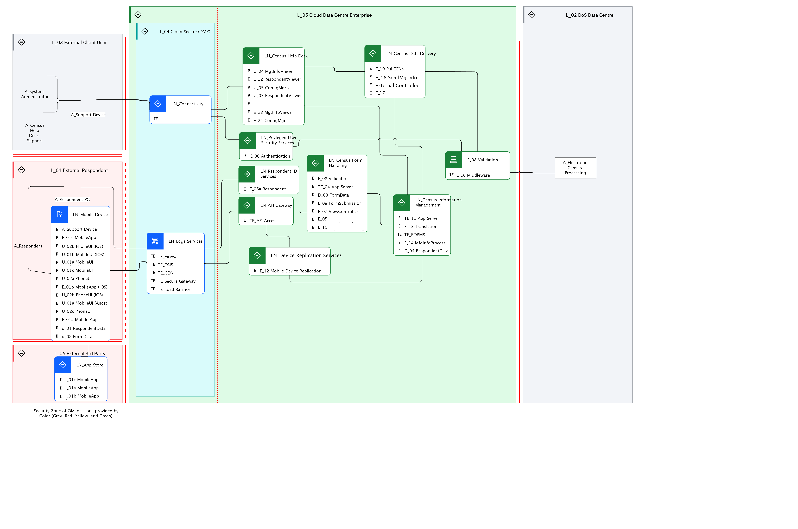

## Diagram

### Name

LOM Base - new

### Description

This is a Logical Operational View of the ECS solution. Identified Actors, along with Logical Nodes, are placed onto the Logical Location View developed earlier. In addition, the identified Deployment Units are “deployed” onto Nodes in the model. The ECS solution is consistent with a generic web application hosting pattern.

## Element

[Expand all](#){ .md-button .diff-line }

### Actor

    

A_Electronic Census Processing

<table>
    <caption></caption>
    <thead>
        <tr>
            <th></th>
            <th></th>
        </tr>
    </thead>
    <tr>
        <td> <strong>Name</strong> </td>
        <td>A_Electronic Census Processing</td>
    </tr>
    <tr>
        <td> <strong>Description</strong> </td>
        <td></td>
    </tr>
    <tr>
        <td> <strong>Type</strong> </td>
        <td>IT System</td>
    </tr>
    <tr>
        <td> <strong>Generic Group</strong> </td>
<td>
        
</td>
    </tr>
</table>

    

A_Support Device

<table>
    <caption></caption>
    <thead>
        <tr>
            <th></th>
            <th></th>
        </tr>
    </thead>
    <tr>
        <td> <strong>Name</strong> </td>
        <td>A_Support Device</td>
    </tr>
    <tr>
        <td> <strong>Description</strong> </td>
        <td>PC or mobile device used by help desk support person.  They are using the system via a browser, so no software to be deployed.

The browser accessed user interface - must meet the accessibility requirements including operation with JavaScript disabled and support for screen readers. ECS application running on the server generates all HTML pages displayed to the respondent and performs all field validation, business rule and mandatory question checks, and subsequent processing. The browser performs the pure presentation layer function, and thus every individual page transition requires interaction with the server.</td>
    </tr>
    <tr>
        <td> <strong>Type</strong> </td>
        <td>IT System</td>
    </tr>
    <tr>
        <td> <strong>Generic Group</strong> </td>
<td>
        
</td>
    </tr>
</table>

    

A_System Administrator

<table>
    <caption></caption>
    <thead>
        <tr>
            <th></th>
            <th></th>
        </tr>
    </thead>
    <tr>
        <td> <strong>Name</strong> </td>
        <td>A_System Administrator</td>
    </tr>
    <tr>
        <td> <strong>Description</strong> </td>
        <td>The System Administrator is responsible for support of the ECS system itself.  The System Administrator deploys new versions of the ECS system and may be involved in problem troubleshooting on request from the Census Help Desk.</td>
    </tr>
    <tr>
        <td> <strong>Type</strong> </td>
        <td>Human</td>
    </tr>
    <tr>
        <td> <strong>Generic Group</strong> </td>
<td>
        
                
                
<strong>SubSystem,Access</strong>[Auto-Generated]

                
This group is derived from SubSystem named Access.

                
                
</td>
    </tr>
</table>

    

A_Census Help Desk Support

<table>
    <caption></caption>
    <thead>
        <tr>
            <th></th>
            <th></th>
        </tr>
    </thead>
    <tr>
        <td> <strong>Name</strong> </td>
        <td>A_Census Help Desk Support</td>
    </tr>
    <tr>
        <td> <strong>Description</strong> </td>
        <td>Help desk provides visibility to end-user issues.</td>
    </tr>
    <tr>
        <td> <strong>Type</strong> </td>
        <td>Human</td>
    </tr>
    <tr>
        <td> <strong>Generic Group</strong> </td>
<td>
        
</td>
    </tr>
</table>

    

A_Respondent

<table>
    <caption></caption>
    <thead>
        <tr>
            <th></th>
            <th></th>
        </tr>
    </thead>
    <tr>
        <td> <strong>Name</strong> </td>
        <td>A_Respondent</td>
    </tr>
    <tr>
        <td> <strong>Description</strong> </td>
        <td>Census form respondent, might be using a PC, or a mobile device.</td>
    </tr>
    <tr>
        <td> <strong>Type</strong> </td>
        <td>Human</td>
    </tr>
    <tr>
        <td> <strong>Generic Group</strong> </td>
<td>
        
                
                
<strong>SubSystem,Access</strong>[Auto-Generated]

                
This group is derived from SubSystem named Access.

                
                
</td>
    </tr>
</table>

    

A_Respondent PC

<table>
    <caption></caption>
    <thead>
        <tr>
            <th></th>
            <th></th>
        </tr>
    </thead>
    <tr>
        <td> <strong>Name</strong> </td>
        <td>A_Respondent PC</td>
    </tr>
    <tr>
        <td> <strong>Description</strong> </td>
        <td>PC used by census respondent, in this case using a browser to access the centralized version of the application.</td>
    </tr>
    <tr>
        <td> <strong>Type</strong> </td>
        <td>IT System</td>
    </tr>
    <tr>
        <td> <strong>Generic Group</strong> </td>
<td>
        
</td>
    </tr>
</table>

    

### Subsystem

### OMLocation

    

L_01 External Respondent

<table>
    <caption></caption>
    <thead>
        <tr>
            <th></th>
            <th></th>
        </tr>
    </thead>
    <tr>
        <td> <strong>Name</strong> </td>
        <td>L_01 External Respondent</td>
    </tr>
    <tr>
        <td> <strong>Description</strong> </td>
        <td>L_External Respondent

Cardinality = 10,000,000</td>
    </tr>
</table>

    

L_02 DoS Data Centre

<table>
    <caption></caption>
    <thead>
        <tr>
            <th></th>
            <th></th>
        </tr>
    </thead>
    <tr>
        <td> <strong>Name</strong> </td>
        <td>L_02 DoS Data Centre</td>
    </tr>
    <tr>
        <td> <strong>Description</strong> </td>
        <td>L_External Client Data Centre

Cardinality = 1</td>
    </tr>
</table>

    

L_03 External Client User

<table>
    <caption></caption>
    <thead>
        <tr>
            <th></th>
            <th></th>
        </tr>
    </thead>
    <tr>
        <td> <strong>Name</strong> </td>
        <td>L_03 External Client User</td>
    </tr>
    <tr>
        <td> <strong>Description</strong> </td>
        <td>L_External Client User

Cardinality = 1</td>
    </tr>
</table>

    

L_04 Cloud Secure (DMZ)

<table>
    <caption></caption>
    <thead>
        <tr>
            <th></th>
            <th></th>
        </tr>
    </thead>
    <tr>
        <td> <strong>Name</strong> </td>
        <td>L_04 Cloud Secure (DMZ)</td>
    </tr>
    <tr>
        <td> <strong>Description</strong> </td>
        <td>L_Cloud Secure (DMZ)

Cardinality = 1</td>
    </tr>
</table>

    

L_05 Cloud Data Centre Enterprise

<table>
    <caption></caption>
    <thead>
        <tr>
            <th></th>
            <th></th>
        </tr>
    </thead>
    <tr>
        <td> <strong>Name</strong> </td>
        <td>L_05 Cloud Data Centre Enterprise</td>
    </tr>
    <tr>
        <td> <strong>Description</strong> </td>
        <td>L_Cloud Data Centre Enterprise

Cardinality = 1</td>
    </tr>
</table>

    

L_06 External 3rd Party

<table>
    <caption></caption>
    <thead>
        <tr>
            <th></th>
            <th></th>
        </tr>
    </thead>
    <tr>
        <td> <strong>Name</strong> </td>
        <td>L_06 External 3rd Party</td>
    </tr>
    <tr>
        <td> <strong>Description</strong> </td>
        <td>L_External 3rd Party

Cardinality = 3</td>
    </tr>
</table>

    

### Logical Connection

    

<table>
    <caption></caption>
    <thead>
        <tr>
            <th></th>
            <th></th>
        </tr>
    </thead>
    <tr>
        <td> <strong>Name</strong> </td>
        <td></td>
    </tr>
    <tr>
        <td> <strong>Description</strong> </td>
        <td></td>
    </tr>
</table>

    

<table>
    <caption></caption>
    <thead>
        <tr>
            <th></th>
            <th></th>
        </tr>
    </thead>
    <tr>
        <td> <strong>Name</strong> </td>
        <td></td>
    </tr>
    <tr>
        <td> <strong>Description</strong> </td>
        <td></td>
    </tr>
</table>

    

<table>
    <caption></caption>
    <thead>
        <tr>
            <th></th>
            <th></th>
        </tr>
    </thead>
    <tr>
        <td> <strong>Name</strong> </td>
        <td></td>
    </tr>
    <tr>
        <td> <strong>Description</strong> </td>
        <td></td>
    </tr>
</table>

    

<table>
    <caption></caption>
    <thead>
        <tr>
            <th></th>
            <th></th>
        </tr>
    </thead>
    <tr>
        <td> <strong>Name</strong> </td>
        <td></td>
    </tr>
    <tr>
        <td> <strong>Description</strong> </td>
        <td></td>
    </tr>
</table>

    

<table>
    <caption></caption>
    <thead>
        <tr>
            <th></th>
            <th></th>
        </tr>
    </thead>
    <tr>
        <td> <strong>Name</strong> </td>
        <td></td>
    </tr>
    <tr>
        <td> <strong>Description</strong> </td>
        <td></td>
    </tr>
</table>

    

<table>
    <caption></caption>
    <thead>
        <tr>
            <th></th>
            <th></th>
        </tr>
    </thead>
    <tr>
        <td> <strong>Name</strong> </td>
        <td></td>
    </tr>
    <tr>
        <td> <strong>Description</strong> </td>
        <td></td>
    </tr>
</table>

    

<table>
    <caption></caption>
    <thead>
        <tr>
            <th></th>
            <th></th>
        </tr>
    </thead>
    <tr>
        <td> <strong>Name</strong> </td>
        <td></td>
    </tr>
    <tr>
        <td> <strong>Description</strong> </td>
        <td></td>
    </tr>
</table>

    

<table>
    <caption></caption>
    <thead>
        <tr>
            <th></th>
            <th></th>
        </tr>
    </thead>
    <tr>
        <td> <strong>Name</strong> </td>
        <td></td>
    </tr>
    <tr>
        <td> <strong>Description</strong> </td>
        <td></td>
    </tr>
</table>

    

<table>
    <caption></caption>
    <thead>
        <tr>
            <th></th>
            <th></th>
        </tr>
    </thead>
    <tr>
        <td> <strong>Name</strong> </td>
        <td></td>
    </tr>
    <tr>
        <td> <strong>Description</strong> </td>
        <td></td>
    </tr>
</table>

    

<table>
    <caption></caption>
    <thead>
        <tr>
            <th></th>
            <th></th>
        </tr>
    </thead>
    <tr>
        <td> <strong>Name</strong> </td>
        <td></td>
    </tr>
    <tr>
        <td> <strong>Description</strong> </td>
        <td></td>
    </tr>
</table>

    

<table>
    <caption></caption>
    <thead>
        <tr>
            <th></th>
            <th></th>
        </tr>
    </thead>
    <tr>
        <td> <strong>Name</strong> </td>
        <td></td>
    </tr>
    <tr>
        <td> <strong>Description</strong> </td>
        <td></td>
    </tr>
</table>

    

<table>
    <caption></caption>
    <thead>
        <tr>
            <th></th>
            <th></th>
        </tr>
    </thead>
    <tr>
        <td> <strong>Name</strong> </td>
        <td></td>
    </tr>
    <tr>
        <td> <strong>Description</strong> </td>
        <td></td>
    </tr>
</table>

    

<table>
    <caption></caption>
    <thead>
        <tr>
            <th></th>
            <th></th>
        </tr>
    </thead>
    <tr>
        <td> <strong>Name</strong> </td>
        <td></td>
    </tr>
    <tr>
        <td> <strong>Description</strong> </td>
        <td></td>
    </tr>
</table>

    

<table>
    <caption></caption>
    <thead>
        <tr>
            <th></th>
            <th></th>
        </tr>
    </thead>
    <tr>
        <td> <strong>Name</strong> </td>
        <td></td>
    </tr>
    <tr>
        <td> <strong>Description</strong> </td>
        <td></td>
    </tr>
</table>

    

<table>
    <caption></caption>
    <thead>
        <tr>
            <th></th>
            <th></th>
        </tr>
    </thead>
    <tr>
        <td> <strong>Name</strong> </td>
        <td></td>
    </tr>
    <tr>
        <td> <strong>Description</strong> </td>
        <td></td>
    </tr>
</table>

    

<table>
    <caption></caption>
    <thead>
        <tr>
            <th></th>
            <th></th>
        </tr>
    </thead>
    <tr>
        <td> <strong>Name</strong> </td>
        <td></td>
    </tr>
    <tr>
        <td> <strong>Description</strong> </td>
        <td></td>
    </tr>
</table>

    

<table>
    <caption></caption>
    <thead>
        <tr>
            <th></th>
            <th></th>
        </tr>
    </thead>
    <tr>
        <td> <strong>Name</strong> </td>
        <td></td>
    </tr>
    <tr>
        <td> <strong>Description</strong> </td>
        <td></td>
    </tr>
</table>

    

<table>
    <caption></caption>
    <thead>
        <tr>
            <th></th>
            <th></th>
        </tr>
    </thead>
    <tr>
        <td> <strong>Name</strong> </td>
        <td></td>
    </tr>
    <tr>
        <td> <strong>Description</strong> </td>
        <td></td>
    </tr>
</table>

    

<table>
    <caption></caption>
    <thead>
        <tr>
            <th></th>
            <th></th>
        </tr>
    </thead>
    <tr>
        <td> <strong>Name</strong> </td>
        <td></td>
    </tr>
    <tr>
        <td> <strong>Description</strong> </td>
        <td></td>
    </tr>
</table>

    

### Logical Node

    

LN_API Gateway

<table>
    <caption></caption>
    <thead>
        <tr>
            <th></th>
            <th></th>
        </tr>
    </thead>
    <tr>
        <td> <strong>Name</strong> </td>
        <td>LN_API Gateway</td>
    </tr>
    <tr>
        <td> <strong>Description</strong> </td>
        <td></td>
    </tr>
    <tr>
        <td> <strong>Type</strong> </td>
        <td></td>
    </tr>
    <tr>
        <td> <strong>Primary Capability</strong> </td>
        <td>
            
        </td>
    </tr>
    <tr>
        <td> <strong>Implementation</strong> </td>
        <td>
            
                
<a href="https://www.ibm.com/cloud/api-connect">IBM API Connect</a>

            
        </td>
    </tr>
    <tr>
        <td> <strong>Architectural Decision</strong> </td>
        <td>
            
        </td>
    </tr>
    <tr>
        <td> <strong>Non Functional Requirement</strong> </td>
        <td>
            
        </td>
    </tr>
    <tr>
        <td> <strong>Generic Group</strong> </td>
        <td></td>
    </tr>
    <tr>
        <td> <strong>Sub-level Diagram</strong> </td>
        <td></td>
    </tr>
    <tr>
        <td> <strong>Related Diagrams</strong> </td>
        <td>
            
                
<a href="../../Logical Operational View/lomview_S18vZHZqK9FO_r13-bc9lY_BJK24keC9">LOM - Base</a>

            
                
<a href="../../Logical Operational View/lomview_SJ4GogkCd_r13-bc9lY_BJK24keC9">LOM Base - new</a>

            
                
<a href="../../Prescribed Operational Model/pomview_ryoKWHbcF9Yd_r13-bc9lY_BJK24keC9">POM - Base</a>

            
        </td>
    </tr>
    <tr>
        <td> <strong>Related Elements</strong> </td>
        <td>
            
                
PN_Gateway

                
                    
                    <li><a href="../../Prescribed Operational Model/pomview_ryoKWHbcF9Yd_r13-bc9lY_BJK24keC9">POM - Base</a></li>
                    
                
            
                
L_05 Cloud Data Centre Enterprise

                
                    
                    <li><a href="../../Logical Operational View/lomview_S18vZHZqK9FO_r13-bc9lY_BJK24keC9">LOM - Base</a></li>
                    
                    <li><a href="../../Logical Operational View/lomview_SJ4GogkCd_r13-bc9lY_BJK24keC9">LOM Base - new</a></li>
                    
                
            
            
                
TE_API Access

                
                    
                    <li>
<a href="../../Prescribed Operational Model/pomview_ryoKWHbcF9Yd_r13-bc9lY_BJK24keC9">POM - Base</a>
</li>
                    
                    <li>
<a href="../../Logical Operational View/lomview_S18vZHZqK9FO_r13-bc9lY_BJK24keC9">LOM - Base</a>
</li>
                    
                    <li>
<a href="../../Logical Operational View/lomview_SJ4GogkCd_r13-bc9lY_BJK24keC9">LOM Base - new</a>
</li>
                    
                    <li>
<a href="../../Sequence View/cmdynamicview_rknuMrZcFqKO_r13-bc9lY_BJK24keC9">SD - UC_01 Logon</a>
</li>
                    
                    <li>
<a href="../../Static View/cmstaticview_2VSZD2lD7RK_r13-bc9lY_BJK24keC9">ECS Static View</a>
</li>
                    
                
            
        </td>
    </tr>
</table>

    

LN_App Store

<table>
    <caption></caption>
    <thead>
        <tr>
            <th></th>
            <th></th>
        </tr>
    </thead>
    <tr>
        <td> <strong>Name</strong> </td>
        <td>LN_App Store</td>
    </tr>
    <tr>
        <td> <strong>Description</strong> </td>
        <td></td>
    </tr>
    <tr>
        <td> <strong>Type</strong> </td>
        <td></td>
    </tr>
    <tr>
        <td> <strong>Primary Capability</strong> </td>
        <td>
            
        </td>
    </tr>
    <tr>
        <td> <strong>Implementation</strong> </td>
        <td>
            
                
<a href="">ECS Solution</a>

            
                
<a href="https://www.sqlite.org/index.html">SQLite</a>

            
                
<a href="">Android</a>

            
                
<a href="">IOS</a>

            
                
<a href="">Windows</a>

            
                
<a href="https://developers.google.com/maps/documentation/geolocation/overview">Google Maps API</a>

            
        </td>
    </tr>
    <tr>
        <td> <strong>Architectural Decision</strong> </td>
        <td>
            
        </td>
    </tr>
    <tr>
        <td> <strong>Non Functional Requirement</strong> </td>
        <td>
            
        </td>
    </tr>
    <tr>
        <td> <strong>Generic Group</strong> </td>
        <td></td>
    </tr>
    <tr>
        <td> <strong>Sub-level Diagram</strong> </td>
        <td></td>
    </tr>
    <tr>
        <td> <strong>Related Diagrams</strong> </td>
        <td>
            
                
<a href="../../Logical Operational View/lomview_S18vZHZqK9FO_r13-bc9lY_BJK24keC9">LOM - Base</a>

            
                
<a href="../../Logical Operational View/lomview_SJ4GogkCd_r13-bc9lY_BJK24keC9">LOM Base - new</a>

            
        </td>
    </tr>
    <tr>
        <td> <strong>Related Elements</strong> </td>
        <td>
            
                
L_06 External 3rd Party

                
                    
                    <li><a href="../../Logical Operational View/lomview_S18vZHZqK9FO_r13-bc9lY_BJK24keC9">LOM - Base</a></li>
                    
                    <li><a href="../../Logical Operational View/lomview_SJ4GogkCd_r13-bc9lY_BJK24keC9">LOM Base - new</a></li>
                    
                
            
            
                
I_01b MobileApp (IOS)

                
                    
                    <li>
<a href="../../Logical Operational View/lomview_S18vZHZqK9FO_r13-bc9lY_BJK24keC9">LOM - Base</a>
</li>
                    
                    <li>
<a href="../../Logical Operational View/lomview_SJ4GogkCd_r13-bc9lY_BJK24keC9">LOM Base - new</a>
</li>
                    
                    <li>
<a href="../../Static View/cmstaticview_2VSZD2lD7RK_r13-bc9lY_BJK24keC9">ECS Static View</a>
</li>
                    
                    <li>
<a href="../../Sequence View/cmdynamicview_rknuMrZcFqKO_r13-bc9lY_BJK24keC9">SD - UC_01 Logon</a>
</li>
                    
                
            
                
I_01a MobileApp (Android)

                
                    
                    <li>
<a href="../../Logical Operational View/lomview_S18vZHZqK9FO_r13-bc9lY_BJK24keC9">LOM - Base</a>
</li>
                    
                    <li>
<a href="../../Logical Operational View/lomview_SJ4GogkCd_r13-bc9lY_BJK24keC9">LOM Base - new</a>
</li>
                    
                    <li>
<a href="../../Static View/cmstaticview_2VSZD2lD7RK_r13-bc9lY_BJK24keC9">ECS Static View</a>
</li>
                    
                    <li>
<a href="../../Sequence View/cmdynamicview_rknuMrZcFqKO_r13-bc9lY_BJK24keC9">SD - UC_01 Logon</a>
</li>
                    
                
            
                
I_01c MobileApp (Windows)

                
                    
                    <li>
<a href="../../Logical Operational View/lomview_S18vZHZqK9FO_r13-bc9lY_BJK24keC9">LOM - Base</a>
</li>
                    
                    <li>
<a href="../../Logical Operational View/lomview_SJ4GogkCd_r13-bc9lY_BJK24keC9">LOM Base - new</a>
</li>
                    
                    <li>
<a href="../../Static View/cmstaticview_2VSZD2lD7RK_r13-bc9lY_BJK24keC9">ECS Static View</a>
</li>
                    
                    <li>
<a href="../../Sequence View/cmdynamicview_rknuMrZcFqKO_r13-bc9lY_BJK24keC9">SD - UC_01 Logon</a>
</li>
                    
                
            
        </td>
    </tr>
</table>

    

LN_Census Data Delivery

<table>
    <caption></caption>
    <thead>
        <tr>
            <th></th>
            <th></th>
        </tr>
    </thead>
    <tr>
        <td> <strong>Name</strong> </td>
        <td>LN_Census Data Delivery</td>
    </tr>
    <tr>
        <td> <strong>Description</strong> </td>
        <td></td>
    </tr>
    <tr>
        <td> <strong>Type</strong> </td>
        <td></td>
    </tr>
    <tr>
        <td> <strong>Primary Capability</strong> </td>
        <td>
            
        </td>
    </tr>
    <tr>
        <td> <strong>Implementation</strong> </td>
        <td>
            
        </td>
    </tr>
    <tr>
        <td> <strong>Architectural Decision</strong> </td>
        <td>
            
        </td>
    </tr>
    <tr>
        <td> <strong>Non Functional Requirement</strong> </td>
        <td>
            
        </td>
    </tr>
    <tr>
        <td> <strong>Generic Group</strong> </td>
        <td></td>
    </tr>
    <tr>
        <td> <strong>Sub-level Diagram</strong> </td>
        <td></td>
    </tr>
    <tr>
        <td> <strong>Related Diagrams</strong> </td>
        <td>
            
                
<a href="../../Logical Operational View/lomview_S18vZHZqK9FO_r13-bc9lY_BJK24keC9">LOM - Base</a>

            
                
<a href="../../Logical Operational View/lomview_SJ4GogkCd_r13-bc9lY_BJK24keC9">LOM Base - new</a>

            
                
<a href="../../Prescribed Operational Model/pomview_ryoKWHbcF9Yd_r13-bc9lY_BJK24keC9">POM - Base</a>

            
        </td>
    </tr>
    <tr>
        <td> <strong>Related Elements</strong> </td>
        <td>
            
                
PN_Messaging

                
                    
                    <li><a href="../../Prescribed Operational Model/pomview_ryoKWHbcF9Yd_r13-bc9lY_BJK24keC9">POM - Base</a></li>
                    
                
            
                
L_05 Cloud Data Centre Enterprise

                
                    
                    <li><a href="../../Logical Operational View/lomview_S18vZHZqK9FO_r13-bc9lY_BJK24keC9">LOM - Base</a></li>
                    
                    <li><a href="../../Logical Operational View/lomview_SJ4GogkCd_r13-bc9lY_BJK24keC9">LOM Base - new</a></li>
                    
                
            
            
                
E_17 SendRespondentData

                
                    
                    <li>
<a href="../../Prescribed Operational Model/pomview_ryoKWHbcF9Yd_r13-bc9lY_BJK24keC9">POM - Base</a>
</li>
                    
                    <li>
<a href="../../Logical Operational View/lomview_S18vZHZqK9FO_r13-bc9lY_BJK24keC9">LOM - Base</a>
</li>
                    
                    <li>
<a href="../../Logical Operational View/lomview_SJ4GogkCd_r13-bc9lY_BJK24keC9">LOM Base - new</a>
</li>
                    
                    <li>
<a href="../../Static View/cmstaticview_2VSZD2lD7RK_r13-bc9lY_BJK24keC9">ECS Static View</a>
</li>
                    
                
            
                
E_20 ForwardProxy

                
            
                
E_18 SendMgtInfo

                
                    
                    <li>
<a href="../../Prescribed Operational Model/pomview_ryoKWHbcF9Yd_r13-bc9lY_BJK24keC9">POM - Base</a>
</li>
                    
                    <li>
<a href="../../Logical Operational View/lomview_S18vZHZqK9FO_r13-bc9lY_BJK24keC9">LOM - Base</a>
</li>
                    
                    <li>
<a href="../../Logical Operational View/lomview_SJ4GogkCd_r13-bc9lY_BJK24keC9">LOM Base - new</a>
</li>
                    
                    <li>
<a href="../../Static View/cmstaticview_2VSZD2lD7RK_r13-bc9lY_BJK24keC9">ECS Static View</a>
</li>
                    
                
            
                
E_19 PullECNs

                
                    
                    <li>
<a href="../../Prescribed Operational Model/pomview_ryoKWHbcF9Yd_r13-bc9lY_BJK24keC9">POM - Base</a>
</li>
                    
                    <li>
<a href="../../Logical Operational View/lomview_S18vZHZqK9FO_r13-bc9lY_BJK24keC9">LOM - Base</a>
</li>
                    
                    <li>
<a href="../../Logical Operational View/lomview_SJ4GogkCd_r13-bc9lY_BJK24keC9">LOM Base - new</a>
</li>
                    
                    <li>
<a href="../../Static View/cmstaticview_2VSZD2lD7RK_r13-bc9lY_BJK24keC9">ECS Static View</a>
</li>
                    
                
            
        </td>
    </tr>
</table>

    

LN_Census Form Handling

<table>
    <caption></caption>
    <thead>
        <tr>
            <th></th>
            <th></th>
        </tr>
    </thead>
    <tr>
        <td> <strong>Name</strong> </td>
        <td>LN_Census Form Handling</td>
    </tr>
    <tr>
        <td> <strong>Description</strong> </td>
        <td></td>
    </tr>
    <tr>
        <td> <strong>Type</strong> </td>
        <td></td>
    </tr>
    <tr>
        <td> <strong>Primary Capability</strong> </td>
        <td>
            
        </td>
    </tr>
    <tr>
        <td> <strong>Implementation</strong> </td>
        <td>
            
                
<a href="https://httpd.apache.org/">Apache http Server</a>

            
                
<a href="https://cloud.ibm.com/developer/appservice/create-app?starterKit=687d91f2-ba5c-3914-8da5-57876c1f772a&defaultLanguage=undefined">Java Liberty App</a>

            
                
<a href="https://tomcat.apache.org/">Apache Tomcat</a>

            
                
<a href="https://cloud.ibm.com/catalog/content/.::1-b9f20fe3-baac-459b-b047-cb4ae9eb46f2-global">WebSphere Application Server for VSI</a>

            
        </td>
    </tr>
    <tr>
        <td> <strong>Architectural Decision</strong> </td>
        <td>
            
        </td>
    </tr>
    <tr>
        <td> <strong>Non Functional Requirement</strong> </td>
        <td>
            
        </td>
    </tr>
    <tr>
        <td> <strong>Generic Group</strong> </td>
        <td></td>
    </tr>
    <tr>
        <td> <strong>Sub-level Diagram</strong> </td>
        <td></td>
    </tr>
    <tr>
        <td> <strong>Related Diagrams</strong> </td>
        <td>
            
                
<a href="../../Logical Operational View/lomview_S18vZHZqK9FO_r13-bc9lY_BJK24keC9">LOM - Base</a>

            
                
<a href="../../Logical Operational View/lomview_SJ4GogkCd_r13-bc9lY_BJK24keC9">LOM Base - new</a>

            
                
<a href="../../Prescribed Operational Model/pomview_ryoKWHbcF9Yd_r13-bc9lY_BJK24keC9">POM - Base</a>

            
        </td>
    </tr>
    <tr>
        <td> <strong>Related Elements</strong> </td>
        <td>
            
                
PN_App_Microservices

                
                    
                    <li><a href="../../Prescribed Operational Model/pomview_ryoKWHbcF9Yd_r13-bc9lY_BJK24keC9">POM - Base</a></li>
                    
                
            
                
L_05 Cloud Data Centre Enterprise

                
                    
                    <li><a href="../../Logical Operational View/lomview_S18vZHZqK9FO_r13-bc9lY_BJK24keC9">LOM - Base</a></li>
                    
                    <li><a href="../../Logical Operational View/lomview_SJ4GogkCd_r13-bc9lY_BJK24keC9">LOM Base - new</a></li>
                    
                
            
            
                
E_10 FormDefinitionController

                
                    
                    <li>
<a href="../../Prescribed Operational Model/pomview_ryoKWHbcF9Yd_r13-bc9lY_BJK24keC9">POM - Base</a>
</li>
                    
                    <li>
<a href="../../Logical Operational View/lomview_S18vZHZqK9FO_r13-bc9lY_BJK24keC9">LOM - Base</a>
</li>
                    
                    <li>
<a href="../../Logical Operational View/lomview_SJ4GogkCd_r13-bc9lY_BJK24keC9">LOM Base - new</a>
</li>
                    
                    <li>
<a href="../../Sequence View/cmdynamicview_rknuMrZcFqKO_r13-bc9lY_BJK24keC9">SD - UC_01 Logon</a>
</li>
                    
                    <li>
<a href="../../Services View/aodservices_2SjGFR5cKyw_r13-bc9lY_BJK24keC9">ECS Services</a>
</li>
                    
                
            
                
E_05 FormHandlingWebServer

                
                    
                    <li>
<a href="../../Prescribed Operational Model/pomview_ryoKWHbcF9Yd_r13-bc9lY_BJK24keC9">POM - Base</a>
</li>
                    
                    <li>
<a href="../../Logical Operational View/lomview_S18vZHZqK9FO_r13-bc9lY_BJK24keC9">LOM - Base</a>
</li>
                    
                    <li>
<a href="../../Logical Operational View/lomview_SJ4GogkCd_r13-bc9lY_BJK24keC9">LOM Base - new</a>
</li>
                    
                    <li>
<a href="../../Sequence View/cmdynamicview_rknuMrZcFqKO_r13-bc9lY_BJK24keC9">SD - UC_01 Logon</a>
</li>
                    
                    <li>
<a href="../../Static View/cmstaticview_2VSZD2lD7RK_r13-bc9lY_BJK24keC9">ECS Static View</a>
</li>
                    
                
            
                
E_07 ViewController

                
                    
                    <li>
<a href="../../Prescribed Operational Model/pomview_ryoKWHbcF9Yd_r13-bc9lY_BJK24keC9">POM - Base</a>
</li>
                    
                    <li>
<a href="../../Logical Operational View/lomview_S18vZHZqK9FO_r13-bc9lY_BJK24keC9">LOM - Base</a>
</li>
                    
                    <li>
<a href="../../Logical Operational View/lomview_SJ4GogkCd_r13-bc9lY_BJK24keC9">LOM Base - new</a>
</li>
                    
                    <li>
<a href="../../Sequence View/cmdynamicview_rknuMrZcFqKO_r13-bc9lY_BJK24keC9">SD - UC_01 Logon</a>
</li>
                    
                    <li>
<a href="../../Static View/cmstaticview_2VSZD2lD7RK_r13-bc9lY_BJK24keC9">ECS Static View</a>
</li>
                    
                
            
                
E_09 FormSubmission

                
                    
                    <li>
<a href="../../Prescribed Operational Model/pomview_ryoKWHbcF9Yd_r13-bc9lY_BJK24keC9">POM - Base</a>
</li>
                    
                    <li>
<a href="../../Logical Operational View/lomview_S18vZHZqK9FO_r13-bc9lY_BJK24keC9">LOM - Base</a>
</li>
                    
                    <li>
<a href="../../Logical Operational View/lomview_SJ4GogkCd_r13-bc9lY_BJK24keC9">LOM Base - new</a>
</li>
                    
                    <li>
<a href="../../Static View/cmstaticview_2VSZD2lD7RK_r13-bc9lY_BJK24keC9">ECS Static View</a>
</li>
                    
                    <li>
<a href="../../Services View/aodservices_2SjGFR5cKyw_r13-bc9lY_BJK24keC9">ECS Services</a>
</li>
                    
                
            
                
D_03 FormData

                
                    
                    <li>
<a href="../../Prescribed Operational Model/pomview_ryoKWHbcF9Yd_r13-bc9lY_BJK24keC9">POM - Base</a>
</li>
                    
                    <li>
<a href="../../Logical Operational View/lomview_S18vZHZqK9FO_r13-bc9lY_BJK24keC9">LOM - Base</a>
</li>
                    
                    <li>
<a href="../../Logical Operational View/lomview_SJ4GogkCd_r13-bc9lY_BJK24keC9">LOM Base - new</a>
</li>
                    
                    <li>
<a href="../../Sequence View/cmdynamicview_rknuMrZcFqKO_r13-bc9lY_BJK24keC9">SD - UC_01 Logon</a>
</li>
                    
                    <li>
<a href="../../Static View/cmstaticview_2VSZD2lD7RK_r13-bc9lY_BJK24keC9">ECS Static View</a>
</li>
                    
                    <li>
<a href="../../Services View/aodservices_2SjGFR5cKyw_r13-bc9lY_BJK24keC9">ECS Services</a>
</li>
                    
                
            
                
TE_04 App Server

                
                    
                    <li>
<a href="../../Prescribed Operational Model/pomview_ryoKWHbcF9Yd_r13-bc9lY_BJK24keC9">POM - Base</a>
</li>
                    
                    <li>
<a href="../../Logical Operational View/lomview_S18vZHZqK9FO_r13-bc9lY_BJK24keC9">LOM - Base</a>
</li>
                    
                    <li>
<a href="../../Logical Operational View/lomview_SJ4GogkCd_r13-bc9lY_BJK24keC9">LOM Base - new</a>
</li>
                    
                    <li>
<a href="../../Static View/cmstaticview_2VSZD2lD7RK_r13-bc9lY_BJK24keC9">ECS Static View</a>
</li>
                    
                
            
                
E_08 Validation

                
                    
                    <li>
<a href="../../Prescribed Operational Model/pomview_ryoKWHbcF9Yd_r13-bc9lY_BJK24keC9">POM - Base</a>
</li>
                    
                    <li>
<a href="../../Logical Operational View/lomview_S18vZHZqK9FO_r13-bc9lY_BJK24keC9">LOM - Base</a>
</li>
                    
                    <li>
<a href="../../Logical Operational View/lomview_SJ4GogkCd_r13-bc9lY_BJK24keC9">LOM Base - new</a>
</li>
                    
                    <li>
<a href="../../Static View/cmstaticview_2VSZD2lD7RK_r13-bc9lY_BJK24keC9">ECS Static View</a>
</li>
                    
                
            
        </td>
    </tr>
</table>

    

LN_Census Help Desk

<table>
    <caption></caption>
    <thead>
        <tr>
            <th></th>
            <th></th>
        </tr>
    </thead>
    <tr>
        <td> <strong>Name</strong> </td>
        <td>LN_Census Help Desk</td>
    </tr>
    <tr>
        <td> <strong>Description</strong> </td>
        <td></td>
    </tr>
    <tr>
        <td> <strong>Type</strong> </td>
        <td></td>
    </tr>
    <tr>
        <td> <strong>Primary Capability</strong> </td>
        <td>
            
        </td>
    </tr>
    <tr>
        <td> <strong>Implementation</strong> </td>
        <td>
            
                
<a href="">ECS Solution</a>

            
                
<a href="https://cloud.ibm.com/developer/appservice/create-app?starterKit=687d91f2-ba5c-3914-8da5-57876c1f772a&defaultLanguage=undefined">Java Liberty App</a>

            
                
<a href="https://tomcat.apache.org/">Apache Tomcat</a>

            
        </td>
    </tr>
    <tr>
        <td> <strong>Architectural Decision</strong> </td>
        <td>
            
        </td>
    </tr>
    <tr>
        <td> <strong>Non Functional Requirement</strong> </td>
        <td>
            
        </td>
    </tr>
    <tr>
        <td> <strong>Generic Group</strong> </td>
        <td></td>
    </tr>
    <tr>
        <td> <strong>Sub-level Diagram</strong> </td>
        <td></td>
    </tr>
    <tr>
        <td> <strong>Related Diagrams</strong> </td>
        <td>
            
                
<a href="../../Logical Operational View/lomview_S18vZHZqK9FO_r13-bc9lY_BJK24keC9">LOM - Base</a>

            
                
<a href="../../Logical Operational View/lomview_SJ4GogkCd_r13-bc9lY_BJK24keC9">LOM Base - new</a>

            
                
<a href="../../Prescribed Operational Model/pomview_ryoKWHbcF9Yd_r13-bc9lY_BJK24keC9">POM - Base</a>

            
        </td>
    </tr>
    <tr>
        <td> <strong>Related Elements</strong> </td>
        <td>
            
                
PN_Census Help Desk

                
                    
                    <li><a href="../../Prescribed Operational Model/pomview_ryoKWHbcF9Yd_r13-bc9lY_BJK24keC9">POM - Base</a></li>
                    
                
            
                
L_05 Cloud Data Centre Enterprise

                
                    
                    <li><a href="../../Logical Operational View/lomview_S18vZHZqK9FO_r13-bc9lY_BJK24keC9">LOM - Base</a></li>
                    
                    <li><a href="../../Logical Operational View/lomview_SJ4GogkCd_r13-bc9lY_BJK24keC9">LOM Base - new</a></li>
                    
                
            
            
                
E_24 ConfigMgr

                
                    
                    <li>
<a href="../../Prescribed Operational Model/pomview_ryoKWHbcF9Yd_r13-bc9lY_BJK24keC9">POM - Base</a>
</li>
                    
                    <li>
<a href="../../Logical Operational View/lomview_S18vZHZqK9FO_r13-bc9lY_BJK24keC9">LOM - Base</a>
</li>
                    
                    <li>
<a href="../../Logical Operational View/lomview_SJ4GogkCd_r13-bc9lY_BJK24keC9">LOM Base - new</a>
</li>
                    
                    <li>
<a href="../../Static View/cmstaticview_2VSZD2lD7RK_r13-bc9lY_BJK24keC9">ECS Static View</a>
</li>
                    
                
            
                
E_23 MgtInfoViewer

                
                    
                    <li>
<a href="../../Prescribed Operational Model/pomview_ryoKWHbcF9Yd_r13-bc9lY_BJK24keC9">POM - Base</a>
</li>
                    
                    <li>
<a href="../../Logical Operational View/lomview_S18vZHZqK9FO_r13-bc9lY_BJK24keC9">LOM - Base</a>
</li>
                    
                    <li>
<a href="../../Logical Operational View/lomview_SJ4GogkCd_r13-bc9lY_BJK24keC9">LOM Base - new</a>
</li>
                    
                    <li>
<a href="../../Static View/cmstaticview_2VSZD2lD7RK_r13-bc9lY_BJK24keC9">ECS Static View</a>
</li>
                    
                
            
                
TE_App Server

                
                    
                    <li>
<a href="../../Prescribed Operational Model/pomview_ryoKWHbcF9Yd_r13-bc9lY_BJK24keC9">POM - Base</a>
</li>
                    
                    <li>
<a href="../../Logical Operational View/lomview_S18vZHZqK9FO_r13-bc9lY_BJK24keC9">LOM - Base</a>
</li>
                    
                    <li>
<a href="../../Logical Operational View/lomview_SJ4GogkCd_r13-bc9lY_BJK24keC9">LOM Base - new</a>
</li>
                    
                    <li>
<a href="../../Static View/cmstaticview_2VSZD2lD7RK_r13-bc9lY_BJK24keC9">ECS Static View</a>
</li>
                    
                
            
                
U_03 RespondentViewer

                
                    
                    <li>
<a href="../../Prescribed Operational Model/pomview_ryoKWHbcF9Yd_r13-bc9lY_BJK24keC9">POM - Base</a>
</li>
                    
                    <li>
<a href="../../Logical Operational View/lomview_S18vZHZqK9FO_r13-bc9lY_BJK24keC9">LOM - Base</a>
</li>
                    
                    <li>
<a href="../../Logical Operational View/lomview_SJ4GogkCd_r13-bc9lY_BJK24keC9">LOM Base - new</a>
</li>
                    
                    <li>
<a href="../../Static View/cmstaticview_2VSZD2lD7RK_r13-bc9lY_BJK24keC9">ECS Static View</a>
</li>
                    
                
            
                
U_05 ConfigMgrUI

                
                    
                    <li>
<a href="../../Prescribed Operational Model/pomview_ryoKWHbcF9Yd_r13-bc9lY_BJK24keC9">POM - Base</a>
</li>
                    
                    <li>
<a href="../../Logical Operational View/lomview_S18vZHZqK9FO_r13-bc9lY_BJK24keC9">LOM - Base</a>
</li>
                    
                    <li>
<a href="../../Logical Operational View/lomview_SJ4GogkCd_r13-bc9lY_BJK24keC9">LOM Base - new</a>
</li>
                    
                    <li>
<a href="../../Static View/cmstaticview_2VSZD2lD7RK_r13-bc9lY_BJK24keC9">ECS Static View</a>
</li>
                    
                
            
                
E_22 RespondentViewer

                
                    
                    <li>
<a href="../../Prescribed Operational Model/pomview_ryoKWHbcF9Yd_r13-bc9lY_BJK24keC9">POM - Base</a>
</li>
                    
                    <li>
<a href="../../Logical Operational View/lomview_S18vZHZqK9FO_r13-bc9lY_BJK24keC9">LOM - Base</a>
</li>
                    
                    <li>
<a href="../../Logical Operational View/lomview_SJ4GogkCd_r13-bc9lY_BJK24keC9">LOM Base - new</a>
</li>
                    
                    <li>
<a href="../../Static View/cmstaticview_2VSZD2lD7RK_r13-bc9lY_BJK24keC9">ECS Static View</a>
</li>
                    
                
            
                
U_04 MgtInfoViewer

                
                    
                    <li>
<a href="../../Prescribed Operational Model/pomview_ryoKWHbcF9Yd_r13-bc9lY_BJK24keC9">POM - Base</a>
</li>
                    
                    <li>
<a href="../../Logical Operational View/lomview_S18vZHZqK9FO_r13-bc9lY_BJK24keC9">LOM - Base</a>
</li>
                    
                    <li>
<a href="../../Logical Operational View/lomview_SJ4GogkCd_r13-bc9lY_BJK24keC9">LOM Base - new</a>
</li>
                    
                    <li>
<a href="../../Static View/cmstaticview_2VSZD2lD7RK_r13-bc9lY_BJK24keC9">ECS Static View</a>
</li>
                    
                    <li>
<a href="../../Sequence View/cmdynamicview_rknuMrZcFqKO_r13-bc9lY_BJK24keC9">SD - UC_01 Logon</a>
</li>
                    
                
            
        </td>
    </tr>
</table>

    

LN_Census Information Management

<table>
    <caption></caption>
    <thead>
        <tr>
            <th></th>
            <th></th>
        </tr>
    </thead>
    <tr>
        <td> <strong>Name</strong> </td>
        <td>LN_Census Information Management</td>
    </tr>
    <tr>
        <td> <strong>Description</strong> </td>
        <td></td>
    </tr>
    <tr>
        <td> <strong>Type</strong> </td>
        <td></td>
    </tr>
    <tr>
        <td> <strong>Primary Capability</strong> </td>
        <td>
            
        </td>
    </tr>
    <tr>
        <td> <strong>Implementation</strong> </td>
        <td>
            
                
<a href="">ECS Solution</a>

            
                
<a href="https://cloud.ibm.com/developer/appservice/create-app?starterKit=687d91f2-ba5c-3914-8da5-57876c1f772a&defaultLanguage=undefined">Java Liberty App</a>

            
                
<a href="https://tomcat.apache.org/">Apache Tomcat</a>

            
                
<a href="https://cloud.ibm.com/catalog/content/.::1-b9f20fe3-baac-459b-b047-cb4ae9eb46f2-global">WebSphere Application Server for VSI</a>

            
                
<a href="">MongoDB</a>

            
                
<a href="https://cloud.ibm.com/catalog/services/db2">Db2</a>

            
                
<a href="https://cloud.ibm.com/databases/databases-for-postgresql/create">Databases for PostgreSQL</a>

            
        </td>
    </tr>
    <tr>
        <td> <strong>Architectural Decision</strong> </td>
        <td>
            
        </td>
    </tr>
    <tr>
        <td> <strong>Non Functional Requirement</strong> </td>
        <td>
            
        </td>
    </tr>
    <tr>
        <td> <strong>Generic Group</strong> </td>
        <td></td>
    </tr>
    <tr>
        <td> <strong>Sub-level Diagram</strong> </td>
        <td></td>
    </tr>
    <tr>
        <td> <strong>Related Diagrams</strong> </td>
        <td>
            
                
<a href="../../Logical Operational View/lomview_S18vZHZqK9FO_r13-bc9lY_BJK24keC9">LOM - Base</a>

            
                
<a href="../../Logical Operational View/lomview_SJ4GogkCd_r13-bc9lY_BJK24keC9">LOM Base - new</a>

            
                
<a href="../../Prescribed Operational Model/pomview_ryoKWHbcF9Yd_r13-bc9lY_BJK24keC9">POM - Base</a>

            
        </td>
    </tr>
    <tr>
        <td> <strong>Related Elements</strong> </td>
        <td>
            
                
PN_Database Services

                
                    
                    <li><a href="../../Prescribed Operational Model/pomview_ryoKWHbcF9Yd_r13-bc9lY_BJK24keC9">POM - Base</a></li>
                    
                
            
                
L_05 Cloud Data Centre Enterprise

                
                    
                    <li><a href="../../Logical Operational View/lomview_S18vZHZqK9FO_r13-bc9lY_BJK24keC9">LOM - Base</a></li>
                    
                    <li><a href="../../Logical Operational View/lomview_SJ4GogkCd_r13-bc9lY_BJK24keC9">LOM Base - new</a></li>
                    
                
            
            
                
D_04 RespondentData

                
                    
                    <li>
<a href="../../Prescribed Operational Model/pomview_ryoKWHbcF9Yd_r13-bc9lY_BJK24keC9">POM - Base</a>
</li>
                    
                    <li>
<a href="../../Logical Operational View/lomview_S18vZHZqK9FO_r13-bc9lY_BJK24keC9">LOM - Base</a>
</li>
                    
                    <li>
<a href="../../Logical Operational View/lomview_SJ4GogkCd_r13-bc9lY_BJK24keC9">LOM Base - new</a>
</li>
                    
                    <li>
<a href="../../Sequence View/cmdynamicview_rknuMrZcFqKO_r13-bc9lY_BJK24keC9">SD - UC_01 Logon</a>
</li>
                    
                    <li>
<a href="../../Sequence View/cmdynamicview_B19eGrZ5tqYO_r13-bc9lY_BJK24keC9">SD - UC_19 Transfer Management Information</a>
</li>
                    
                    <li>
<a href="../../Static View/cmstaticview_2VSZD2lD7RK_r13-bc9lY_BJK24keC9">ECS Static View</a>
</li>
                    
                    <li>
<a href="../../Services View/aodservices_2SjGFR5cKyw_r13-bc9lY_BJK24keC9">ECS Services</a>
</li>
                    
                
            
                
E_14 MfgInfoProcess

                
                    
                    <li>
<a href="../../Prescribed Operational Model/pomview_ryoKWHbcF9Yd_r13-bc9lY_BJK24keC9">POM - Base</a>
</li>
                    
                    <li>
<a href="../../Logical Operational View/lomview_S18vZHZqK9FO_r13-bc9lY_BJK24keC9">LOM - Base</a>
</li>
                    
                    <li>
<a href="../../Logical Operational View/lomview_SJ4GogkCd_r13-bc9lY_BJK24keC9">LOM Base - new</a>
</li>
                    
                    <li>
<a href="../../Sequence View/cmdynamicview_rknuMrZcFqKO_r13-bc9lY_BJK24keC9">SD - UC_01 Logon</a>
</li>
                    
                    <li>
<a href="../../Static View/cmstaticview_2VSZD2lD7RK_r13-bc9lY_BJK24keC9">ECS Static View</a>
</li>
                    
                
            
                
TE_RDBMS

                
                    
                    <li>
<a href="../../Prescribed Operational Model/pomview_ryoKWHbcF9Yd_r13-bc9lY_BJK24keC9">POM - Base</a>
</li>
                    
                    <li>
<a href="../../Logical Operational View/lomview_S18vZHZqK9FO_r13-bc9lY_BJK24keC9">LOM - Base</a>
</li>
                    
                    <li>
<a href="../../Logical Operational View/lomview_SJ4GogkCd_r13-bc9lY_BJK24keC9">LOM Base - new</a>
</li>
                    
                    <li>
<a href="../../Static View/cmstaticview_2VSZD2lD7RK_r13-bc9lY_BJK24keC9">ECS Static View</a>
</li>
                    
                
            
                
E_13 Translation

                
                    
                    <li>
<a href="../../Prescribed Operational Model/pomview_ryoKWHbcF9Yd_r13-bc9lY_BJK24keC9">POM - Base</a>
</li>
                    
                    <li>
<a href="../../Logical Operational View/lomview_S18vZHZqK9FO_r13-bc9lY_BJK24keC9">LOM - Base</a>
</li>
                    
                    <li>
<a href="../../Logical Operational View/lomview_SJ4GogkCd_r13-bc9lY_BJK24keC9">LOM Base - new</a>
</li>
                    
                    <li>
<a href="../../Sequence View/cmdynamicview_rknuMrZcFqKO_r13-bc9lY_BJK24keC9">SD - UC_01 Logon</a>
</li>
                    
                    <li>
<a href="../../Static View/cmstaticview_2VSZD2lD7RK_r13-bc9lY_BJK24keC9">ECS Static View</a>
</li>
                    
                
            
                
TE_11 App Server

                
                    
                    <li>
<a href="../../Prescribed Operational Model/pomview_ryoKWHbcF9Yd_r13-bc9lY_BJK24keC9">POM - Base</a>
</li>
                    
                    <li>
<a href="../../Logical Operational View/lomview_S18vZHZqK9FO_r13-bc9lY_BJK24keC9">LOM - Base</a>
</li>
                    
                    <li>
<a href="../../Logical Operational View/lomview_SJ4GogkCd_r13-bc9lY_BJK24keC9">LOM Base - new</a>
</li>
                    
                    <li>
<a href="../../Static View/cmstaticview_2VSZD2lD7RK_r13-bc9lY_BJK24keC9">ECS Static View</a>
</li>
                    
                
            
        </td>
    </tr>
</table>

    

LN_Connectivity

<table>
    <caption></caption>
    <thead>
        <tr>
            <th></th>
            <th></th>
        </tr>
    </thead>
    <tr>
        <td> <strong>Name</strong> </td>
        <td>LN_Connectivity</td>
    </tr>
    <tr>
        <td> <strong>Description</strong> </td>
        <td></td>
    </tr>
    <tr>
        <td> <strong>Type</strong> </td>
        <td></td>
    </tr>
    <tr>
        <td> <strong>Primary Capability</strong> </td>
        <td>
            
        </td>
    </tr>
    <tr>
        <td> <strong>Implementation</strong> </td>
        <td>
            
                
<a href="https://www.ibm.com/cloud/cloud-internet-services">IBM Cloud Internet Services</a>

            
        </td>
    </tr>
    <tr>
        <td> <strong>Architectural Decision</strong> </td>
        <td>
            
        </td>
    </tr>
    <tr>
        <td> <strong>Non Functional Requirement</strong> </td>
        <td>
            
        </td>
    </tr>
    <tr>
        <td> <strong>Generic Group</strong> </td>
        <td></td>
    </tr>
    <tr>
        <td> <strong>Sub-level Diagram</strong> </td>
        <td></td>
    </tr>
    <tr>
        <td> <strong>Related Diagrams</strong> </td>
        <td>
            
                
<a href="../../Logical Operational View/lomview_S18vZHZqK9FO_r13-bc9lY_BJK24keC9">LOM - Base</a>

            
                
<a href="../../Logical Operational View/lomview_SJ4GogkCd_r13-bc9lY_BJK24keC9">LOM Base - new</a>

            
        </td>
    </tr>
    <tr>
        <td> <strong>Related Elements</strong> </td>
        <td>
            
                
L_04 Cloud Secure (DMZ)

                
                    
                    <li><a href="../../Logical Operational View/lomview_S18vZHZqK9FO_r13-bc9lY_BJK24keC9">LOM - Base</a></li>
                    
                    <li><a href="../../Logical Operational View/lomview_SJ4GogkCd_r13-bc9lY_BJK24keC9">LOM Base - new</a></li>
                    
                
            
            
                
TE_Firewall

                
            
        </td>
    </tr>
</table>

    

LN_Device Replication Services

<table>
    <caption></caption>
    <thead>
        <tr>
            <th></th>
            <th></th>
        </tr>
    </thead>
    <tr>
        <td> <strong>Name</strong> </td>
        <td>LN_Device Replication Services</td>
    </tr>
    <tr>
        <td> <strong>Description</strong> </td>
        <td></td>
    </tr>
    <tr>
        <td> <strong>Type</strong> </td>
        <td></td>
    </tr>
    <tr>
        <td> <strong>Primary Capability</strong> </td>
        <td>
            
        </td>
    </tr>
    <tr>
        <td> <strong>Implementation</strong> </td>
        <td>
            
                
<a href="">ECS Solution</a>

            
        </td>
    </tr>
    <tr>
        <td> <strong>Architectural Decision</strong> </td>
        <td>
            
        </td>
    </tr>
    <tr>
        <td> <strong>Non Functional Requirement</strong> </td>
        <td>
            
        </td>
    </tr>
    <tr>
        <td> <strong>Generic Group</strong> </td>
        <td></td>
    </tr>
    <tr>
        <td> <strong>Sub-level Diagram</strong> </td>
        <td></td>
    </tr>
    <tr>
        <td> <strong>Related Diagrams</strong> </td>
        <td>
            
                
<a href="../../Logical Operational View/lomview_S18vZHZqK9FO_r13-bc9lY_BJK24keC9">LOM - Base</a>

            
                
<a href="../../Logical Operational View/lomview_SJ4GogkCd_r13-bc9lY_BJK24keC9">LOM Base - new</a>

            
        </td>
    </tr>
    <tr>
        <td> <strong>Related Elements</strong> </td>
        <td>
            
                
L_05 Cloud Data Centre Enterprise

                
                    
                    <li><a href="../../Logical Operational View/lomview_S18vZHZqK9FO_r13-bc9lY_BJK24keC9">LOM - Base</a></li>
                    
                    <li><a href="../../Logical Operational View/lomview_SJ4GogkCd_r13-bc9lY_BJK24keC9">LOM Base - new</a></li>
                    
                
            
            
                
E_12 Mobile Device Replication

                
                    
                    <li>
<a href="../../Logical Operational View/lomview_S18vZHZqK9FO_r13-bc9lY_BJK24keC9">LOM - Base</a>
</li>
                    
                    <li>
<a href="../../Logical Operational View/lomview_SJ4GogkCd_r13-bc9lY_BJK24keC9">LOM Base - new</a>
</li>
                    
                    <li>
<a href="../../Static View/cmstaticview_2VSZD2lD7RK_r13-bc9lY_BJK24keC9">ECS Static View</a>
</li>
                    
                    <li>
<a href="../../Services View/aodservices_2SjGFR5cKyw_r13-bc9lY_BJK24keC9">ECS Services</a>
</li>
                    
                
            
        </td>
    </tr>
</table>

    

LN_Edge Services

<table>
    <caption></caption>
    <thead>
        <tr>
            <th></th>
            <th></th>
        </tr>
    </thead>
    <tr>
        <td> <strong>Name</strong> </td>
        <td>LN_Edge Services</td>
    </tr>
    <tr>
        <td> <strong>Description</strong> </td>
        <td>Provide network capability to deliver content through the Internet (DNS, CDN, firewall, load balancer).</td>
    </tr>
    <tr>
        <td> <strong>Type</strong> </td>
        <td></td>
    </tr>
    <tr>
        <td> <strong>Primary Capability</strong> </td>
        <td>
            
                
edge services

            
        </td>
    </tr>
    <tr>
        <td> <strong>Implementation</strong> </td>
        <td>
            
                
<a href="https://www.ibm.com/cloud/cloud-internet-services">IBM Cloud Internet Services</a>

            
        </td>
    </tr>
    <tr>
        <td> <strong>Architectural Decision</strong> </td>
        <td>
            
        </td>
    </tr>
    <tr>
        <td> <strong>Non Functional Requirement</strong> </td>
        <td>
            
                
<a href="../../Non Functional Requirements/nfr_BJAcxrWqK5YO_r13-bc9lY_BJK24keC9">Overall response time</a>

            
                
<a href="../../Non Functional Requirements/nfr_HJ55lSW9t9YO_r13-bc9lY_BJK24keC9">Capacity during census enumeration period.</a>

            
                
<a href="../../Non Functional Requirements/nfr_Hkv5lBZ9tqtd_r13-bc9lY_BJK24keC9">Transaction Processing Time</a>

            
                
<a href="../../Non Functional Requirements/nfr_Hy89lHbcY5tO_r13-bc9lY_BJK24keC9">Device Support</a>

            
                
<a href="../../Non Functional Requirements/nfr_r1_qgSZct9Fd_r13-bc9lY_BJK24keC9">Availability</a>

            
        </td>
    </tr>
    <tr>
        <td> <strong>Generic Group</strong> </td>
        <td></td>
    </tr>
    <tr>
        <td> <strong>Sub-level Diagram</strong> </td>
        <td></td>
    </tr>
    <tr>
        <td> <strong>Related Diagrams</strong> </td>
        <td>
            
                
<a href="../../Logical Operational View/lomview_S18vZHZqK9FO_r13-bc9lY_BJK24keC9">LOM - Base</a>

            
                
<a href="../../Logical Operational View/lomview_SJ4GogkCd_r13-bc9lY_BJK24keC9">LOM Base - new</a>

            
                
<a href="../../IT System View/aoditsystem_SJ5yHK9eF_r13-bc9lY_BJK24keC9">ECS Base</a>

            
                
<a href="../../Prescribed Operational Model/pomview_ryoKWHbcF9Yd_r13-bc9lY_BJK24keC9">POM - Base</a>

            
        </td>
    </tr>
    <tr>
        <td> <strong>Related Elements</strong> </td>
        <td>
            
                
PN_Edge Services

                
                    
                    <li><a href="../../Prescribed Operational Model/pomview_ryoKWHbcF9Yd_r13-bc9lY_BJK24keC9">POM - Base</a></li>
                    
                
            
                
L_04 Cloud Secure (DMZ)

                
                    
                    <li><a href="../../Logical Operational View/lomview_S18vZHZqK9FO_r13-bc9lY_BJK24keC9">LOM - Base</a></li>
                    
                    <li><a href="../../Logical Operational View/lomview_SJ4GogkCd_r13-bc9lY_BJK24keC9">LOM Base - new</a></li>
                    
                
            
                
Overall response time

                
                    
                    <li><a href="../../Prescribed Operational Model/pomview_ryoKWHbcF9Yd_r13-bc9lY_BJK24keC9">POM - Base</a></li>
                    
                    <li><a href="../../Logical Operational View/lomview_S18vZHZqK9FO_r13-bc9lY_BJK24keC9">LOM - Base</a></li>
                    
                    <li><a href="../../Logical Operational View/lomview_SJ4GogkCd_r13-bc9lY_BJK24keC9">LOM Base - new</a></li>
                    
                    <li><a href="../../IT System View/aoditsystem_SJ5yHK9eF_r13-bc9lY_BJK24keC9">ECS Base</a></li>
                    
                
            
                
Capacity during census enumeration period.

                
                    
                    <li><a href="../../Prescribed Operational Model/pomview_ryoKWHbcF9Yd_r13-bc9lY_BJK24keC9">POM - Base</a></li>
                    
                    <li><a href="../../Logical Operational View/lomview_S18vZHZqK9FO_r13-bc9lY_BJK24keC9">LOM - Base</a></li>
                    
                    <li><a href="../../Logical Operational View/lomview_SJ4GogkCd_r13-bc9lY_BJK24keC9">LOM Base - new</a></li>
                    
                    <li><a href="../../IT System View/aoditsystem_SJ5yHK9eF_r13-bc9lY_BJK24keC9">ECS Base</a></li>
                    
                
            
                
Transaction Processing Time

                
                    
                    <li><a href="../../Prescribed Operational Model/pomview_ryoKWHbcF9Yd_r13-bc9lY_BJK24keC9">POM - Base</a></li>
                    
                    <li><a href="../../Logical Operational View/lomview_S18vZHZqK9FO_r13-bc9lY_BJK24keC9">LOM - Base</a></li>
                    
                    <li><a href="../../Logical Operational View/lomview_SJ4GogkCd_r13-bc9lY_BJK24keC9">LOM Base - new</a></li>
                    
                    <li><a href="../../IT System View/aoditsystem_SJ5yHK9eF_r13-bc9lY_BJK24keC9">ECS Base</a></li>
                    
                
            
                
Device Support

                
                    
                    <li><a href="../../Prescribed Operational Model/pomview_ryoKWHbcF9Yd_r13-bc9lY_BJK24keC9">POM - Base</a></li>
                    
                    <li><a href="../../Logical Operational View/lomview_S18vZHZqK9FO_r13-bc9lY_BJK24keC9">LOM - Base</a></li>
                    
                    <li><a href="../../Logical Operational View/lomview_SJ4GogkCd_r13-bc9lY_BJK24keC9">LOM Base - new</a></li>
                    
                    <li><a href="../../IT System View/aoditsystem_SJ5yHK9eF_r13-bc9lY_BJK24keC9">ECS Base</a></li>
                    
                
            
                
Availability

                
                    
                    <li><a href="../../Prescribed Operational Model/pomview_ryoKWHbcF9Yd_r13-bc9lY_BJK24keC9">POM - Base</a></li>
                    
                    <li><a href="../../Logical Operational View/lomview_S18vZHZqK9FO_r13-bc9lY_BJK24keC9">LOM - Base</a></li>
                    
                    <li><a href="../../Logical Operational View/lomview_SJ4GogkCd_r13-bc9lY_BJK24keC9">LOM Base - new</a></li>
                    
                    <li><a href="../../IT System View/aoditsystem_SJ5yHK9eF_r13-bc9lY_BJK24keC9">ECS Base</a></li>
                    
                
            
            
                
TE_Load Balancer

                
            
                
TE_Secure Gateway

                
            
                
TE_CDN

                
            
                
TE_DNS

                
            
                
TE_Firewall

                
            
        </td>
    </tr>
</table>

    

LN_Mobile Device

<table>
    <caption></caption>
    <thead>
        <tr>
            <th></th>
            <th></th>
        </tr>
    </thead>
    <tr>
        <td> <strong>Name</strong> </td>
        <td>LN_Mobile Device</td>
    </tr>
    <tr>
        <td> <strong>Description</strong> </td>
        <td>Mobile device, running an application that must be available for Android, iOS and Windows devices. The functionality of the mobile device application will be like that offered by the Rich client browser application. Additionally, the solution will support “offline” mode of operation whereby census can be filled in by the mobile device user while the device is not connected to any network. The data is temporarily stored on the device and replicated back to the servers as soon as connection to a network is established. The data is removed from the mobile device once it is replicated to the server.</td>
    </tr>
    <tr>
        <td> <strong>Type</strong> </td>
        <td></td>
    </tr>
    <tr>
        <td> <strong>Primary Capability</strong> </td>
        <td>
            
        </td>
    </tr>
    <tr>
        <td> <strong>Implementation</strong> </td>
        <td>
            
                
<a href="">ECS Solution</a>

            
                
<a href="https://www.sqlite.org/index.html">SQLite</a>

            
                
<a href="">Android</a>

            
                
<a href="">IOS</a>

            
                
<a href="">Windows</a>

            
                
<a href="https://developers.google.com/maps/documentation/geolocation/overview">Google Maps API</a>

            
        </td>
    </tr>
    <tr>
        <td> <strong>Architectural Decision</strong> </td>
        <td>
            
        </td>
    </tr>
    <tr>
        <td> <strong>Non Functional Requirement</strong> </td>
        <td>
            
        </td>
    </tr>
    <tr>
        <td> <strong>Generic Group</strong> </td>
        <td></td>
    </tr>
    <tr>
        <td> <strong>Sub-level Diagram</strong> </td>
        <td></td>
    </tr>
    <tr>
        <td> <strong>Related Diagrams</strong> </td>
        <td>
            
                
<a href="../../Logical Operational View/lomview_S18vZHZqK9FO_r13-bc9lY_BJK24keC9">LOM - Base</a>

            
                
<a href="../../Logical Operational View/lomview_SJ4GogkCd_r13-bc9lY_BJK24keC9">LOM Base - new</a>

            
                
<a href="../../IT System View/aoditsystem_SJ5yHK9eF_r13-bc9lY_BJK24keC9">ECS Base</a>

            
        </td>
    </tr>
    <tr>
        <td> <strong>Related Elements</strong> </td>
        <td>
            
                
L_01 External Respondent

                
                    
                    <li><a href="../../Logical Operational View/lomview_S18vZHZqK9FO_r13-bc9lY_BJK24keC9">LOM - Base</a></li>
                    
                    <li><a href="../../Logical Operational View/lomview_SJ4GogkCd_r13-bc9lY_BJK24keC9">LOM Base - new</a></li>
                    
                
            
            
                
d_02 FormData

                
                    
                    <li>
<a href="../../Logical Operational View/lomview_S18vZHZqK9FO_r13-bc9lY_BJK24keC9">LOM - Base</a>
</li>
                    
                    <li>
<a href="../../Logical Operational View/lomview_SJ4GogkCd_r13-bc9lY_BJK24keC9">LOM Base - new</a>
</li>
                    
                    <li>
<a href="../../Static View/cmstaticview_2VSZD2lD7RK_r13-bc9lY_BJK24keC9">ECS Static View</a>
</li>
                    
                
            
                
d_01 RespondentData

                
                    
                    <li>
<a href="../../Logical Operational View/lomview_S18vZHZqK9FO_r13-bc9lY_BJK24keC9">LOM - Base</a>
</li>
                    
                    <li>
<a href="../../Logical Operational View/lomview_SJ4GogkCd_r13-bc9lY_BJK24keC9">LOM Base - new</a>
</li>
                    
                    <li>
<a href="../../Static View/cmstaticview_2VSZD2lD7RK_r13-bc9lY_BJK24keC9">ECS Static View</a>
</li>
                    
                
            
                
E_01a Mobile App (Android)

                
                    
                    <li>
<a href="../../Logical Operational View/lomview_S18vZHZqK9FO_r13-bc9lY_BJK24keC9">LOM - Base</a>
</li>
                    
                    <li>
<a href="../../Logical Operational View/lomview_SJ4GogkCd_r13-bc9lY_BJK24keC9">LOM Base - new</a>
</li>
                    
                    <li>
<a href="../../Static View/cmstaticview_2VSZD2lD7RK_r13-bc9lY_BJK24keC9">ECS Static View</a>
</li>
                    
                    <li>
<a href="../../Sequence View/cmdynamicview_rknuMrZcFqKO_r13-bc9lY_BJK24keC9">SD - UC_01 Logon</a>
</li>
                    
                
            
                
U_02c PhoneUI (Windows)

                
            
                
E_02a DeviceLocalDB (Android)

                
                    
                    <li>
<a href="../../Logical Operational View/lomview_S18vZHZqK9FO_r13-bc9lY_BJK24keC9">LOM - Base</a>
</li>
                    
                    <li>
<a href="../../Logical Operational View/lomview_SJ4GogkCd_r13-bc9lY_BJK24keC9">LOM Base - new</a>
</li>
                    
                    <li>
<a href="../../Static View/cmstaticview_2VSZD2lD7RK_r13-bc9lY_BJK24keC9">ECS Static View</a>
</li>
                    
                
            
                
E_02b DeviceLocalDB (IOS)

                
                    
                    <li>
<a href="../../Logical Operational View/lomview_S18vZHZqK9FO_r13-bc9lY_BJK24keC9">LOM - Base</a>
</li>
                    
                    <li>
<a href="../../Logical Operational View/lomview_SJ4GogkCd_r13-bc9lY_BJK24keC9">LOM Base - new</a>
</li>
                    
                    <li>
<a href="../../Static View/cmstaticview_2VSZD2lD7RK_r13-bc9lY_BJK24keC9">ECS Static View</a>
</li>
                    
                
            
                
E_01b MobileApp (IOS)

                
                    
                    <li>
<a href="../../Logical Operational View/lomview_S18vZHZqK9FO_r13-bc9lY_BJK24keC9">LOM - Base</a>
</li>
                    
                    <li>
<a href="../../Logical Operational View/lomview_SJ4GogkCd_r13-bc9lY_BJK24keC9">LOM Base - new</a>
</li>
                    
                    <li>
<a href="../../Static View/cmstaticview_2VSZD2lD7RK_r13-bc9lY_BJK24keC9">ECS Static View</a>
</li>
                    
                    <li>
<a href="../../Sequence View/cmdynamicview_rknuMrZcFqKO_r13-bc9lY_BJK24keC9">SD - UC_01 Logon</a>
</li>
                    
                
            
                
U_02a PhoneUI (Android)

                
            
                
U_01c MobileUI (Windows)

                
                    
                    <li>
<a href="../../Logical Operational View/lomview_S18vZHZqK9FO_r13-bc9lY_BJK24keC9">LOM - Base</a>
</li>
                    
                    <li>
<a href="../../Logical Operational View/lomview_SJ4GogkCd_r13-bc9lY_BJK24keC9">LOM Base - new</a>
</li>
                    
                    <li>
<a href="../../Static View/cmstaticview_2VSZD2lD7RK_r13-bc9lY_BJK24keC9">ECS Static View</a>
</li>
                    
                
            
                
U_01a MobileUI (Android)

                
                    
                    <li>
<a href="../../Logical Operational View/lomview_S18vZHZqK9FO_r13-bc9lY_BJK24keC9">LOM - Base</a>
</li>
                    
                    <li>
<a href="../../Logical Operational View/lomview_SJ4GogkCd_r13-bc9lY_BJK24keC9">LOM Base - new</a>
</li>
                    
                    <li>
<a href="../../Static View/cmstaticview_2VSZD2lD7RK_r13-bc9lY_BJK24keC9">ECS Static View</a>
</li>
                    
                
            
                
U_01b MobileUI (IOS)

                
                    
                    <li>
<a href="../../Logical Operational View/lomview_S18vZHZqK9FO_r13-bc9lY_BJK24keC9">LOM - Base</a>
</li>
                    
                    <li>
<a href="../../Logical Operational View/lomview_SJ4GogkCd_r13-bc9lY_BJK24keC9">LOM Base - new</a>
</li>
                    
                    <li>
<a href="../../Static View/cmstaticview_2VSZD2lD7RK_r13-bc9lY_BJK24keC9">ECS Static View</a>
</li>
                    
                
            
                
U_02b PhoneUI (IOS)

                
            
                
E_01c MobileApp (WIndows)

                
                    
                    <li>
<a href="../../Logical Operational View/lomview_S18vZHZqK9FO_r13-bc9lY_BJK24keC9">LOM - Base</a>
</li>
                    
                    <li>
<a href="../../Logical Operational View/lomview_SJ4GogkCd_r13-bc9lY_BJK24keC9">LOM Base - new</a>
</li>
                    
                    <li>
<a href="../../Static View/cmstaticview_2VSZD2lD7RK_r13-bc9lY_BJK24keC9">ECS Static View</a>
</li>
                    
                    <li>
<a href="../../Sequence View/cmdynamicview_rknuMrZcFqKO_r13-bc9lY_BJK24keC9">SD - UC_01 Logon</a>
</li>
                    
                
            
                
E_02c DeviceLocalDB (Windows)

                
                    
                    <li>
<a href="../../Logical Operational View/lomview_S18vZHZqK9FO_r13-bc9lY_BJK24keC9">LOM - Base</a>
</li>
                    
                    <li>
<a href="../../Logical Operational View/lomview_SJ4GogkCd_r13-bc9lY_BJK24keC9">LOM Base - new</a>
</li>
                    
                    <li>
<a href="../../Static View/cmstaticview_2VSZD2lD7RK_r13-bc9lY_BJK24keC9">ECS Static View</a>
</li>
                    
                
            
        </td>
    </tr>
</table>

    

LN_Privleged User Security Services

<table>
    <caption></caption>
    <thead>
        <tr>
            <th></th>
            <th></th>
        </tr>
    </thead>
    <tr>
        <td> <strong>Name</strong> </td>
        <td>LN_Privleged User Security Services</td>
    </tr>
    <tr>
        <td> <strong>Description</strong> </td>
        <td>Authentication for privliedged users</td>
    </tr>
    <tr>
        <td> <strong>Type</strong> </td>
        <td></td>
    </tr>
    <tr>
        <td> <strong>Primary Capability</strong> </td>
        <td>
            
        </td>
    </tr>
    <tr>
        <td> <strong>Implementation</strong> </td>
        <td>
            
        </td>
    </tr>
    <tr>
        <td> <strong>Architectural Decision</strong> </td>
        <td>
            
        </td>
    </tr>
    <tr>
        <td> <strong>Non Functional Requirement</strong> </td>
        <td>
            
        </td>
    </tr>
    <tr>
        <td> <strong>Generic Group</strong> </td>
        <td></td>
    </tr>
    <tr>
        <td> <strong>Sub-level Diagram</strong> </td>
        <td></td>
    </tr>
    <tr>
        <td> <strong>Related Diagrams</strong> </td>
        <td>
            
                
<a href="../../Logical Operational View/lomview_S18vZHZqK9FO_r13-bc9lY_BJK24keC9">LOM - Base</a>

            
                
<a href="../../Logical Operational View/lomview_SJ4GogkCd_r13-bc9lY_BJK24keC9">LOM Base - new</a>

            
                
<a href="../../Prescribed Operational Model/pomview_ryoKWHbcF9Yd_r13-bc9lY_BJK24keC9">POM - Base</a>

            
        </td>
    </tr>
    <tr>
        <td> <strong>Related Elements</strong> </td>
        <td>
            
                
PN_IAM

                
                    
                    <li><a href="../../Prescribed Operational Model/pomview_ryoKWHbcF9Yd_r13-bc9lY_BJK24keC9">POM - Base</a></li>
                    
                
            
                
L_05 Cloud Data Centre Enterprise

                
                    
                    <li><a href="../../Logical Operational View/lomview_S18vZHZqK9FO_r13-bc9lY_BJK24keC9">LOM - Base</a></li>
                    
                    <li><a href="../../Logical Operational View/lomview_SJ4GogkCd_r13-bc9lY_BJK24keC9">LOM Base - new</a></li>
                    
                
            
            
                
E_06 Authentication

                
                    
                    <li>
<a href="../../Prescribed Operational Model/pomview_ryoKWHbcF9Yd_r13-bc9lY_BJK24keC9">POM - Base</a>
</li>
                    
                    <li>
<a href="../../Logical Operational View/lomview_S18vZHZqK9FO_r13-bc9lY_BJK24keC9">LOM - Base</a>
</li>
                    
                    <li>
<a href="../../Logical Operational View/lomview_SJ4GogkCd_r13-bc9lY_BJK24keC9">LOM Base - new</a>
</li>
                    
                    <li>
<a href="../../Static View/cmstaticview_2VSZD2lD7RK_r13-bc9lY_BJK24keC9">ECS Static View</a>
</li>
                    
                    <li>
<a href="../../Services View/aodservices_2SjGFR5cKyw_r13-bc9lY_BJK24keC9">ECS Services</a>
</li>
                    
                
            
        </td>
    </tr>
</table>

    

LN_Respondent ID Services

<table>
    <caption></caption>
    <thead>
        <tr>
            <th></th>
            <th></th>
        </tr>
    </thead>
    <tr>
        <td> <strong>Name</strong> </td>
        <td>LN_Respondent ID Services</td>
    </tr>
    <tr>
        <td> <strong>Description</strong> </td>
        <td>Responsible for validating CFN/ECN against master list and using this to identify session.</td>
    </tr>
    <tr>
        <td> <strong>Type</strong> </td>
        <td></td>
    </tr>
    <tr>
        <td> <strong>Primary Capability</strong> </td>
        <td>
            
        </td>
    </tr>
    <tr>
        <td> <strong>Implementation</strong> </td>
        <td>
            
                
<a href="">ECS Solution</a>

            
        </td>
    </tr>
    <tr>
        <td> <strong>Architectural Decision</strong> </td>
        <td>
            
        </td>
    </tr>
    <tr>
        <td> <strong>Non Functional Requirement</strong> </td>
        <td>
            
        </td>
    </tr>
    <tr>
        <td> <strong>Generic Group</strong> </td>
        <td></td>
    </tr>
    <tr>
        <td> <strong>Sub-level Diagram</strong> </td>
        <td></td>
    </tr>
    <tr>
        <td> <strong>Related Diagrams</strong> </td>
        <td>
            
                
<a href="../../Logical Operational View/lomview_SJ4GogkCd_r13-bc9lY_BJK24keC9">LOM Base - new</a>

            
                
<a href="../../Prescribed Operational Model/pomview_ryoKWHbcF9Yd_r13-bc9lY_BJK24keC9">POM - Base</a>

            
        </td>
    </tr>
    <tr>
        <td> <strong>Related Elements</strong> </td>
        <td>
            
                
PN_App_Microservices

                
                    
                    <li><a href="../../Prescribed Operational Model/pomview_ryoKWHbcF9Yd_r13-bc9lY_BJK24keC9">POM - Base</a></li>
                    
                
            
                
L_05 Cloud Data Centre Enterprise

                
                    
                    <li><a href="../../Logical Operational View/lomview_S18vZHZqK9FO_r13-bc9lY_BJK24keC9">LOM - Base</a></li>
                    
                    <li><a href="../../Logical Operational View/lomview_SJ4GogkCd_r13-bc9lY_BJK24keC9">LOM Base - new</a></li>
                    
                
            
            
                
E_06a Respondent Identity

                
                    
                    <li>
<a href="../../Prescribed Operational Model/pomview_ryoKWHbcF9Yd_r13-bc9lY_BJK24keC9">POM - Base</a>
</li>
                    
                    <li>
<a href="../../Logical Operational View/lomview_SJ4GogkCd_r13-bc9lY_BJK24keC9">LOM Base - new</a>
</li>
                    
                    <li>
<a href="../../Sequence View/cmdynamicview_rknuMrZcFqKO_r13-bc9lY_BJK24keC9">SD - UC_01 Logon</a>
</li>
                    
                    <li>
<a href="../../Static View/cmstaticview_2VSZD2lD7RK_r13-bc9lY_BJK24keC9">ECS Static View</a>
</li>
                    
                    <li>
<a href="../../Services View/aodservices_2SjGFR5cKyw_r13-bc9lY_BJK24keC9">ECS Services</a>
</li>
                    
                
            
        </td>
    </tr>
</table>

    

LN_Transformation & Connectivity

<table>
    <caption></caption>
    <thead>
        <tr>
            <th></th>
            <th></th>
        </tr>
    </thead>
    <tr>
        <td> <strong>Name</strong> </td>
        <td>LN_Transformation & Connectivity</td>
    </tr>
    <tr>
        <td> <strong>Description</strong> </td>
        <td>Transformation and Connectivity - enables and connects securely between modules running in the cloud and applications running in the DoS enterprise data centre.</td>
    </tr>
    <tr>
        <td> <strong>Type</strong> </td>
        <td></td>
    </tr>
    <tr>
        <td> <strong>Primary Capability</strong> </td>
        <td>
            
                
messaging

            
        </td>
    </tr>
    <tr>
        <td> <strong>Implementation</strong> </td>
        <td>
            
                
<a href="https://camel.apache.org/">Apache Camel</a>

            
                
<a href="https://www.ibm.com/support/knowledgecenter/en/SSTTDS_11.0.0/com.ibm.ace.home.doc/help_home.htm">IBM App Connect Enterprise</a>

            
        </td>
    </tr>
    <tr>
        <td> <strong>Architectural Decision</strong> </td>
        <td>
            
        </td>
    </tr>
    <tr>
        <td> <strong>Non Functional Requirement</strong> </td>
        <td>
            
        </td>
    </tr>
    <tr>
        <td> <strong>Generic Group</strong> </td>
        <td></td>
    </tr>
    <tr>
        <td> <strong>Sub-level Diagram</strong> </td>
        <td></td>
    </tr>
    <tr>
        <td> <strong>Related Diagrams</strong> </td>
        <td>
            
                
<a href="../../Logical Operational View/lomview_SJ4GogkCd_r13-bc9lY_BJK24keC9">LOM Base - new</a>

            
                
<a href="../../IT System View/aoditsystem_SJ5yHK9eF_r13-bc9lY_BJK24keC9">ECS Base</a>

            
                
<a href="../../Prescribed Operational Model/pomview_ryoKWHbcF9Yd_r13-bc9lY_BJK24keC9">POM - Base</a>

            
        </td>
    </tr>
    <tr>
        <td> <strong>Related Elements</strong> </td>
        <td>
            
                
PN_Edge Services

                
                    
                    <li><a href="../../Prescribed Operational Model/pomview_ryoKWHbcF9Yd_r13-bc9lY_BJK24keC9">POM - Base</a></li>
                    
                
            
                
L_05 Cloud Data Centre Enterprise

                
                    
                    <li><a href="../../Logical Operational View/lomview_S18vZHZqK9FO_r13-bc9lY_BJK24keC9">LOM - Base</a></li>
                    
                    <li><a href="../../Logical Operational View/lomview_SJ4GogkCd_r13-bc9lY_BJK24keC9">LOM Base - new</a></li>
                    
                
            
            
                
E_16 Middleware

                
                    
                    <li>
<a href="../../Prescribed Operational Model/pomview_ryoKWHbcF9Yd_r13-bc9lY_BJK24keC9">POM - Base</a>
</li>
                    
                    <li>
<a href="../../Logical Operational View/lomview_SJ4GogkCd_r13-bc9lY_BJK24keC9">LOM Base - new</a>
</li>
                    
                    <li>
<a href="../../Static View/cmstaticview_2VSZD2lD7RK_r13-bc9lY_BJK24keC9">ECS Static View</a>
</li>
                    
                
            
        </td>
    </tr>
</table>

    

