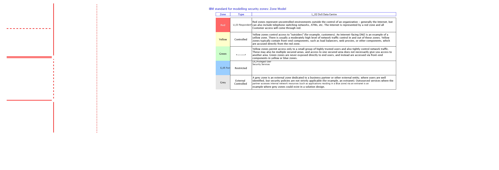

## Diagram

### Name

Logical Location View - Initial

### Description

The first step in developing the operational viewpoint is to develop a Logical Location View. This is the initial view of the locations.

## Element

[Expand all](#){ .md-button .diff-line }

### Actor

    

### Subsystem

### OMLocation

    

### Logical Connection

    

### Logical Node

    

