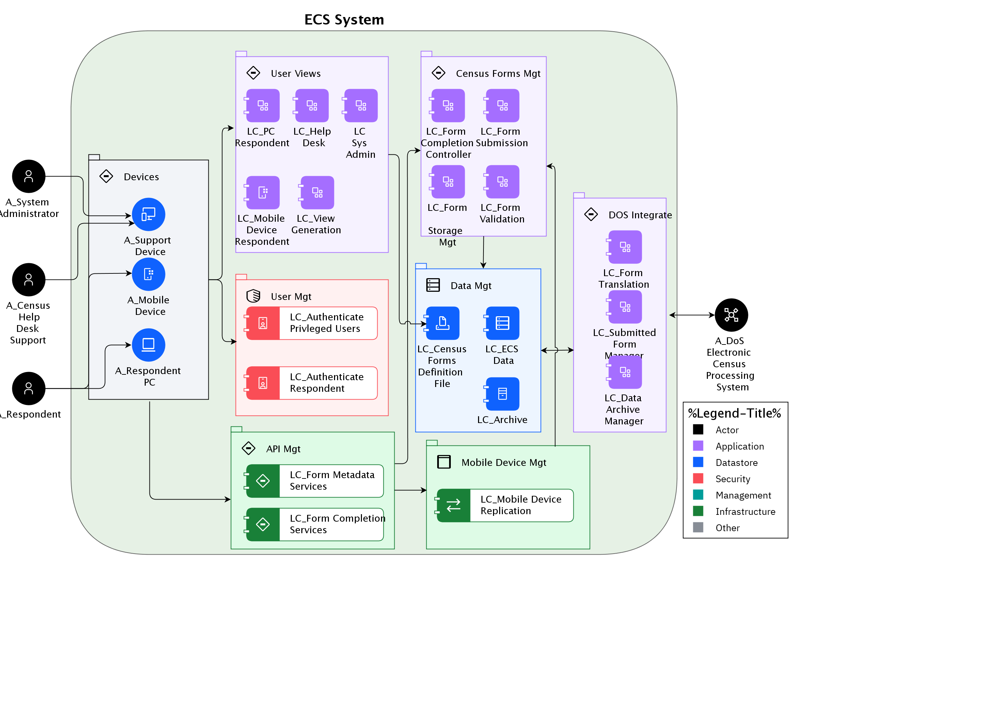

## Diagram

### Name

ECS Services

### Description

## Element

[Expand all](#){ .md-button .diff-line }

### Actor

    

A_Census Help Desk Support

<table>
    <caption></caption>
    <thead>
        <tr>
            <th></th>
            <th></th>
        </tr>
    </thead>
    <tr>
        <td> <strong>Name</strong> </td>
        <td>A_Census Help Desk Support</td>
    </tr>
    <tr>
        <td> <strong>Description</strong> </td>
        <td>Help desk provides visibility to end-user issues.</td>
    </tr>
    <tr>
        <td> <strong>Type</strong> </td>
        <td>Human</td>
    </tr>
    <tr>
        <td> <strong>Generic Group</strong> </td>
<td>
        
</td>
    </tr>
</table>

    

A_DoS Electronic Census Processing System

<table>
    <caption></caption>
    <thead>
        <tr>
            <th></th>
            <th></th>
        </tr>
    </thead>
    <tr>
        <td> <strong>Name</strong> </td>
        <td>A_DoS Electronic Census Processing System</td>
    </tr>
    <tr>
        <td> <strong>Description</strong> </td>
        <td>DoS Census Processing  system – this component receives data files, separates out the different data types (collector notifications, technical help requests, respondent data and feedback) processing each as appropriate, and generates acknowledgement and resend request files if required.</td>
    </tr>
    <tr>
        <td> <strong>Type</strong> </td>
        <td>IT System</td>
    </tr>
    <tr>
        <td> <strong>Generic Group</strong> </td>
<td>
        
</td>
    </tr>
</table>

    

A_Mobile Device

<table>
    <caption></caption>
    <thead>
        <tr>
            <th></th>
            <th></th>
        </tr>
    </thead>
    <tr>
        <td> <strong>Name</strong> </td>
        <td>A_Mobile Device</td>
    </tr>
    <tr>
        <td> <strong>Description</strong> </td>
        <td>Mobile device used by census respondent.  This user is using the system via an App.</td>
    </tr>
    <tr>
        <td> <strong>Type</strong> </td>
        <td>IT System</td>
    </tr>
    <tr>
        <td> <strong>Generic Group</strong> </td>
<td>
        
</td>
    </tr>
</table>

    

A_Respondent

<table>
    <caption></caption>
    <thead>
        <tr>
            <th></th>
            <th></th>
        </tr>
    </thead>
    <tr>
        <td> <strong>Name</strong> </td>
        <td>A_Respondent</td>
    </tr>
    <tr>
        <td> <strong>Description</strong> </td>
        <td>Census form respondent, might be using a PC, or a mobile device.</td>
    </tr>
    <tr>
        <td> <strong>Type</strong> </td>
        <td>Human</td>
    </tr>
    <tr>
        <td> <strong>Generic Group</strong> </td>
<td>
        
                
                
<strong>SubSystem,Access</strong>[Auto-Generated]

                
This group is derived from SubSystem named Access.

                
                
</td>
    </tr>
</table>

    

A_Respondent PC

<table>
    <caption></caption>
    <thead>
        <tr>
            <th></th>
            <th></th>
        </tr>
    </thead>
    <tr>
        <td> <strong>Name</strong> </td>
        <td>A_Respondent PC</td>
    </tr>
    <tr>
        <td> <strong>Description</strong> </td>
        <td>PC used by census respondent, in this case using a browser to access the centralized version of the application.</td>
    </tr>
    <tr>
        <td> <strong>Type</strong> </td>
        <td>IT System</td>
    </tr>
    <tr>
        <td> <strong>Generic Group</strong> </td>
<td>
        
</td>
    </tr>
</table>

    

A_Support Device

<table>
    <caption></caption>
    <thead>
        <tr>
            <th></th>
            <th></th>
        </tr>
    </thead>
    <tr>
        <td> <strong>Name</strong> </td>
        <td>A_Support Device</td>
    </tr>
    <tr>
        <td> <strong>Description</strong> </td>
        <td>PC or mobile device used by help desk support person.  They are using the system via a browser, so no software to be deployed.

The browser accessed user interface - must meet the accessibility requirements including operation with JavaScript disabled and support for screen readers. ECS application running on the server generates all HTML pages displayed to the respondent and performs all field validation, business rule and mandatory question checks, and subsequent processing. The browser performs the pure presentation layer function, and thus every individual page transition requires interaction with the server.</td>
    </tr>
    <tr>
        <td> <strong>Type</strong> </td>
        <td>IT System</td>
    </tr>
    <tr>
        <td> <strong>Generic Group</strong> </td>
<td>
        
</td>
    </tr>
</table>

    

A_System Administrator

<table>
    <caption></caption>
    <thead>
        <tr>
            <th></th>
            <th></th>
        </tr>
    </thead>
    <tr>
        <td> <strong>Name</strong> </td>
        <td>A_System Administrator</td>
    </tr>
    <tr>
        <td> <strong>Description</strong> </td>
        <td>The System Administrator is responsible for support of the ECS system itself.  The System Administrator deploys new versions of the ECS system and may be involved in problem troubleshooting on request from the Census Help Desk.</td>
    </tr>
    <tr>
        <td> <strong>Type</strong> </td>
        <td>Human</td>
    </tr>
    <tr>
        <td> <strong>Generic Group</strong> </td>
<td>
        
                
                
<strong>SubSystem,Access</strong>[Auto-Generated]

                
This group is derived from SubSystem named Access.

                
                
</td>
    </tr>
</table>

    

### Subsystem

    

API Mgt

<table>
    <caption></caption>
    <thead>
        <tr>
            <th></th>
            <th></th>
        </tr>
    </thead>
    <tr>
        <td> <strong>Name</strong> </td>
        <td>API Mgt</td>
    </tr>
    <tr>
        <td> <strong>Description</strong> </td>
        <td></td>
    </tr>
</table>

    

Census Forms Mgt

<table>
    <caption></caption>
    <thead>
        <tr>
            <th></th>
            <th></th>
        </tr>
    </thead>
    <tr>
        <td> <strong>Name</strong> </td>
        <td>Census Forms Mgt</td>
    </tr>
    <tr>
        <td> <strong>Description</strong> </td>
        <td></td>
    </tr>
</table>

    

Data Mgt

<table>
    <caption></caption>
    <thead>
        <tr>
            <th></th>
            <th></th>
        </tr>
    </thead>
    <tr>
        <td> <strong>Name</strong> </td>
        <td>Data Mgt</td>
    </tr>
    <tr>
        <td> <strong>Description</strong> </td>
        <td></td>
    </tr>
</table>

    

Devices

<table>
    <caption></caption>
    <thead>
        <tr>
            <th></th>
            <th></th>
        </tr>
    </thead>
    <tr>
        <td> <strong>Name</strong> </td>
        <td>Devices</td>
    </tr>
    <tr>
        <td> <strong>Description</strong> </td>
        <td></td>
    </tr>
</table>

    

DOS Integrate

<table>
    <caption></caption>
    <thead>
        <tr>
            <th></th>
            <th></th>
        </tr>
    </thead>
    <tr>
        <td> <strong>Name</strong> </td>
        <td>DOS Integrate</td>
    </tr>
    <tr>
        <td> <strong>Description</strong> </td>
        <td></td>
    </tr>
</table>

    

Mobile Device Mgt

<table>
    <caption></caption>
    <thead>
        <tr>
            <th></th>
            <th></th>
        </tr>
    </thead>
    <tr>
        <td> <strong>Name</strong> </td>
        <td>Mobile Device Mgt</td>
    </tr>
    <tr>
        <td> <strong>Description</strong> </td>
        <td></td>
    </tr>
</table>

    

User Mgt

<table>
    <caption></caption>
    <thead>
        <tr>
            <th></th>
            <th></th>
        </tr>
    </thead>
    <tr>
        <td> <strong>Name</strong> </td>
        <td>User Mgt</td>
    </tr>
    <tr>
        <td> <strong>Description</strong> </td>
        <td></td>
    </tr>
</table>

    

User Views

<table>
    <caption></caption>
    <thead>
        <tr>
            <th></th>
            <th></th>
        </tr>
    </thead>
    <tr>
        <td> <strong>Name</strong> </td>
        <td>User Views</td>
    </tr>
    <tr>
        <td> <strong>Description</strong> </td>
        <td></td>
    </tr>
</table>

    

### Logical Component

    

LC Sys Admin

<table>
    <caption></caption>
    <thead>
        <tr>
            <th></th>
            <th></th>
        </tr>
    </thead>
    <tr>
        <td> <strong>Name</strong> </td>
        <td>LC Sys Admin</td>
    </tr>
    <tr>
        <td> <strong>Description</strong> </td>
        <td>This is the view used by the System Administrator, who is using a browser.  This view will be used by the View generation component to create the completed view for the System Administrator.</td>
    </tr>
</table>

    

LC_Archive

<table>
    <caption></caption>
    <thead>
        <tr>
            <th></th>
            <th></th>
        </tr>
    </thead>
    <tr>
        <td> <strong>Name</strong> </td>
        <td>LC_Archive</td>
    </tr>
    <tr>
        <td> <strong>Description</strong> </td>
        <td></td>
    </tr>
</table>

    

LC_Authenticate Privleged Users

<table>
    <caption></caption>
    <thead>
        <tr>
            <th></th>
            <th></th>
        </tr>
    </thead>
    <tr>
        <td> <strong>Name</strong> </td>
        <td>LC_Authenticate Privleged Users</td>
    </tr>
    <tr>
        <td> <strong>Description</strong> </td>
        <td>Authenticates privileged users of the ECS system against an embedded ECS user registry.  Authenticate method is userid/pw and, optionally, two factor is supported as well.</td>
    </tr>
</table>

    

LC_Authenticate Respondent

<table>
    <caption></caption>
    <thead>
        <tr>
            <th></th>
            <th></th>
        </tr>
    </thead>
    <tr>
        <td> <strong>Name</strong> </td>
        <td>LC_Authenticate Respondent</td>
    </tr>
    <tr>
        <td> <strong>Description</strong> </td>
        <td>Performs ECN and CFN validations as defined in the “UC_01 Logon” use case (see Requirements Specification document [2]).  If successful, initiates respondent’s session and marks respondent’s control status as “started”.</td>
    </tr>
</table>

    

LC_Census Forms Definition File

<table>
    <caption></caption>
    <thead>
        <tr>
            <th></th>
            <th></th>
        </tr>
    </thead>
    <tr>
        <td> <strong>Name</strong> </td>
        <td>LC_Census Forms Definition File</td>
    </tr>
    <tr>
        <td> <strong>Description</strong> </td>
        <td>XML file(s) containing both form definitions for each census form as well as related validation rules.</td>
    </tr>
</table>

    

LC_Data Archive Manager

<table>
    <caption></caption>
    <thead>
        <tr>
            <th></th>
            <th></th>
        </tr>
    </thead>
    <tr>
        <td> <strong>Name</strong> </td>
        <td>LC_Data Archive Manager</td>
    </tr>
    <tr>
        <td> <strong>Description</strong> </td>
        <td>This component is responsible to enforcing the data retention policy, namely no long-time access of citizen data available to solution provider.</td>
    </tr>
</table>

    

LC_ECS Data

<table>
    <caption></caption>
    <thead>
        <tr>
            <th></th>
            <th></th>
        </tr>
    </thead>
    <tr>
        <td> <strong>Name</strong> </td>
        <td>LC_ECS Data</td>
    </tr>
    <tr>
        <td> <strong>Description</strong> </td>
        <td>
The ECS Data Store contains completed form data, as well as system generated management information, waiting to be transferred to the DOS system.

Also included here is reference data, form questions and associated validation rules.

Once completed forms are transferred to the DOS ECP system, the forms are encrypted and are archived in the ECS system.</td>
    </tr>
</table>

    

LC_Form Completion Controller

<table>
    <caption></caption>
    <thead>
        <tr>
            <th></th>
            <th></th>
        </tr>
    </thead>
    <tr>
        <td> <strong>Name</strong> </td>
        <td>LC_Form Completion Controller</td>
    </tr>
    <tr>
        <td> <strong>Description</strong> </td>
        <td>Fetches either page or sections related questions, validation rules and any other meta data required by the UI to properly render screens and validate the data entry.</td>
    </tr>
</table>

    

LC_Form Completion Services

<table>
    <caption></caption>
    <thead>
        <tr>
            <th></th>
            <th></th>
        </tr>
    </thead>
    <tr>
        <td> <strong>Name</strong> </td>
        <td>LC_Form Completion Services</td>
    </tr>
    <tr>
        <td> <strong>Description</strong> </td>
        <td></td>
    </tr>
</table>

    

LC_Form Metadata Services

<table>
    <caption></caption>
    <thead>
        <tr>
            <th></th>
            <th></th>
        </tr>
    </thead>
    <tr>
        <td> <strong>Name</strong> </td>
        <td>LC_Form Metadata Services</td>
    </tr>
    <tr>
        <td> <strong>Description</strong> </td>
        <td></td>
    </tr>
</table>

    

LC_Form Storage Mgt

<table>
    <caption></caption>
    <thead>
        <tr>
            <th></th>
            <th></th>
        </tr>
    </thead>
    <tr>
        <td> <strong>Name</strong> </td>
        <td>LC_Form Storage Mgt</td>
    </tr>
    <tr>
        <td> <strong>Description</strong> </td>
        <td>This component manages storage and retrieval of completed forms.</td>
    </tr>
</table>

    

LC_Form Submission

<table>
    <caption></caption>
    <thead>
        <tr>
            <th></th>
            <th></th>
        </tr>
    </thead>
    <tr>
        <td> <strong>Name</strong> </td>
        <td>LC_Form Submission</td>
    </tr>
    <tr>
        <td> <strong>Description</strong> </td>
        <td>Final validation and submission of the responder data which results in Census form deemed completed. Updates management information accordingly and renders respondent data ready to be passed onto DoS.</td>
    </tr>
</table>

    

LC_Form Translation

<table>
    <caption></caption>
    <thead>
        <tr>
            <th></th>
            <th></th>
        </tr>
    </thead>
    <tr>
        <td> <strong>Name</strong> </td>
        <td>LC_Form Translation</td>
    </tr>
    <tr>
        <td> <strong>Description</strong> </td>
        <td>Translates the completed form into the format required by the DOS system.  This component can be configured to operate on a schedule, or when completed forms are available for delivery.</td>
    </tr>
</table>

    

LC_Form Validation

<table>
    <caption></caption>
    <thead>
        <tr>
            <th></th>
            <th></th>
        </tr>
    </thead>
    <tr>
        <td> <strong>Name</strong> </td>
        <td>LC_Form Validation</td>
    </tr>
    <tr>
        <td> <strong>Description</strong> </td>
        <td>This component is used to validate completed forms (before they are stored).</td>
    </tr>
</table>

    

LC_Help Desk

<table>
    <caption></caption>
    <thead>
        <tr>
            <th></th>
            <th></th>
        </tr>
    </thead>
    <tr>
        <td> <strong>Name</strong> </td>
        <td>LC_Help Desk</td>
    </tr>
    <tr>
        <td> <strong>Description</strong> </td>
        <td>This is the view used by the Help Desk respondent.  This view will be used by the View generation component to create the completed view for the Rich Client respondent.</td>
    </tr>
</table>

    

LC_Mobile Device Replication

<table>
    <caption></caption>
    <thead>
        <tr>
            <th></th>
            <th></th>
        </tr>
    </thead>
    <tr>
        <td> <strong>Name</strong> </td>
        <td>LC_Mobile Device Replication</td>
    </tr>
    <tr>
        <td> <strong>Description</strong> </td>
        <td>Receives submitted responses from the mobile devices and stores them into the ECS DB.</td>
    </tr>
</table>

    

LC_Mobile Device Respondent

<table>
    <caption></caption>
    <thead>
        <tr>
            <th></th>
            <th></th>
        </tr>
    </thead>
    <tr>
        <td> <strong>Name</strong> </td>
        <td>LC_Mobile Device Respondent</td>
    </tr>
    <tr>
        <td> <strong>Description</strong> </td>
        <td>This is the view used by the Mobile Device respondent.  This view will be used by the View generation component to create the completed view for the Mobile Device respondent.</td>
    </tr>
</table>

    

LC_PC Respondent

<table>
    <caption></caption>
    <thead>
        <tr>
            <th></th>
            <th></th>
        </tr>
    </thead>
    <tr>
        <td> <strong>Name</strong> </td>
        <td>LC_PC Respondent</td>
    </tr>
    <tr>
        <td> <strong>Description</strong> </td>
        <td>This is the view used by the PC respondent.  This view will be used by the View generation component to create the completed view for the PC respondent (who is using a browser).</td>
    </tr>
</table>

    

LC_Submitted Form Manager

<table>
    <caption></caption>
    <thead>
        <tr>
            <th></th>
            <th></th>
        </tr>
    </thead>
    <tr>
        <td> <strong>Name</strong> </td>
        <td>LC_Submitted Form Manager</td>
    </tr>
    <tr>
        <td> <strong>Description</strong> </td>
        <td>This component is responsible for synchronizing both status and data to DoS ECPS. This involves communicating the completed form ids so that those households are removed from the census agent "processing list", and delivering the completed forms for ultimate processing.  Exactly once deliver must be insured.  Acknowledgement of receipt of a completed form will trigger marking data for archival.</td>
    </tr>
</table>

    

LC_View Generation

<table>
    <caption></caption>
    <thead>
        <tr>
            <th></th>
            <th></th>
        </tr>
    </thead>
    <tr>
        <td> <strong>Name</strong> </td>
        <td>LC_View Generation</td>
    </tr>
    <tr>
        <td> <strong>Description</strong> </td>
        <td>HTML page generation – page generation after the Welcome and Login page is performed on the server and rendered on the client side.  The Census Forms Definition file and the various user views, as well as the login information, are combined to create the user view.</td>
    </tr>
</table>

    

### Logical Connector

    

<table>
    <caption></caption>
    <thead>
        <tr>
            <th></th>
            <th></th>
        </tr>
    </thead>
    <tr>
        <td> <strong>Name</strong> </td>
        <td></td>
    </tr>
    <tr>
        <td> <strong>Description</strong> </td>
        <td></td>
    </tr>
</table>

    

<table>
    <caption></caption>
    <thead>
        <tr>
            <th></th>
            <th></th>
        </tr>
    </thead>
    <tr>
        <td> <strong>Name</strong> </td>
        <td></td>
    </tr>
    <tr>
        <td> <strong>Description</strong> </td>
        <td></td>
    </tr>
</table>

    

<table>
    <caption></caption>
    <thead>
        <tr>
            <th></th>
            <th></th>
        </tr>
    </thead>
    <tr>
        <td> <strong>Name</strong> </td>
        <td></td>
    </tr>
    <tr>
        <td> <strong>Description</strong> </td>
        <td></td>
    </tr>
</table>

    

<table>
    <caption></caption>
    <thead>
        <tr>
            <th></th>
            <th></th>
        </tr>
    </thead>
    <tr>
        <td> <strong>Name</strong> </td>
        <td></td>
    </tr>
    <tr>
        <td> <strong>Description</strong> </td>
        <td></td>
    </tr>
</table>

    

<table>
    <caption></caption>
    <thead>
        <tr>
            <th></th>
            <th></th>
        </tr>
    </thead>
    <tr>
        <td> <strong>Name</strong> </td>
        <td></td>
    </tr>
    <tr>
        <td> <strong>Description</strong> </td>
        <td></td>
    </tr>
</table>

    

<table>
    <caption></caption>
    <thead>
        <tr>
            <th></th>
            <th></th>
        </tr>
    </thead>
    <tr>
        <td> <strong>Name</strong> </td>
        <td></td>
    </tr>
    <tr>
        <td> <strong>Description</strong> </td>
        <td></td>
    </tr>
</table>

    

<table>
    <caption></caption>
    <thead>
        <tr>
            <th></th>
            <th></th>
        </tr>
    </thead>
    <tr>
        <td> <strong>Name</strong> </td>
        <td></td>
    </tr>
    <tr>
        <td> <strong>Description</strong> </td>
        <td></td>
    </tr>
</table>

    

<table>
    <caption></caption>
    <thead>
        <tr>
            <th></th>
            <th></th>
        </tr>
    </thead>
    <tr>
        <td> <strong>Name</strong> </td>
        <td></td>
    </tr>
    <tr>
        <td> <strong>Description</strong> </td>
        <td></td>
    </tr>
</table>

    

<table>
    <caption></caption>
    <thead>
        <tr>
            <th></th>
            <th></th>
        </tr>
    </thead>
    <tr>
        <td> <strong>Name</strong> </td>
        <td></td>
    </tr>
    <tr>
        <td> <strong>Description</strong> </td>
        <td></td>
    </tr>
</table>

    

<table>
    <caption></caption>
    <thead>
        <tr>
            <th></th>
            <th></th>
        </tr>
    </thead>
    <tr>
        <td> <strong>Name</strong> </td>
        <td></td>
    </tr>
    <tr>
        <td> <strong>Description</strong> </td>
        <td></td>
    </tr>
</table>

    

<table>
    <caption></caption>
    <thead>
        <tr>
            <th></th>
            <th></th>
        </tr>
    </thead>
    <tr>
        <td> <strong>Name</strong> </td>
        <td></td>
    </tr>
    <tr>
        <td> <strong>Description</strong> </td>
        <td></td>
    </tr>
</table>

    

<table>
    <caption></caption>
    <thead>
        <tr>
            <th></th>
            <th></th>
        </tr>
    </thead>
    <tr>
        <td> <strong>Name</strong> </td>
        <td></td>
    </tr>
    <tr>
        <td> <strong>Description</strong> </td>
        <td></td>
    </tr>
</table>

    

<table>
    <caption></caption>
    <thead>
        <tr>
            <th></th>
            <th></th>
        </tr>
    </thead>
    <tr>
        <td> <strong>Name</strong> </td>
        <td></td>
    </tr>
    <tr>
        <td> <strong>Description</strong> </td>
        <td></td>
    </tr>
</table>

    

<table>
    <caption></caption>
    <thead>
        <tr>
            <th></th>
            <th></th>
        </tr>
    </thead>
    <tr>
        <td> <strong>Name</strong> </td>
        <td></td>
    </tr>
    <tr>
        <td> <strong>Description</strong> </td>
        <td></td>
    </tr>
</table>

    

