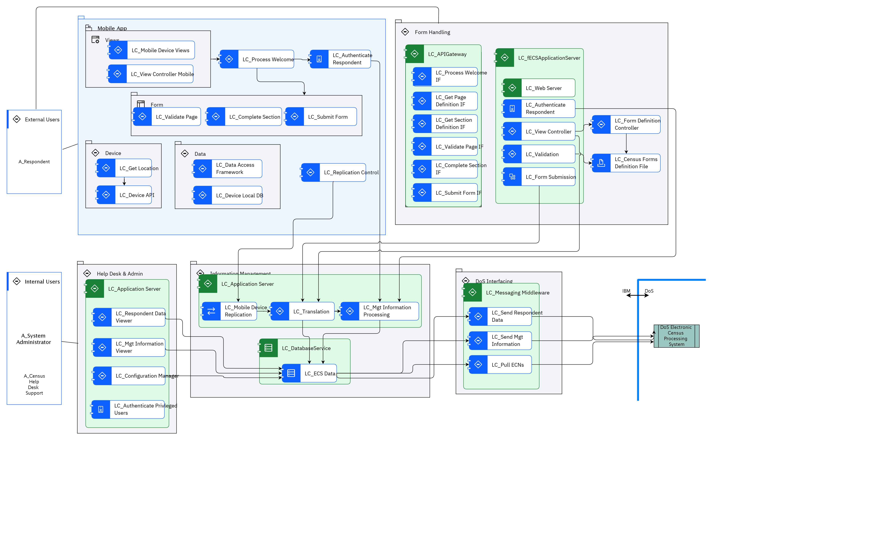

## Diagram

### Name

ECS Static View

### Description

## Element

[Expand all](#){ .md-button .diff-line }

### Actor

    

A_Census Help Desk Support

<table>
    <caption></caption>
    <thead>
        <tr>
            <th></th>
            <th></th>
        </tr>
    </thead>
    <tr>
        <td> <strong>Name</strong> </td>
        <td>A_Census Help Desk Support</td>
    </tr>
    <tr>
        <td> <strong>Description</strong> </td>
        <td>Help desk provides visibility to end-user issues.</td>
    </tr>
    <tr>
        <td> <strong>Type</strong> </td>
        <td>Human</td>
    </tr>
    <tr>
        <td> <strong>Generic Group</strong> </td>
<td>
        
</td>
    </tr>
</table>

    

A_Respondent

<table>
    <caption></caption>
    <thead>
        <tr>
            <th></th>
            <th></th>
        </tr>
    </thead>
    <tr>
        <td> <strong>Name</strong> </td>
        <td>A_Respondent</td>
    </tr>
    <tr>
        <td> <strong>Description</strong> </td>
        <td>Census form respondent, might be using a PC, or a mobile device.</td>
    </tr>
    <tr>
        <td> <strong>Type</strong> </td>
        <td>Human</td>
    </tr>
    <tr>
        <td> <strong>Generic Group</strong> </td>
<td>
        
                
                
<strong>SubSystem,Access</strong>[Auto-Generated]

                
This group is derived from SubSystem named Access.

                
                
</td>
    </tr>
</table>

    

A_System Administrator

<table>
    <caption></caption>
    <thead>
        <tr>
            <th></th>
            <th></th>
        </tr>
    </thead>
    <tr>
        <td> <strong>Name</strong> </td>
        <td>A_System Administrator</td>
    </tr>
    <tr>
        <td> <strong>Description</strong> </td>
        <td>The System Administrator is responsible for support of the ECS system itself.  The System Administrator deploys new versions of the ECS system and may be involved in problem troubleshooting on request from the Census Help Desk.</td>
    </tr>
    <tr>
        <td> <strong>Type</strong> </td>
        <td>Human</td>
    </tr>
    <tr>
        <td> <strong>Generic Group</strong> </td>
<td>
        
                
                
<strong>SubSystem,Access</strong>[Auto-Generated]

                
This group is derived from SubSystem named Access.

                
                
</td>
    </tr>
</table>

    

DoS Electronic Census Processing System

<table>
    <caption></caption>
    <thead>
        <tr>
            <th></th>
            <th></th>
        </tr>
    </thead>
    <tr>
        <td> <strong>Name</strong> </td>
        <td>DoS Electronic Census Processing System</td>
    </tr>
    <tr>
        <td> <strong>Description</strong> </td>
        <td>DoS Census Processing  system – this component receives data files, separates out the different data types (collector notifications, technical help requests, respondent data and feedback) processing each as appropriate, and generates acknowledgement and resend request files if required.</td>
    </tr>
    <tr>
        <td> <strong>Type</strong> </td>
        <td>IT System</td>
    </tr>
    <tr>
        <td> <strong>Generic Group</strong> </td>
<td>
        
</td>
    </tr>
</table>

    

### Subsystem

    

Data

<table>
    <caption></caption>
    <thead>
        <tr>
            <th></th>
            <th></th>
        </tr>
    </thead>
    <tr>
        <td> <strong>Name</strong> </td>
        <td>Data</td>
    </tr>
    <tr>
        <td> <strong>Description</strong> </td>
        <td></td>
    </tr>
</table>

    

Device

<table>
    <caption></caption>
    <thead>
        <tr>
            <th></th>
            <th></th>
        </tr>
    </thead>
    <tr>
        <td> <strong>Name</strong> </td>
        <td>Device</td>
    </tr>
    <tr>
        <td> <strong>Description</strong> </td>
        <td></td>
    </tr>
</table>

    

DoS Interfacing

<table>
    <caption></caption>
    <thead>
        <tr>
            <th></th>
            <th></th>
        </tr>
    </thead>
    <tr>
        <td> <strong>Name</strong> </td>
        <td>DoS Interfacing</td>
    </tr>
    <tr>
        <td> <strong>Description</strong> </td>
        <td>Interfaces between ECS an DoS enterprise system (Electronic Census Processing)</td>
    </tr>
</table>

    

External Users

<table>
    <caption></caption>
    <thead>
        <tr>
            <th></th>
            <th></th>
        </tr>
    </thead>
    <tr>
        <td> <strong>Name</strong> </td>
        <td>External Users</td>
    </tr>
    <tr>
        <td> <strong>Description</strong> </td>
        <td></td>
    </tr>
</table>

    

Form

<table>
    <caption></caption>
    <thead>
        <tr>
            <th></th>
            <th></th>
        </tr>
    </thead>
    <tr>
        <td> <strong>Name</strong> </td>
        <td>Form</td>
    </tr>
    <tr>
        <td> <strong>Description</strong> </td>
        <td></td>
    </tr>
</table>

    

Form Handling

<table>
    <caption></caption>
    <thead>
        <tr>
            <th></th>
            <th></th>
        </tr>
    </thead>
    <tr>
        <td> <strong>Name</strong> </td>
        <td>Form Handling</td>
    </tr>
    <tr>
        <td> <strong>Description</strong> </td>
        <td>ECS application UI used by both, the rich client users and the thin client users</td>
    </tr>
</table>

    

Help Desk & Admin

<table>
    <caption></caption>
    <thead>
        <tr>
            <th></th>
            <th></th>
        </tr>
    </thead>
    <tr>
        <td> <strong>Name</strong> </td>
        <td>Help Desk & Admin</td>
    </tr>
    <tr>
        <td> <strong>Description</strong> </td>
        <td></td>
    </tr>
</table>

    

Information Management

<table>
    <caption></caption>
    <thead>
        <tr>
            <th></th>
            <th></th>
        </tr>
    </thead>
    <tr>
        <td> <strong>Name</strong> </td>
        <td>Information Management</td>
    </tr>
    <tr>
        <td> <strong>Description</strong> </td>
        <td>ECS database, data access framework and associated components</td>
    </tr>
</table>

    

Internal Users

<table>
    <caption></caption>
    <thead>
        <tr>
            <th></th>
            <th></th>
        </tr>
    </thead>
    <tr>
        <td> <strong>Name</strong> </td>
        <td>Internal Users</td>
    </tr>
    <tr>
        <td> <strong>Description</strong> </td>
        <td></td>
    </tr>
</table>

    

Mobile App

<table>
    <caption></caption>
    <thead>
        <tr>
            <th></th>
            <th></th>
        </tr>
    </thead>
    <tr>
        <td> <strong>Name</strong> </td>
        <td>Mobile App</td>
    </tr>
    <tr>
        <td> <strong>Description</strong> </td>
        <td>ECS application installed on a mobile device.</td>
    </tr>
</table>

    

Views

<table>
    <caption></caption>
    <thead>
        <tr>
            <th></th>
            <th></th>
        </tr>
    </thead>
    <tr>
        <td> <strong>Name</strong> </td>
        <td>Views</td>
    </tr>
    <tr>
        <td> <strong>Description</strong> </td>
        <td></td>
    </tr>
</table>

    

### Logical Component

    

LC_APIGateway

<table>
    <caption></caption>
    <thead>
        <tr>
            <th></th>
            <th></th>
        </tr>
    </thead>
    <tr>
        <td> <strong>Name</strong> </td>
        <td>LC_APIGateway</td>
    </tr>
    <tr>
        <td> <strong>Description</strong> </td>
        <td>Invokes the APIs and connects the request from the front end application.</td>
    </tr>
</table>

    

LC_Application Server

<table>
    <caption></caption>
    <thead>
        <tr>
            <th></th>
            <th></th>
        </tr>
    </thead>
    <tr>
        <td> <strong>Name</strong> </td>
        <td>LC_Application Server</td>
    </tr>
    <tr>
        <td> <strong>Description</strong> </td>
        <td>Runtime container for the applications that accomplish business goals.</td>
    </tr>
</table>

    

LC_Authenticate Privleged Users

<table>
    <caption></caption>
    <thead>
        <tr>
            <th></th>
            <th></th>
        </tr>
    </thead>
    <tr>
        <td> <strong>Name</strong> </td>
        <td>LC_Authenticate Privleged Users</td>
    </tr>
    <tr>
        <td> <strong>Description</strong> </td>
        <td>Authenticates privileged users of the ECS system against an embedded ECS user registry.  Authenticate method is userid/pw and, optionally, two factor is supported as well.</td>
    </tr>
</table>

    

LC_Authenticate Respondent

<table>
    <caption></caption>
    <thead>
        <tr>
            <th></th>
            <th></th>
        </tr>
    </thead>
    <tr>
        <td> <strong>Name</strong> </td>
        <td>LC_Authenticate Respondent</td>
    </tr>
    <tr>
        <td> <strong>Description</strong> </td>
        <td>Performs ECN and CFN validations as defined in the “UC_01 Logon” use case (see Requirements Specification document [2]).  If successful, initiates respondent’s session and marks respondent’s control status as “started”.</td>
    </tr>
</table>

    

LC_Census Forms Definition File

<table>
    <caption></caption>
    <thead>
        <tr>
            <th></th>
            <th></th>
        </tr>
    </thead>
    <tr>
        <td> <strong>Name</strong> </td>
        <td>LC_Census Forms Definition File</td>
    </tr>
    <tr>
        <td> <strong>Description</strong> </td>
        <td>XML file(s) containing both form definitions for each census form as well as related validation rules.</td>
    </tr>
</table>

    

LC_Complete Section

<table>
    <caption></caption>
    <thead>
        <tr>
            <th></th>
            <th></th>
        </tr>
    </thead>
    <tr>
        <td> <strong>Name</strong> </td>
        <td>LC_Complete Section</td>
    </tr>
    <tr>
        <td> <strong>Description</strong> </td>
        <td>Validates final page within section and saves the section data.</td>
    </tr>
</table>

    

LC_Complete Section IF

<table>
    <caption></caption>
    <thead>
        <tr>
            <th></th>
            <th></th>
        </tr>
    </thead>
    <tr>
        <td> <strong>Name</strong> </td>
        <td>LC_Complete Section IF</td>
    </tr>
    <tr>
        <td> <strong>Description</strong> </td>
        <td>Interface:
Used by the rich client UI to validate sections and save data before the navigation moves to the next section.</td>
    </tr>
</table>

    

LC_Configuration Manager

<table>
    <caption></caption>
    <thead>
        <tr>
            <th></th>
            <th></th>
        </tr>
    </thead>
    <tr>
        <td> <strong>Name</strong> </td>
        <td>LC_Configuration Manager</td>
    </tr>
    <tr>
        <td> <strong>Description</strong> </td>
        <td>Allows System Admin staff to modify reference data, unlock respondent access etc.</td>
    </tr>
</table>

    

LC_Data Access Framework

<table>
    <caption></caption>
    <thead>
        <tr>
            <th></th>
            <th></th>
        </tr>
    </thead>
    <tr>
        <td> <strong>Name</strong> </td>
        <td>LC_Data Access Framework</td>
    </tr>
    <tr>
        <td> <strong>Description</strong> </td>
        <td>API providing access to the local device database.</td>
    </tr>
</table>

    

LC_DatabaseService

<table>
    <caption></caption>
    <thead>
        <tr>
            <th></th>
            <th></th>
        </tr>
    </thead>
    <tr>
        <td> <strong>Name</strong> </td>
        <td>LC_DatabaseService</td>
    </tr>
    <tr>
        <td> <strong>Description</strong> </td>
        <td>Database to store and manage potentially partially complete census forms.  The service will also be used to capture application metrics and history.
</td>
    </tr>
</table>

    

LC_Device API

<table>
    <caption></caption>
    <thead>
        <tr>
            <th></th>
            <th></th>
        </tr>
    </thead>
    <tr>
        <td> <strong>Name</strong> </td>
        <td>LC_Device API</td>
    </tr>
    <tr>
        <td> <strong>Description</strong> </td>
        <td>Device native API which supports Hybrid Apps being able to access native device functions & sensors.</td>
    </tr>
</table>

    

LC_Device Local DB

<table>
    <caption></caption>
    <thead>
        <tr>
            <th></th>
            <th></th>
        </tr>
    </thead>
    <tr>
        <td> <strong>Name</strong> </td>
        <td>LC_Device Local DB</td>
    </tr>
    <tr>
        <td> <strong>Description</strong> </td>
        <td>Local mobile device database.</td>
    </tr>
</table>

    

LC_ECS Data

<table>
    <caption></caption>
    <thead>
        <tr>
            <th></th>
            <th></th>
        </tr>
    </thead>
    <tr>
        <td> <strong>Name</strong> </td>
        <td>LC_ECS Data</td>
    </tr>
    <tr>
        <td> <strong>Description</strong> </td>
        <td>
The ECS Data Store contains completed form data, as well as system generated management information, waiting to be transferred to the DOS system.

Also included here is reference data, form questions and associated validation rules.

Once completed forms are transferred to the DOS ECP system, the forms are encrypted and are archived in the ECS system.</td>
    </tr>
</table>

    

LC_fECSApplicationServer

<table>
    <caption></caption>
    <thead>
        <tr>
            <th></th>
            <th></th>
        </tr>
    </thead>
    <tr>
        <td> <strong>Name</strong> </td>
        <td>LC_fECSApplicationServer</td>
    </tr>
    <tr>
        <td> <strong>Description</strong> </td>
        <td>Runtime container for the applications that accomplish business goals.</td>
    </tr>
</table>

    

LC_Form Definition Controller

<table>
    <caption></caption>
    <thead>
        <tr>
            <th></th>
            <th></th>
        </tr>
    </thead>
    <tr>
        <td> <strong>Name</strong> </td>
        <td>LC_Form Definition Controller</td>
    </tr>
    <tr>
        <td> <strong>Description</strong> </td>
        <td>Fetches either page or sections related questions, validation rules and any other meta data required by the UI to properly render screens and validate the data entry.</td>
    </tr>
</table>

    

LC_Form Submission

<table>
    <caption></caption>
    <thead>
        <tr>
            <th></th>
            <th></th>
        </tr>
    </thead>
    <tr>
        <td> <strong>Name</strong> </td>
        <td>LC_Form Submission</td>
    </tr>
    <tr>
        <td> <strong>Description</strong> </td>
        <td>Final validation and submission of the responder data which results in Census form deemed completed. Updates management information accordingly and renders respondent data ready to be passed onto DoS.</td>
    </tr>
</table>

    

LC_Get Location

<table>
    <caption></caption>
    <thead>
        <tr>
            <th></th>
            <th></th>
        </tr>
    </thead>
    <tr>
        <td> <strong>Name</strong> </td>
        <td>LC_Get Location</td>
    </tr>
    <tr>
        <td> <strong>Description</strong> </td>
        <td>Calls device native API to obtain device location information attempting to validate that the respondent is at the dwelling as declared on the form.</td>
    </tr>
</table>

    

LC_Get Page Definition IF

<table>
    <caption></caption>
    <thead>
        <tr>
            <th></th>
            <th></th>
        </tr>
    </thead>
    <tr>
        <td> <strong>Name</strong> </td>
        <td>LC_Get Page Definition IF</td>
    </tr>
    <tr>
        <td> <strong>Description</strong> </td>
        <td>Interface:
Given the page id, returns page related questions and validations rules. Intended for use by thin client UI which operates at the page by page level.</td>
    </tr>
</table>

    

LC_Get Section Definition IF

<table>
    <caption></caption>
    <thead>
        <tr>
            <th></th>
            <th></th>
        </tr>
    </thead>
    <tr>
        <td> <strong>Name</strong> </td>
        <td>LC_Get Section Definition IF</td>
    </tr>
    <tr>
        <td> <strong>Description</strong> </td>
        <td>Interface:
Given the section id, returns section related questions and validations rules. Intended for use by rich client UI which operates at the section by section level.</td>
    </tr>
</table>

    

LC_Messaging Middleware

<table>
    <caption></caption>
    <thead>
        <tr>
            <th></th>
            <th></th>
        </tr>
    </thead>
    <tr>
        <td> <strong>Name</strong> </td>
        <td>LC_Messaging Middleware</td>
    </tr>
    <tr>
        <td> <strong>Description</strong> </td>
        <td>Specific class of middleware that supports the exchange of general-purpose messages in a distributed application environment. In ECS scenario it is used for interchange of data between ECS and DOS Census Processing.</td>
    </tr>
</table>

    

LC_Mgt Information Processing

<table>
    <caption></caption>
    <thead>
        <tr>
            <th></th>
            <th></th>
        </tr>
    </thead>
    <tr>
        <td> <strong>Name</strong> </td>
        <td>LC_Mgt Information Processing</td>
    </tr>
    <tr>
        <td> <strong>Description</strong> </td>
        <td>Maintains session, status and other meta-data from the respondents’ data and records these on the database.</td>
    </tr>
</table>

    

LC_Mgt Information Viewer

<table>
    <caption></caption>
    <thead>
        <tr>
            <th></th>
            <th></th>
        </tr>
    </thead>
    <tr>
        <td> <strong>Name</strong> </td>
        <td>LC_Mgt Information Viewer</td>
    </tr>
    <tr>
        <td> <strong>Description</strong> </td>
        <td>Makes it possible for the support staff to retrieve any management data, such as session, number of attempted log ins, state of the respondent data, statistics etc.</td>
    </tr>
</table>

    

LC_Mobile Device Replication

<table>
    <caption></caption>
    <thead>
        <tr>
            <th></th>
            <th></th>
        </tr>
    </thead>
    <tr>
        <td> <strong>Name</strong> </td>
        <td>LC_Mobile Device Replication</td>
    </tr>
    <tr>
        <td> <strong>Description</strong> </td>
        <td>Receives submitted responses from the mobile devices and stores them into the ECS DB.</td>
    </tr>
</table>

    

LC_Mobile Device Views

<table>
    <caption></caption>
    <thead>
        <tr>
            <th></th>
            <th></th>
        </tr>
    </thead>
    <tr>
        <td> <strong>Name</strong> </td>
        <td>LC_Mobile Device Views</td>
    </tr>
    <tr>
        <td> <strong>Description</strong> </td>
        <td>A set of UI components (screens or pages and pop-ups) that support the functionality of the mobile device client application.</td>
    </tr>
</table>

    

LC_Process Welcome

<table>
    <caption></caption>
    <thead>
        <tr>
            <th></th>
            <th></th>
        </tr>
    </thead>
    <tr>
        <td> <strong>Name</strong> </td>
        <td>LC_Process Welcome</td>
    </tr>
    <tr>
        <td> <strong>Description</strong> </td>
        <td>Processes the initial page and calls authentication module.</td>
    </tr>
</table>

    

LC_Process Welcome IF

<table>
    <caption></caption>
    <thead>
        <tr>
            <th></th>
            <th></th>
        </tr>
    </thead>
    <tr>
        <td> <strong>Name</strong> </td>
        <td>LC_Process Welcome IF</td>
    </tr>
    <tr>
        <td> <strong>Description</strong> </td>
        <td>Interface:
Welcome page processing which in turn invokes authentication module.</td>
    </tr>
</table>

    

LC_Pull ECNs

<table>
    <caption></caption>
    <thead>
        <tr>
            <th></th>
            <th></th>
        </tr>
    </thead>
    <tr>
        <td> <strong>Name</strong> </td>
        <td>LC_Pull ECNs</td>
    </tr>
    <tr>
        <td> <strong>Description</strong> </td>
        <td>Pull Confirmed or Failed ECNs:
Periodically pulls status records (acknowledgements or errors) indicating outcome of the data upload into the DOS Census Processing system.</td>
    </tr>
</table>

    

LC_Replication Control

<table>
    <caption></caption>
    <thead>
        <tr>
            <th></th>
            <th></th>
        </tr>
    </thead>
    <tr>
        <td> <strong>Name</strong> </td>
        <td>LC_Replication Control</td>
    </tr>
    <tr>
        <td> <strong>Description</strong> </td>
        <td>Once respondent successfully completes and submits the form, the respondent data is temporarily stored on the device local database until this component is able to establish connectivity with the ECS back end and send the respondent data to the ECS DB.</td>
    </tr>
</table>

    

LC_Respondent Data Viewer

<table>
    <caption></caption>
    <thead>
        <tr>
            <th></th>
            <th></th>
        </tr>
    </thead>
    <tr>
        <td> <strong>Name</strong> </td>
        <td>LC_Respondent Data Viewer</td>
    </tr>
    <tr>
        <td> <strong>Description</strong> </td>
        <td>Makes it possible for the support staff to search and retrieve any respondent data currently save on the respondent database</td>
    </tr>
</table>

    

LC_Send Mgt Information

<table>
    <caption></caption>
    <thead>
        <tr>
            <th></th>
            <th></th>
        </tr>
    </thead>
    <tr>
        <td> <strong>Name</strong> </td>
        <td>LC_Send Mgt Information</td>
    </tr>
    <tr>
        <td> <strong>Description</strong> </td>
        <td>Periodically sends any new management information that previously hasn’t been sent to the DOS Census Processing system.</td>
    </tr>
</table>

    

LC_Send Respondent Data

<table>
    <caption></caption>
    <thead>
        <tr>
            <th></th>
            <th></th>
        </tr>
    </thead>
    <tr>
        <td> <strong>Name</strong> </td>
        <td>LC_Send Respondent Data</td>
    </tr>
    <tr>
        <td> <strong>Description</strong> </td>
        <td>Periodically sends any new respondent records that previously haven’t been sent to the DOS Census Processing system, and also resends records that have failed to upload on the DOS side.</td>
    </tr>
</table>

    

LC_Submit Form

<table>
    <caption></caption>
    <thead>
        <tr>
            <th></th>
            <th></th>
        </tr>
    </thead>
    <tr>
        <td> <strong>Name</strong> </td>
        <td>LC_Submit Form</td>
    </tr>
    <tr>
        <td> <strong>Description</strong> </td>
        <td>Final form submission initiating the respondent data being marked as completed.</td>
    </tr>
</table>

    

LC_Submit Form IF

<table>
    <caption></caption>
    <thead>
        <tr>
            <th></th>
            <th></th>
        </tr>
    </thead>
    <tr>
        <td> <strong>Name</strong> </td>
        <td>LC_Submit Form IF</td>
    </tr>
    <tr>
        <td> <strong>Description</strong> </td>
        <td>Interface:
Invoked for final validation and submission of the responder data which results in Census form deemed completed.</td>
    </tr>
</table>

    

LC_Translation

<table>
    <caption></caption>
    <thead>
        <tr>
            <th></th>
            <th></th>
        </tr>
    </thead>
    <tr>
        <td> <strong>Name</strong> </td>
        <td>LC_Translation</td>
    </tr>
    <tr>
        <td> <strong>Description</strong> </td>
        <td>Translates respondent data from the input format into the IFP format before committing the data to the database.</td>
    </tr>
</table>

    

LC_Validate Page

<table>
    <caption></caption>
    <thead>
        <tr>
            <th></th>
            <th></th>
        </tr>
    </thead>
    <tr>
        <td> <strong>Name</strong> </td>
        <td>LC_Validate Page</td>
    </tr>
    <tr>
        <td> <strong>Description</strong> </td>
        <td>Performs page validations based on the page definitions and associated rules.</td>
    </tr>
</table>

    

LC_Validate Page IF

<table>
    <caption></caption>
    <thead>
        <tr>
            <th></th>
            <th></th>
        </tr>
    </thead>
    <tr>
        <td> <strong>Name</strong> </td>
        <td>LC_Validate Page IF</td>
    </tr>
    <tr>
        <td> <strong>Description</strong> </td>
        <td>Interface:
Used by the thin client UI to validate pages and save page data before the navigation moves to the next page.</td>
    </tr>
</table>

    

LC_Validation

<table>
    <caption></caption>
    <thead>
        <tr>
            <th></th>
            <th></th>
        </tr>
    </thead>
    <tr>
        <td> <strong>Name</strong> </td>
        <td>LC_Validation</td>
    </tr>
    <tr>
        <td> <strong>Description</strong> </td>
        <td>Server side page and cross page (section) level validations that couldn’t be enforced by the UI.</td>
    </tr>
</table>

    

LC_View Controller

<table>
    <caption></caption>
    <thead>
        <tr>
            <th></th>
            <th></th>
        </tr>
    </thead>
    <tr>
        <td> <strong>Name</strong> </td>
        <td>LC_View Controller</td>
    </tr>
    <tr>
        <td> <strong>Description</strong> </td>
        <td>Returns page level or section level question definitions and corresponding validation rules to be presented and executed by the respondent’s browser.</td>
    </tr>
</table>

    

LC_View Controller Mobile

<table>
    <caption></caption>
    <thead>
        <tr>
            <th></th>
            <th></th>
        </tr>
    </thead>
    <tr>
        <td> <strong>Name</strong> </td>
        <td>LC_View Controller Mobile</td>
    </tr>
    <tr>
        <td> <strong>Description</strong> </td>
        <td>Manages navigation through the UI (implementing controller part of the MVC pattern).</td>
    </tr>
</table>

    

LC_Web Server

<table>
    <caption></caption>
    <thead>
        <tr>
            <th></th>
            <th></th>
        </tr>
    </thead>
    <tr>
        <td> <strong>Name</strong> </td>
        <td>LC_Web Server</td>
    </tr>
    <tr>
        <td> <strong>Description</strong> </td>
        <td>Technical component delivered as a part of application server. Servers static web content and handles HTTP/HTTPs requests from the client side.</td>
    </tr>
</table>

    

### Logical Connector

    

<table>
    <caption></caption>
    <thead>
        <tr>
            <th></th>
            <th></th>
        </tr>
    </thead>
    <tr>
        <td> <strong>Name</strong> </td>
        <td></td>
    </tr>
    <tr>
        <td> <strong>Description</strong> </td>
        <td></td>
    </tr>
</table>

    

<table>
    <caption></caption>
    <thead>
        <tr>
            <th></th>
            <th></th>
        </tr>
    </thead>
    <tr>
        <td> <strong>Name</strong> </td>
        <td></td>
    </tr>
    <tr>
        <td> <strong>Description</strong> </td>
        <td></td>
    </tr>
</table>

    

<table>
    <caption></caption>
    <thead>
        <tr>
            <th></th>
            <th></th>
        </tr>
    </thead>
    <tr>
        <td> <strong>Name</strong> </td>
        <td></td>
    </tr>
    <tr>
        <td> <strong>Description</strong> </td>
        <td></td>
    </tr>
</table>

    

<table>
    <caption></caption>
    <thead>
        <tr>
            <th></th>
            <th></th>
        </tr>
    </thead>
    <tr>
        <td> <strong>Name</strong> </td>
        <td></td>
    </tr>
    <tr>
        <td> <strong>Description</strong> </td>
        <td></td>
    </tr>
</table>

    

<table>
    <caption></caption>
    <thead>
        <tr>
            <th></th>
            <th></th>
        </tr>
    </thead>
    <tr>
        <td> <strong>Name</strong> </td>
        <td></td>
    </tr>
    <tr>
        <td> <strong>Description</strong> </td>
        <td></td>
    </tr>
</table>

    

<table>
    <caption></caption>
    <thead>
        <tr>
            <th></th>
            <th></th>
        </tr>
    </thead>
    <tr>
        <td> <strong>Name</strong> </td>
        <td></td>
    </tr>
    <tr>
        <td> <strong>Description</strong> </td>
        <td></td>
    </tr>
</table>

    

<table>
    <caption></caption>
    <thead>
        <tr>
            <th></th>
            <th></th>
        </tr>
    </thead>
    <tr>
        <td> <strong>Name</strong> </td>
        <td></td>
    </tr>
    <tr>
        <td> <strong>Description</strong> </td>
        <td></td>
    </tr>
</table>

    

<table>
    <caption></caption>
    <thead>
        <tr>
            <th></th>
            <th></th>
        </tr>
    </thead>
    <tr>
        <td> <strong>Name</strong> </td>
        <td></td>
    </tr>
    <tr>
        <td> <strong>Description</strong> </td>
        <td></td>
    </tr>
</table>

    

<table>
    <caption></caption>
    <thead>
        <tr>
            <th></th>
            <th></th>
        </tr>
    </thead>
    <tr>
        <td> <strong>Name</strong> </td>
        <td></td>
    </tr>
    <tr>
        <td> <strong>Description</strong> </td>
        <td></td>
    </tr>
</table>

    

<table>
    <caption></caption>
    <thead>
        <tr>
            <th></th>
            <th></th>
        </tr>
    </thead>
    <tr>
        <td> <strong>Name</strong> </td>
        <td></td>
    </tr>
    <tr>
        <td> <strong>Description</strong> </td>
        <td></td>
    </tr>
</table>

    

<table>
    <caption></caption>
    <thead>
        <tr>
            <th></th>
            <th></th>
        </tr>
    </thead>
    <tr>
        <td> <strong>Name</strong> </td>
        <td></td>
    </tr>
    <tr>
        <td> <strong>Description</strong> </td>
        <td></td>
    </tr>
</table>

    

<table>
    <caption></caption>
    <thead>
        <tr>
            <th></th>
            <th></th>
        </tr>
    </thead>
    <tr>
        <td> <strong>Name</strong> </td>
        <td></td>
    </tr>
    <tr>
        <td> <strong>Description</strong> </td>
        <td></td>
    </tr>
</table>

    

<table>
    <caption></caption>
    <thead>
        <tr>
            <th></th>
            <th></th>
        </tr>
    </thead>
    <tr>
        <td> <strong>Name</strong> </td>
        <td></td>
    </tr>
    <tr>
        <td> <strong>Description</strong> </td>
        <td></td>
    </tr>
</table>

    

<table>
    <caption></caption>
    <thead>
        <tr>
            <th></th>
            <th></th>
        </tr>
    </thead>
    <tr>
        <td> <strong>Name</strong> </td>
        <td></td>
    </tr>
    <tr>
        <td> <strong>Description</strong> </td>
        <td></td>
    </tr>
</table>

    

<table>
    <caption></caption>
    <thead>
        <tr>
            <th></th>
            <th></th>
        </tr>
    </thead>
    <tr>
        <td> <strong>Name</strong> </td>
        <td></td>
    </tr>
    <tr>
        <td> <strong>Description</strong> </td>
        <td></td>
    </tr>
</table>

    

<table>
    <caption></caption>
    <thead>
        <tr>
            <th></th>
            <th></th>
        </tr>
    </thead>
    <tr>
        <td> <strong>Name</strong> </td>
        <td></td>
    </tr>
    <tr>
        <td> <strong>Description</strong> </td>
        <td></td>
    </tr>
</table>

    

<table>
    <caption></caption>
    <thead>
        <tr>
            <th></th>
            <th></th>
        </tr>
    </thead>
    <tr>
        <td> <strong>Name</strong> </td>
        <td></td>
    </tr>
    <tr>
        <td> <strong>Description</strong> </td>
        <td></td>
    </tr>
</table>

    

<table>
    <caption></caption>
    <thead>
        <tr>
            <th></th>
            <th></th>
        </tr>
    </thead>
    <tr>
        <td> <strong>Name</strong> </td>
        <td></td>
    </tr>
    <tr>
        <td> <strong>Description</strong> </td>
        <td></td>
    </tr>
</table>

    

<table>
    <caption></caption>
    <thead>
        <tr>
            <th></th>
            <th></th>
        </tr>
    </thead>
    <tr>
        <td> <strong>Name</strong> </td>
        <td></td>
    </tr>
    <tr>
        <td> <strong>Description</strong> </td>
        <td></td>
    </tr>
</table>

    

<table>
    <caption></caption>
    <thead>
        <tr>
            <th></th>
            <th></th>
        </tr>
    </thead>
    <tr>
        <td> <strong>Name</strong> </td>
        <td></td>
    </tr>
    <tr>
        <td> <strong>Description</strong> </td>
        <td></td>
    </tr>
</table>

    

<table>
    <caption></caption>
    <thead>
        <tr>
            <th></th>
            <th></th>
        </tr>
    </thead>
    <tr>
        <td> <strong>Name</strong> </td>
        <td></td>
    </tr>
    <tr>
        <td> <strong>Description</strong> </td>
        <td></td>
    </tr>
</table>

    

<table>
    <caption></caption>
    <thead>
        <tr>
            <th></th>
            <th></th>
        </tr>
    </thead>
    <tr>
        <td> <strong>Name</strong> </td>
        <td></td>
    </tr>
    <tr>
        <td> <strong>Description</strong> </td>
        <td></td>
    </tr>
</table>

    

<table>
    <caption></caption>
    <thead>
        <tr>
            <th></th>
            <th></th>
        </tr>
    </thead>
    <tr>
        <td> <strong>Name</strong> </td>
        <td></td>
    </tr>
    <tr>
        <td> <strong>Description</strong> </td>
        <td></td>
    </tr>
</table>

    

<table>
    <caption></caption>
    <thead>
        <tr>
            <th></th>
            <th></th>
        </tr>
    </thead>
    <tr>
        <td> <strong>Name</strong> </td>
        <td></td>
    </tr>
    <tr>
        <td> <strong>Description</strong> </td>
        <td></td>
    </tr>
</table>

    

<table>
    <caption></caption>
    <thead>
        <tr>
            <th></th>
            <th></th>
        </tr>
    </thead>
    <tr>
        <td> <strong>Name</strong> </td>
        <td></td>
    </tr>
    <tr>
        <td> <strong>Description</strong> </td>
        <td></td>
    </tr>
</table>

    

<table>
    <caption></caption>
    <thead>
        <tr>
            <th></th>
            <th></th>
        </tr>
    </thead>
    <tr>
        <td> <strong>Name</strong> </td>
        <td></td>
    </tr>
    <tr>
        <td> <strong>Description</strong> </td>
        <td></td>
    </tr>
</table>

    

<table>
    <caption></caption>
    <thead>
        <tr>
            <th></th>
            <th></th>
        </tr>
    </thead>
    <tr>
        <td> <strong>Name</strong> </td>
        <td></td>
    </tr>
    <tr>
        <td> <strong>Description</strong> </td>
        <td></td>
    </tr>
</table>

    

<table>
    <caption></caption>
    <thead>
        <tr>
            <th></th>
            <th></th>
        </tr>
    </thead>
    <tr>
        <td> <strong>Name</strong> </td>
        <td></td>
    </tr>
    <tr>
        <td> <strong>Description</strong> </td>
        <td></td>
    </tr>
</table>

    

