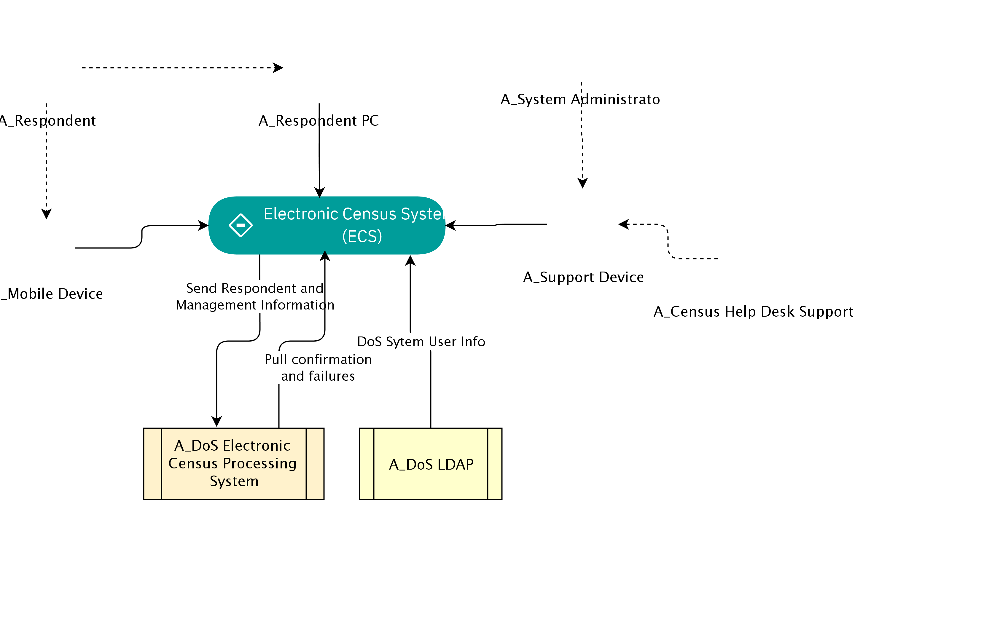

## Diagram

### Name

ECS System Context

### Description

ECS provides the ability to complete the next Census Form electronically over the Internet, via a desktop internet browser on the respondent’s computer and/or mobile app on the respondent’s mobile device.

## Element

[Expand all](#){ .md-button .diff-line }

### Actor

    

A_Census Help Desk Support

<table>
    <caption></caption>
    <thead>
        <tr>
            <th></th>
            <th></th>
        </tr>
    </thead>
    <tr>
        <td> <strong>Name</strong> </td>
        <td>A_Census Help Desk Support</td>
    </tr>
    <tr>
        <td> <strong>Description</strong> </td>
        <td>Help desk provides visibility to end-user issues.</td>
    </tr>
    <tr>
        <td> <strong>Type</strong> </td>
        <td>Human</td>
    </tr>
    <tr>
        <td> <strong>Generic Group</strong> </td>
        <td>
        
        </td>
    </tr>
</table>

    

A_DoS Electronic Census Processing System

<table>
    <caption></caption>
    <thead>
        <tr>
            <th></th>
            <th></th>
        </tr>
    </thead>
    <tr>
        <td> <strong>Name</strong> </td>
        <td>A_DoS Electronic Census Processing System</td>
    </tr>
    <tr>
        <td> <strong>Description</strong> </td>
        <td>DoS Census Processing  system – this component receives data files, separates out the different data types (collector notifications, technical help requests, respondent data and feedback) processing each as appropriate, and generates acknowledgement and resend request files if required.</td>
    </tr>
    <tr>
        <td> <strong>Type</strong> </td>
        <td>IT System</td>
    </tr>
    <tr>
        <td> <strong>Generic Group</strong> </td>
        <td>
        
        </td>
    </tr>
</table>

    

A_DoS LDAP

<table>
    <caption></caption>
    <thead>
        <tr>
            <th></th>
            <th></th>
        </tr>
    </thead>
    <tr>
        <td> <strong>Name</strong> </td>
        <td>A_DoS LDAP</td>
    </tr>
    <tr>
        <td> <strong>Description</strong> </td>
        <td>DoS LDAP system, source of user information for Help Desk and Admin personnel.</td>
    </tr>
    <tr>
        <td> <strong>Type</strong> </td>
        <td>IT System</td>
    </tr>
    <tr>
        <td> <strong>Generic Group</strong> </td>
        <td>
        
        </td>
    </tr>
</table>

    

A_Mobile Device

<table>
    <caption></caption>
    <thead>
        <tr>
            <th></th>
            <th></th>
        </tr>
    </thead>
    <tr>
        <td> <strong>Name</strong> </td>
        <td>A_Mobile Device</td>
    </tr>
    <tr>
        <td> <strong>Description</strong> </td>
        <td>Mobile device used by census respondent.  This user is using the system via an App.</td>
    </tr>
    <tr>
        <td> <strong>Type</strong> </td>
        <td>IT System</td>
    </tr>
    <tr>
        <td> <strong>Generic Group</strong> </td>
        <td>
        
        </td>
    </tr>
</table>

    

A_Respondent

<table>
    <caption></caption>
    <thead>
        <tr>
            <th></th>
            <th></th>
        </tr>
    </thead>
    <tr>
        <td> <strong>Name</strong> </td>
        <td>A_Respondent</td>
    </tr>
    <tr>
        <td> <strong>Description</strong> </td>
        <td>Census form respondent, might be using a PC, or a mobile device.</td>
    </tr>
    <tr>
        <td> <strong>Type</strong> </td>
        <td>Human</td>
    </tr>
    <tr>
        <td> <strong>Generic Group</strong> </td>
        <td>
        
                
                
<strong>SubSystem,Access</strong>[Auto-Generated]

                
This group is derived from SubSystem named Access.

                
                
        </td>
    </tr>
</table>

    

A_Respondent PC

<table>
    <caption></caption>
    <thead>
        <tr>
            <th></th>
            <th></th>
        </tr>
    </thead>
    <tr>
        <td> <strong>Name</strong> </td>
        <td>A_Respondent PC</td>
    </tr>
    <tr>
        <td> <strong>Description</strong> </td>
        <td>PC used by census respondent, in this case using a browser to access the centralized version of the application.</td>
    </tr>
    <tr>
        <td> <strong>Type</strong> </td>
        <td>IT System</td>
    </tr>
    <tr>
        <td> <strong>Generic Group</strong> </td>
        <td>
        
        </td>
    </tr>
</table>

    

A_Support Device

<table>
    <caption></caption>
    <thead>
        <tr>
            <th></th>
            <th></th>
        </tr>
    </thead>
    <tr>
        <td> <strong>Name</strong> </td>
        <td>A_Support Device</td>
    </tr>
    <tr>
        <td> <strong>Description</strong> </td>
        <td>PC or mobile device used by help desk support person.  They are using the system via a browser, so no software to be deployed.

The browser accessed user interface - must meet the accessibility requirements including operation with JavaScript disabled and support for screen readers. ECS application running on the server generates all HTML pages displayed to the respondent and performs all field validation, business rule and mandatory question checks, and subsequent processing. The browser performs the pure presentation layer function, and thus every individual page transition requires interaction with the server.</td>
    </tr>
    <tr>
        <td> <strong>Type</strong> </td>
        <td>IT System</td>
    </tr>
    <tr>
        <td> <strong>Generic Group</strong> </td>
        <td>
        
        </td>
    </tr>
</table>

    

A_System Administrator

<table>
    <caption></caption>
    <thead>
        <tr>
            <th></th>
            <th></th>
        </tr>
    </thead>
    <tr>
        <td> <strong>Name</strong> </td>
        <td>A_System Administrator</td>
    </tr>
    <tr>
        <td> <strong>Description</strong> </td>
        <td>The System Administrator is responsible for support of the ECS system itself.  The System Administrator deploys new versions of the ECS system and may be involved in problem troubleshooting on request from the Census Help Desk.</td>
    </tr>
    <tr>
        <td> <strong>Type</strong> </td>
        <td>Human</td>
    </tr>
    <tr>
        <td> <strong>Generic Group</strong> </td>
        <td>
        
                
                
<strong>SubSystem,Access</strong>[Auto-Generated]

                
This group is derived from SubSystem named Access.

                
                
        </td>
    </tr>
</table>

    

