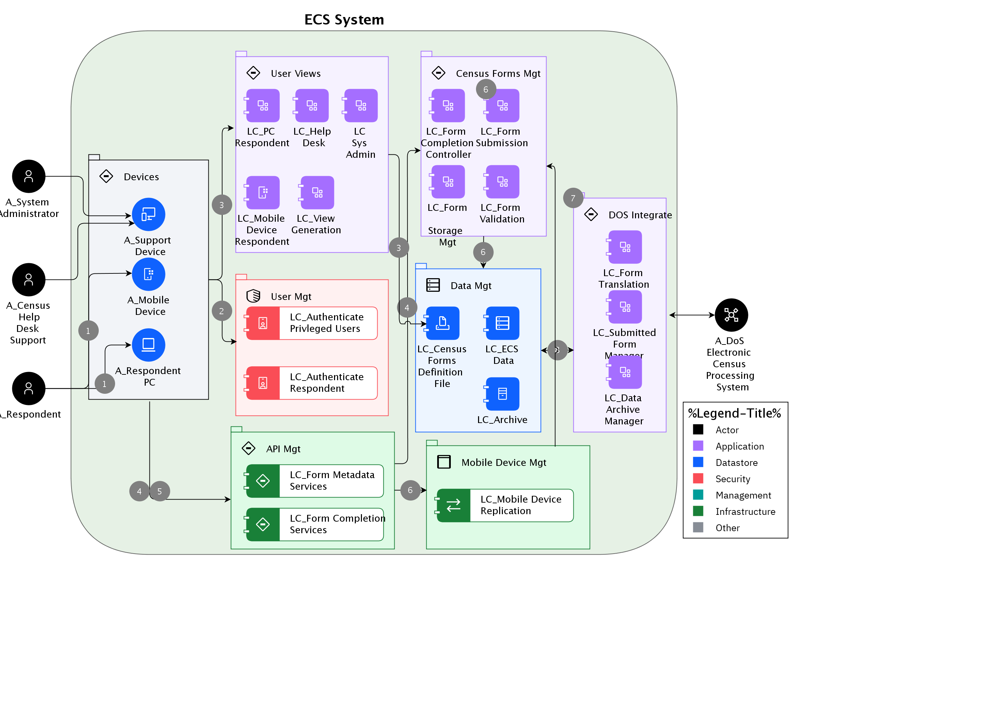

## Diagram

### Name

Main Respondent Flow

### Description

[Expand all](#){ .md-button .same-line }

## Step List

    

1

<table>
    <caption></caption>
    <thead>
        <tr>
            <th></th>
            <th></th>
        </tr>
    </thead>
    <tr>
        <td> <strong>Name</strong> </td>
        <td>1</td>
    </tr>
    <tr>
        <td> <strong>Description</strong> </td>
        <td>User attempts to logon in PC application, or mobile device App </td>
    </tr>
</table>

    

2

<table>
    <caption></caption>
    <thead>
        <tr>
            <th></th>
            <th></th>
        </tr>
    </thead>
    <tr>
        <td> <strong>Name</strong> </td>
        <td>2</td>
    </tr>
    <tr>
        <td> <strong>Description</strong> </td>
        <td>Respondent attempting to logon (via Welcome page) is authenticated.</td>
    </tr>
</table>

    

3

<table>
    <caption></caption>
    <thead>
        <tr>
            <th></th>
            <th></th>
        </tr>
    </thead>
    <tr>
        <td> <strong>Name</strong> </td>
        <td>3</td>
    </tr>
    <tr>
        <td> <strong>Description</strong> </td>
        <td>Authenticated user's role and device type is used to confirm what view they should be presented with for the actions (e.g. Census response on a mobile device (phone or tablet).</td>
    </tr>
</table>

    

4

<table>
    <caption></caption>
    <thead>
        <tr>
            <th></th>
            <th></th>
        </tr>
    </thead>
    <tr>
        <td> <strong>Name</strong> </td>
        <td>4</td>
    </tr>
    <tr>
        <td> <strong>Description</strong> </td>
        <td>Respondent interacts with form in order to complete it.</td>
    </tr>
</table>

    

5

<table>
    <caption></caption>
    <thead>
        <tr>
            <th></th>
            <th></th>
        </tr>
    </thead>
    <tr>
        <td> <strong>Name</strong> </td>
        <td>5</td>
    </tr>
    <tr>
        <td> <strong>Description</strong> </td>
        <td>User submits completed form.  It may be stored locally if it cannot be submitted to the ECS system at this time (e.g. due to lack of a connection).</td>
    </tr>
</table>

    

6

<table>
    <caption></caption>
    <thead>
        <tr>
            <th></th>
            <th></th>
        </tr>
    </thead>
    <tr>
        <td> <strong>Name</strong> </td>
        <td>6</td>
    </tr>
    <tr>
        <td> <strong>Description</strong> </td>
        <td>Once connection is established (if it is not initially), submitted form is validated and is stored in the ECS database prior to submitting to the ECS system.</td>
    </tr>
</table>

    

7

<table>
    <caption></caption>
    <thead>
        <tr>
            <th></th>
            <th></th>
        </tr>
    </thead>
    <tr>
        <td> <strong>Name</strong> </td>
        <td>7</td>
    </tr>
    <tr>
        <td> <strong>Description</strong> </td>
        <td>Completed form's presence in ECS database triggers (when connection is available): notification of completed household and submission of complete form to ECS system.  The form is translated into the ECS system format and, when possible, is submitted to the ECS system.</td>
    </tr>
</table>

    

8

<table>
    <caption></caption>
    <thead>
        <tr>
            <th></th>
            <th></th>
        </tr>
    </thead>
    <tr>
        <td> <strong>Name</strong> </td>
        <td>8</td>
    </tr>
    <tr>
        <td> <strong>Description</strong> </td>
        <td>Upon confirmed delivery to DoS, submitted forms are archived in a way that can only be recovered by DoS staff ensuring that solution provider does not have long-term access to citizen data.</td>
    </tr>
</table>

    

