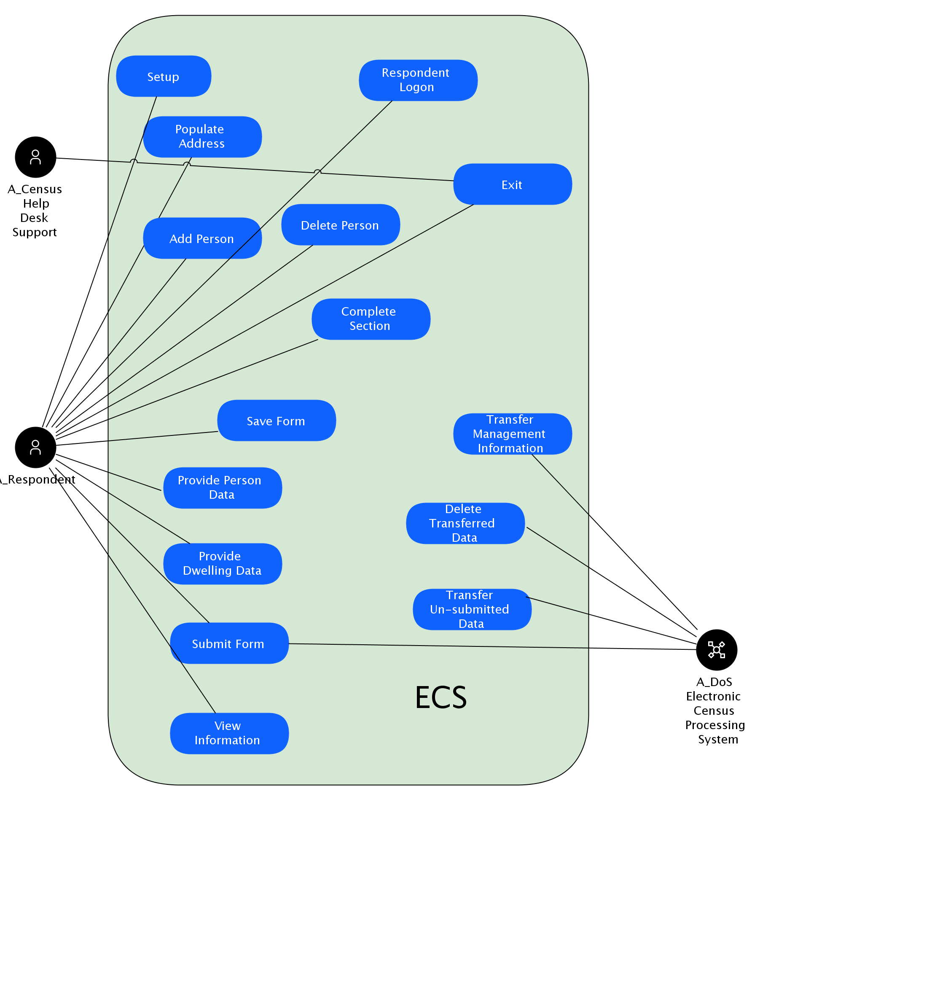

## Diagram

### Name

ECS Use Case Diagram

### Description

## Element

[Expand all](#){ .md-button .diff-line }

### Actor

    

A_Census Help Desk Support

<table>
    <caption></caption>
    <thead>
        <tr>
            <th></th>
            <th></th>
        </tr>
    </thead>
    <tr>
        <td> <strong>Name</strong> </td>
        <td>A_Census Help Desk Support</td>
    </tr>
    <tr>
        <td> <strong>Description</strong> </td>
        <td>Help desk provides visibility to end-user issues.</td>
    </tr>
    <tr>
        <td> <strong>Type</strong> </td>
        <td>Human</td>
    </tr>
    <tr>
        <td> <strong>Generic Group</strong> </td>
        <td>
        
        </td>
    </tr>
</table>

    

A_DoS Electronic Census Processing System

<table>
    <caption></caption>
    <thead>
        <tr>
            <th></th>
            <th></th>
        </tr>
    </thead>
    <tr>
        <td> <strong>Name</strong> </td>
        <td>A_DoS Electronic Census Processing System</td>
    </tr>
    <tr>
        <td> <strong>Description</strong> </td>
        <td>DoS Census Processing  system – this component receives data files, separates out the different data types (collector notifications, technical help requests, respondent data and feedback) processing each as appropriate, and generates acknowledgement and resend request files if required.</td>
    </tr>
    <tr>
        <td> <strong>Type</strong> </td>
        <td>IT System</td>
    </tr>
    <tr>
        <td> <strong>Generic Group</strong> </td>
        <td>
        
        </td>
    </tr>
</table>

    

A_Respondent

<table>
    <caption></caption>
    <thead>
        <tr>
            <th></th>
            <th></th>
        </tr>
    </thead>
    <tr>
        <td> <strong>Name</strong> </td>
        <td>A_Respondent</td>
    </tr>
    <tr>
        <td> <strong>Description</strong> </td>
        <td>Census form respondent, might be using a PC, or a mobile device.</td>
    </tr>
    <tr>
        <td> <strong>Type</strong> </td>
        <td>Human</td>
    </tr>
    <tr>
        <td> <strong>Generic Group</strong> </td>
        <td>
        
                
                
<strong>SubSystem,Access</strong>[Auto-Generated]

                
This group is derived from SubSystem named Access.

                
                
        </td>
    </tr>
</table>

    

### Use Cases

    

Respondent Logon

<table>
    <caption></caption>
    <thead>
        <tr>
            <th></th>
            <th></th>
        </tr>
    </thead>
    <tr>
        <td> <strong>Name</strong> </td>
        <td>Respondent Logon</td>
    </tr>
    <tr>
        <td> <strong>Description</strong> </td>
        <td>The Respondent logs onto the System using a Census Form Number (CFN) and Electronic Census Number (ECN) which constitute logon credentials.
Following successful logon, the Respondent is presented with the ECS Census Form.</td>
    </tr>
</table>

    

Setup

<table>
    <caption></caption>
    <thead>
        <tr>
            <th></th>
            <th></th>
        </tr>
    </thead>
    <tr>
        <td> <strong>Name</strong> </td>
        <td>Setup</td>
    </tr>
    <tr>
        <td> <strong>Description</strong> </td>
        <td>The Census Form can contain a list of up to 10 people residing in the dwelling on Census night. Setup is used to capture the number of persons present on Census night to configure the person section.</td>
    </tr>
</table>

    

Populate Address

<table>
    <caption></caption>
    <thead>
        <tr>
            <th></th>
            <th></th>
        </tr>
    </thead>
    <tr>
        <td> <strong>Name</strong> </td>
        <td>Populate Address</td>
    </tr>
    <tr>
        <td> <strong>Description</strong> </td>
        <td>Addresses must be completed for all dwellings.</td>
    </tr>
</table>

    

Add Person

<table>
    <caption></caption>
    <thead>
        <tr>
            <th></th>
            <th></th>
        </tr>
    </thead>
    <tr>
        <td> <strong>Name</strong> </td>
        <td>Add Person</td>
    </tr>
    <tr>
        <td> <strong>Description</strong> </td>
        <td>The Respondent must be able to add, and modify a person at any time prior to submission.  For those persons added, where the Respondent indicates that they are to be included in the Census, a new person record is also created for them.</td>
    </tr>
</table>

    

Delete Person

<table>
    <caption></caption>
    <thead>
        <tr>
            <th></th>
            <th></th>
        </tr>
    </thead>
    <tr>
        <td> <strong>Name</strong> </td>
        <td>Delete Person</td>
    </tr>
    <tr>
        <td> <strong>Description</strong> </td>
        <td>The Respondent must be able to delete a person at any time prior to submission. </td>
    </tr>
</table>

    

Save Form

<table>
    <caption></caption>
    <thead>
        <tr>
            <th></th>
            <th></th>
        </tr>
    </thead>
    <tr>
        <td> <strong>Name</strong> </td>
        <td>Save Form</td>
    </tr>
    <tr>
        <td> <strong>Description</strong> </td>
        <td>A Save of Census data may be requested at the completion of a page, section, on exit or at submission whilst logged onto the System with a current session.  The data is stored for later retrieval by the Respondent.</td>
    </tr>
</table>

    

Provide Person Data

<table>
    <caption></caption>
    <thead>
        <tr>
            <th></th>
            <th></th>
        </tr>
    </thead>
    <tr>
        <td> <strong>Name</strong> </td>
        <td>Provide Person Data</td>
    </tr>
    <tr>
        <td> <strong>Description</strong> </td>
        <td>The Respondent provides answers to the questions contained in the person section.</td>
    </tr>
</table>

    

Provide Dwelling Data

<table>
    <caption></caption>
    <thead>
        <tr>
            <th></th>
            <th></th>
        </tr>
    </thead>
    <tr>
        <td> <strong>Name</strong> </td>
        <td>Provide Dwelling Data</td>
    </tr>
    <tr>
        <td> <strong>Description</strong> </td>
        <td>The Respondent provides answers to the questions contained in the dwelling section.</td>
    </tr>
</table>

    

Complete Section

<table>
    <caption></caption>
    <thead>
        <tr>
            <th></th>
            <th></th>
        </tr>
    </thead>
    <tr>
        <td> <strong>Name</strong> </td>
        <td>Complete Section</td>
    </tr>
    <tr>
        <td> <strong>Description</strong> </td>
        <td>The Respondent may request completion of a Census section once mandatory questions have been answered.  The completion process entails an implicit save initiated by the System.   When all sections have a status of complete, the Respondent may request submission of their data to the DoS.</td>
    </tr>
</table>

    

Submit Form

<table>
    <caption></caption>
    <thead>
        <tr>
            <th></th>
            <th></th>
        </tr>
    </thead>
    <tr>
        <td> <strong>Name</strong> </td>
        <td>Submit Form</td>
    </tr>
    <tr>
        <td> <strong>Description</strong> </td>
        <td>The Respondent may submit their Census data only once to the DoS, after completing all sections.  After successful submission, the System issues the Respondent with a receipt number. Any subsequent access to the System will provide the Respondent with their receipt number. Respondent is prevented from making changes or resubmitting their Census form.</td>
    </tr>
</table>

    

View Information

<table>
    <caption></caption>
    <thead>
        <tr>
            <th></th>
            <th></th>
        </tr>
    </thead>
    <tr>
        <td> <strong>Name</strong> </td>
        <td>View Information</td>
    </tr>
    <tr>
        <td> <strong>Description</strong> </td>
        <td>The Respondent may at any point request a viewing of extra information.  This includes links such as Copyright, Conditions of Use, Privacy and Security and Contextual Help.</td>
    </tr>
</table>

    

Exit

<table>
    <caption></caption>
    <thead>
        <tr>
            <th></th>
            <th></th>
        </tr>
    </thead>
    <tr>
        <td> <strong>Name</strong> </td>
        <td>Exit</td>
    </tr>
    <tr>
        <td> <strong>Description</strong> </td>
        <td>The Respondent may exit the System at any time with or without saving their Census data.  If the Respondent exits without first saving any changes, the System provides the opportunity to save before exiting.  The Respondent may decline this opportunity, which results in unsaved data being discarded.</td>
    </tr>
</table>

    

Transfer Management Information

<table>
    <caption></caption>
    <thead>
        <tr>
            <th></th>
            <th></th>
        </tr>
    </thead>
    <tr>
        <td> <strong>Name</strong> </td>
        <td>Transfer Management Information</td>
    </tr>
    <tr>
        <td> <strong>Description</strong> </td>
        <td>The System transfers management information data to the DoS Electronic Census Processing System.</td>
    </tr>
</table>

    

Delete Transferred Data

<table>
    <caption></caption>
    <thead>
        <tr>
            <th></th>
            <th></th>
        </tr>
    </thead>
    <tr>
        <td> <strong>Name</strong> </td>
        <td>Delete Transferred Data</td>
    </tr>
    <tr>
        <td> <strong>Description</strong> </td>
        <td>The System receives confirmation from the DoS of Respondent Census data that can be deleted, identified by ECN.  For each ECN received, the System deletes the corresponding Respondent data.</td>
    </tr>
</table>

    

Transfer Un-submitted Data

<table>
    <caption></caption>
    <thead>
        <tr>
            <th></th>
            <th></th>
        </tr>
    </thead>
    <tr>
        <td> <strong>Name</strong> </td>
        <td>Transfer Un-submitted Data</td>
    </tr>
    <tr>
        <td> <strong>Description</strong> </td>
        <td>The System transfers un-submitted Respondent data to the DoS on request.</td>
    </tr>
</table>

    

